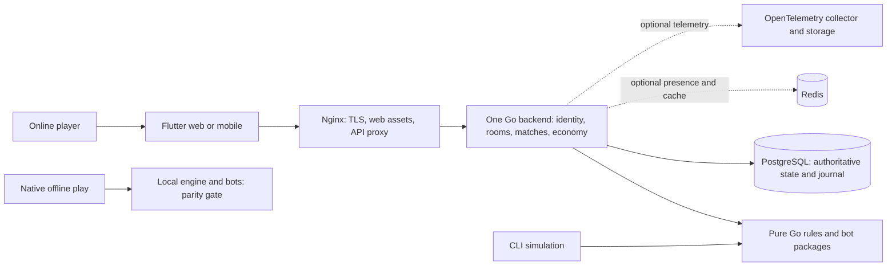

# CGMS architecture proposal

Status: architecture proposed 2026-09-28; inventory and development sequence
updated 2026-09-30. The simulator, PostgreSQL match persistence and local
single-process online API exist with the roadmap evidence. Adaptive Flutter web integration is implemented with recorded local browser
evidence; native acceptance and production release remain separate gates.
The [roadmap](../planning/ROADMAP.md) is the only implementation checklist.

## 1. System context

CGMS is a three- or four-player negotiation card game, with multiple games
per match. Online players use Flutter web, iOS or Android. The Go server
adjudicates online games; an independent CLI uses the same Go rules engine
for experiments. Native offline play has a separate local authority and must
never grant online rewards or upload authoritative match results.

The [current rules](../project/GAME_RULES.md) and accepted decisions in the
[changelog](../../CHANGELOG.md) control game behavior. GAME_RULES supersedes
all four preserved historical drafts. The existing
[project brief](../project/INITIATE.md) supplies stack and product constraints;
its broader documentation assignment is not claimed complete by this proposal.
The [resolved rule register](../design/RULES-IMPLEMENTATION-QUESTIONS.md) records
Q01–Q12 decisions, accepted F01–F10/N01–N07/T01–T03 interaction amendments and their
cross-layer test obligations and their roadmap evidence. Matches fix a visible game
count before start (default three); cumulative-score ties share match rank.



Trust boundaries: client input is untrusted; private hands, decks and random
state stay inside the authority. Private database/configuration/telemetry
networks are inaccessible from public clients. Authentication does not grant
room or match membership: every command and subscription checks both.

## 2. Top-level components

Choose a modular monolith and one backend replica for v1. Three/four-player
matches have small state and tightly coupled actions; separate services would
add partial-failure boundaries to scoring and combat without an established
scale need. PostgreSQL is the durable authority, Redis is optional transient
storage, and Nginx fronts Docker Compose. This is a single-host availability
trade-off, not a highly available deployment claim.

| Component (implemented paths identified below) | Responsibility and ownership |
|---|---|
| `backend/internal/game` | Pure state transitions, legal-action validation, observations, exact score/debt settlement; no clock, sockets, SQL or global randomness. |
| `backend/internal/bots` | Versioned random/heuristic policies consume seat observations; engine independently validates their commands. |
| `backend/internal/matchstore` (implemented) | Command admission, transaction orchestration, memberships, phase transitions and idempotency. Owns match state writes. |
| `backend/internal/identity`, `rooms` | Sessions, account lifecycle, invitations and seats. A room is the lobby; a match owns its games and debt history. |
| `backend/internal/economy` | Daily online allowance, premium entitlements, passes and dirt; separate from in-game score/debt. |
| `backend/internal/matchstore` (implemented) | Transactions, migrations, snapshots, journals and durable command results. All writers obey the same lock order. |
| `backend/internal/transport` | HTTP command/query API and authenticated WebSocket delivery; maps domain errors to stable codes. |
| `backend/internal/config`, `telemetry` | Validated settings, redacted logs, optional metrics/traces and health endpoints. |
| `backend/cmd/server`, `backend/cmd/sim` | Implemented simulator and local server share one `backend/go.mod` and game package. |
| `client/` and its `packages/cgms_ui/` | Flutter host/package with distinct adaptive web presentations display authorized projections and localize ARB codes. Never decide online legality. Native verification follows in R06N. |
| `client/offline_probe/` | Host offline-engine research only; not a second Flutter product host. |
| `sims/` | [Simulation contract](../../sims/README.md), scenarios and experiment artifacts; engine code stays in `backend/`. |

Proposed runtime organization. The later [Phase 0 preparation](../../sims/README.md#phase-0-preparation-and-handoff)
originally added documentation, schemas and curated inputs under `config/` and
`sims/`. The inventory at the end of this document identifies implemented runtime
slices; this broader target layout still includes future components:

```text
backend/       go.mod; cmd/{server,sim}; internal/{game,bots,matchstore,identity,
               rooms,economy,storage,transport,config,telemetry}; migrations/; testdata/
client/  Flutter host; packages/cgms_ui/ reusable presentation; test/
client/offline_probe/  Experimental host engine comparison (not the product UI)
config/        rules/; schemas/; backend/; postgres/; redis/; nginx/; observability/
deploy/        compose/; containers/; backup/                (all proposed)
sims/          README.md; scenarios/; experiments/; artifacts/ (generated output ignored)
docs/          code/; design/; planning/; project/; guides/  (existing)
xops/          agent/; makefile/                            (existing)
```

Proposed durable records: `matches` (versioned aggregate snapshot, pinned
rules/engine identity, fixed game count, private random state), `games` (board
and financial phases with immutable game IDs and separate declaration and score outcomes),
`match_members`, `command_results`, `match_events`, `seat_events`,
`score_entries` and available balances attributed to an origin game, `debts`,
`repayments`, append-only match adjustments with original charge/creating-game
provenance, typed sharing promises/final offers, turn-bound trade/loan proposals
with revisions/status, deferred draw progress and durable financial settlement progress,
accounts/sessions, and separate
economy records. These are schema design names, not existing tables.
The snapshot contains card zones, control, player/ability/interval quotas,
physical-Club usage, exclusive alliances, lasting player effects, persistent
Doppelganger bindings, active-Ace effect zones and per-card availability rounds,
and pending responses/effect decisions. Lasting privilege
ownership is separate from current physical-card custody. Score/debt projections
and their snapshot representation are
updated in one transaction and reconciled by invariant tests, never by two
independent writers. Use snapshots for normal recovery; retain immutable
commands/events for audits and deterministic replay, not mandatory full event
replay on every read.
Keep unanswered proposals separate from pending actions: exact terms are private
to the parties and reserve no cards/allowances. The same match transaction orders
acceptance, revision, withdrawal/decline and turn/closure/departure expiry.

## 3. Data flow

Authenticate and admit a bounded command, then lock the match aggregate in
PostgreSQL. Load current state; check membership, durable command identity,
phase, immutable game ID and the command-specific admission rule. Durable duplicate
lookup precedes game/version checks, so old committed retries retain their result;
new submissions for another game reject. All game-scoped intents require their
origin game ID, including victory and settlement; next-game lifecycle commands
name the finalized predecessor. A fresh server game ID identifies every next
game and nullified replacement, independently of its configured match slot.
Ordinary selected actions check expected version; victory claims validate current
eligibility without rejecting solely for an unrelated version change in that
same game. Run one deterministic transition, validate
invariants, persist the new snapshot, score/debt changes, exact command result
and per-seat events in the same transaction. Respond only after commit.
Delivery reads committed events and can replay them after reconnect.

Each declaration, response, pass or effect input is a short transition. Persist
the pending action, response cursor and effect/decision ID, stage, required actor
and authorized options between requests; never hold a SQL transaction while a
human decides. Several decisions can belong to one response without nested
response windows. Accepted activations cannot be withdrawn and committed random
results cannot be rerolled. A valid Coup can be processed between those transitions,
including during Confinement, without waiting for another actor's input. Never
interrupt a partially applied atomic effect. Ordinary thresholds require an
explicit declaration by a player who is not confined after responses resolve;
they are never automatic wins.
The accepted digital policy uses one authoritative server order for valid
declarations; ordinary-action priority cannot delay victory declarations.
Client timestamps have no authority. Disconnection preserves pending state
without automatically passing, forfeiting or imposing a game-turn deadline.
Ordinary response traversal skips confined/departed seats with no required pass,
preserving fixed order among the rest; a disconnected eligible player is not
skipped. Confinement expiry restores response eligibility and never suppresses
its separate legal Coup exception.

Legal proposal acceptance creates a nonwithdrawable transfer action whose actor
is the acceptor, including for Confinement and response traversal. It rechecks
exact revision, current ownership/availability, transfer prerequisites and origin
turn/game; final resolution checks again before moving all cards atomically.
An intact loan recipient needs ability support only to use the formation, not
to receive it. Create the alliance and any loan-derived Underground privilege
only with successful transfer; canceled actions retain earlier responses and
committed Ace allowances without partial transfer or automatic proposal reopening.

Automatic Compensation draws use one fixed ascending-seat queue after action
returns/shuffle, finish each recipient's quantity and precede point settlement
or ordinary victory. Durable queue/random progress prevents duplicate draws;
exhausted mandatory draws create no later entitlement. A legal Coup may interrupt
between atomic queue steps, preserving completed draws and abandoning the rest.
Deck purchases instead atomically resolve a buyer-chosen positive quantity and
its exact eligible hand/exposed Spade payment, after ordinary responses and
revalidation; there is no partial purchase or automatic quantity reduction.

Close the board immediately on a valid ending, then admit only the financial
settlement commands defined in GAME_RULES §4.4. Keep that origin game's typed
promises, debt-prioritized transfers and explicit finish/refusal decisions open
until resolved; absence is pending. Financial finalization closes its available
pool before the next game starts at zero available cash. Preserve cumulative
scores and outstanding match debts. This sequential model can wait indefinitely
for human settlement; hibernation preserves it without inventing forfeits.
Coup replacement, departure and nullification use the same field-level financial
table, not independent frontend arithmetic.
Cross-game forgiveness appends a nonspendable match adjustment against an original
retained charge, preserving completed results and surviving later Coup replacement.
Its creating-game provenance lets nullification restore both debt and effective
adjustments. A correction against a current-game charge instead remains with that
game and is replaced together with its charge by Coup. Keep original debt/charge
lineage explicit; no correction creates cash or triggers a repayment cascade.

See the [state/delivery design](../design/DESIGN-go-state-and-delivery.md) for
the transaction, failure, retry and goroutine contracts, and the
[implemented API contract](API-game.md) for client-visible behavior.

## 4. Cross-cutting concerns

**Rules/configuration.** Propose versioned JSON at
`config/rules/<ruleset-id>.json`, validated by
`config/schemas/rules.schema.json`: explicit units, bounds, supported player
counts, rules version, engine compatibility and separate interpretation ID.
JSON suits Go, Dart and offline experiment tools; restrict numeric parameters
to exact safe integers and represent fractions as decimal-string numerator
and denominator pairs. Define normalized-key ordering/encoding and hash test
vectors before implementation; hash effective defaults plus overrides, not
just the source bytes. Pin rules, interpretations, engine version and hash at
match creation; updates affect only new matches. Never hot-reload live rules.
Code's in-game settings are match state, not edits to the rules file.
Code declaration is a non-attacking global economic action; its prices/bonuses
affect all opponents. Its hostile round penalty separately requires the active,
non-confined declarer's two current series and excludes protected/confined opponents. Use canonical §2.5
combat algebra with physical card values and modifiers recorded independently;
exchange costs return committed physical Clubs, never virtual modifier cards.

Go service settings use strict schema-validated JSON under `config/backend/`.
`CGMS_CONFIG` selects a complete file with private secret-file references; the
legacy environment-only launcher remains separate.
CLI flags select files; they must not silently override game parameters.
Reject unknown keys, invalid bounds, unsupported versions and missing secrets
before readiness. Compose wires networks, volumes, config/secret references
and image versions; application values do not live in Compose environment
blocks. PostgreSQL, Redis and Nginx retain their native configuration formats
under their own `config/` directories; validate rendered files with each
service's supported checks. Collector/observability settings use their native
schemas. Service settings restart unless an explicit atomic reload is tested.
Use harmless example credentials/placeholders; real credentials stay outside
version control, including development credentials with access to resources.
Compose can grant individual services secret-file access; verify paths and
permissions in deployment tests. [Docker secrets](https://docs.docker.com/compose/how-tos/use-secrets/)
(accessed 2026-09-28).

**Exact arithmetic.** Use an immutable domain wrapper over arbitrary-precision
rationals, reduced with a positive denominator; Go provides `big.Rat`.
Do not use floats or fixed cents: paired Ponzi halves, promised reward
percentages and generic rational receipts must remain exact. Equal-thirds
fixtures test arithmetic only; exclusive pairs preclude three-way Ponzi shares.
Persist canonical numerator/denominator strings and validate them on read/write;
client display rounding never changes authority.
Bound input size and measure internal growth; exceeding a safety limit must
pause with diagnostic evidence, not round or drop points. Exact cycles can take
2D unbatched transfers for reciprocal debts of 1 and receipt 1/D. Prove exact
batching against small reference ledgers, retain reproducible compressed audit
records, and commit resumable progress in a private settlement workspace so
retries do not restart the same expensive work. Publish the final ledger/snapshot
atomically. No gameplay or final-result publication may overtake
unfinished automatic settlement.
[Go math/big](https://pkg.go.dev/math/big#Rat) (accessed 2026-09-28).

**Security/privacy.** Use TLS in production, resource-level authorization,
strict message schemas, body/queue limits, browser origin and CSRF defenses,
parameterized SQL and least-privilege service users. Store session secrets
securely; never put tokens in WebSocket URLs. No hand/deck/seed/receipt payloads
in logs, traces, analytics, global event topics or public replays. Hidden
physical-card IDs must not encode suit/rank or permit tracking across secret
zone changes. Keep public and seat-private projections explicit and test
them against every action using GAME_RULES §2.13. Hand and concealed-Ace counts
are public; faces and hidden royal breakdowns are private. Captured number
Diamonds are public, including hidden Justice captures. Retain already-public
history without disclosing new hidden identities or the location of a separated
bound king. Apply the policy to accessibility labels, bot observations, errors
and reconnect, not only rendered cards. Phase 2 selected local credentials, in-place guest upgrade, revocable opaque
sessions and pseudonymous indefinite match retention on account deletion; see the
[implemented authentication contract](API-game.md#authentication-and-retention-decision-2026-09-30).
Provider recovery, public deployment and a privacy/legal release assessment remain open.

**Logs/telemetry.** Go, Flutter and services share UTC timestamps, severity,
stable event/error names, request/operation ID and safe context. Human-readable
development output and structured production output carry equivalent fields.
Record command latency, queue/lock wait, unknown commits, replay gaps, resource
usage and rule/engine versions. Propose an optional
[OTel Collector](https://opentelemetry.io/docs/collector/) with
[Prometheus](https://prometheus.io/docs/introduction/overview/),
[Tempo and Grafana](https://grafana.com/docs/tempo/latest/)
(official documentation accessed 2026-09-28), containerized and internally exposed; benchmark
its memory cost before v1. `observability.enabled=false` must disable exporters
and the matching Compose profile, retaining basic logs and readiness without
repeated connection errors. Flutter instrumentation support and overhead need
a platform-specific spike before library selection.

**Product boundaries.** Free online play is three games/day. Decision 0015
limits premium products to Ad-free, Daily, Weekly, Monthly and Yearly. Earned
dirt buys only Daily/Weekly unlimited access, retaining ads unless a separate
ad-free entitlement is active. Cosmetics are neither sold nor currency-unlocked.
Standalone Ad-free lasts 30 days and grants no unlimited-play benefit. Paid
Daily lasts 24 hours from confirmed purchase and is non-renewing; paid Daily,
Weekly, Monthly and Yearly all provide unlimited starts and ad removal. The
private effective expiry is projected as `ad_free_until`, separately from
earned play access. Fixed terms retain their original trusted confirmation
instant and expiry through restore and duplicate notifications.
Keep this economy out of the
card-game ledger. Persist start allowances atomically with game start, and
reward each final game at most once using durable effect IDs. Offline results
cannot earn dirt. [Decision 0013](../project/DECISION_LOG.md) now fixes UTC day
boundaries, once-per-start charging, once-per-finalized-game rewards, no automatic
unfinished-game refunds/rewards and pass stacking. Decision 0015 supersedes
0013's ad-free earned passes. Decision 0014 approves 10 dirt per eligible
finalized online game and 30 dirt per pass day; see the current
[economy contracts and dated store matrix](../design/DESIGN-economy-and-stores.md).
Optional adopted-policy activation pins economy to each new match and commits
allowance/reward effects with room/game transitions. Default activation remains off.
Remote purchase validation must reconcile ambiguous outcomes
against the provider identity, with no blind repeated grants. Store-policy
research belongs before commerce implementation; this document claims no
Apple/Google compliance review.

No new promotion or cosmetic channel is part of the adopted product model.
Retain reconciliation and audit history for previously recorded grants without
exposing issuance/redemption or making historical cosmetic records purchasable.
Paid purchase terms that remain unspecified stay unavailable; native adapters
and signed store evidence remain separate release gates.

Card style is public presentation metadata, independent of product entitlement
and the game ledger. Decision 0016 uses a stable match-scoped permutation of
the four editions and authoritative current control when rendering visible
cards. Concealed cards retain one neutral back; style never changes gameplay
or supplies information absent from the authorized projection.

**Web-first client and offline boundary.** Flutter web is the current development
and testing platform. Build on `client/` and its `packages/cgms_ui`, with
shared gameplay/state/adapters and suitable primitives but purpose-built desktop,
phone and tablet presentation components. [UI baseline v2](../design/UI_BASELINE.md)
defines widths (<600, 600–1049, >=1050 logical pixels), compositions, navigation,
input and browser acceptance. Phone/tablet web must faithfully specify eventual
native appearance and journeys. Shared state survives class transitions; views
consume authorized projections and never derive concealed information.

Native clients still require unlimited offline bots; production web gameplay
requires online authority. P01 compares independent Dart engine/bots and native
FFI against Go fixtures on the host, documenting parity and a provisional choice.
P02 builds local save/tutorial/difficulty contracts; P04 web work does not depend
on either candidate or native devices. Shared JSON alone proves no parity.
Final engine approval requires measured benefit, packaging and matched Android/iOS
real-device lifecycle, memory and decision-latency evidence in R06N, before R06/R07.
P06 provider-contract tests precede final actual SDK/store sandbox acceptance.
Missing devices/Xcode block final native acceptance, not web progress. Browser
journeys prove neither native lifecycle nor native accessibility/performance.
No LLM is required; optional research follows evaluated non-LLM baselines and
hardware inventory. Tutorials use the lowest competent difficulty. Existing UI
v1 demo and host/Android compilation evidence are retained within their limits;
v2 online implementation has recorded browser evidence; final relocated-build
verification and native acceptance remain separate roadmap gates.

## 5. Invariants you must not break

| Invariant | Authority and required evidence |
|---|---|
| Each of 104 physical cards occupies exactly one zone | Engine assertions after every transition; shuffled identical ranks remain distinct; custody/loan metadata does not duplicate cards. |
| Persistent Ace custody differs from reusable cards | Inflation/Compensation live in a public effect zone with source, target, physical custodian and expiry; excluded from Fate counts, cleaned up on target departure/board closure, preserved on unrelated caster departure. |
| Restricted-card availability follows its physical identity | §2.14 markers survive involuntary transfers and Fate/shuffle/redraw; prohibit voluntary use/Coup until the recorded round, allow ordinary threshold counting and required proof, and conceal private markers. |
| Historical openings differ from currently open number suits | Opening/loss tests; initial protection never returns; two-current-series attack requirement has no Underground bypass. |
| One pending action and seat-ordered, non-nested responses | Transition tests and crash/reconnect tests; skip confined/departed seats without skipping eligible disconnected players; Coup exception and one terminal result under concurrency. |
| Proposals do not reserve or block before acceptance | Origin-turn expiry, private revisioned terms, withdrawal/decline races, acceptor actor/Confinement and successful-resolution-only alliance/privilege fixtures. |
| Automatic draws and purchases have explicit boundaries | Fixed-seat Compensation queue with exhaustion/counter/replay cases; chosen purchase quantity and exact eligible payment/supply revalidate before atomic payment/shuffle/draw. |
| Exclusive alliances, paired Ponzi shares and oldest-debt-first repayment | At most one partner per player; exact halves, fixed-seat gross receipts then FIFO cascades, cycle/batching evidence, Coup resets and carried unpaid adjustments; score is distinct from spendable points. |
| One governing Code; Underground retains its specific exceptions | Tests separating non-attacking settings for all opponents from hostile penalty eligibility and persistent benefits from conditional income. |
| Clients/bots see only permitted information | Projection/noninterference tests, redaction tests and a hostile forged-command suite. |
| One durable effect per command identity | Lost-response/retry and duplicate-request fault tests, including terminal rewards. |
| New commands cannot cross game instances | Required game ID, duplicate-before-game-fence order, delayed first submissions, fresh nullification replacement IDs and same-game victory-version exception. |
| Financial corrections preserve immutable charge provenance | Full/partial cross-game forgiveness, later Coup and nullification retain exact totals without old-result edits, double credits or spendable forgiveness. |
| Match versions never switch engines mid-game | Compatibility rejection and old/new process rollout tests; replay identity recorded in every simulation artifact. |

The [rule contract matrix](../design/RULES-IMPLEMENTATION-QUESTIONS.md) adds
specific GAME_RULES references, resolved decisions and required test evidence.
Rule acceptance does not imply implementation or verification; unknown ruleset
versions and unsupported experimental interpretations must still fail explicitly.

## 6. Deployment topology

Phase 0 runs a local/containerized CLI without the full service stack. Online
development and production v1 use Docker Compose: Nginx serves the Flutter web
build and proxies APIs/WebSockets; backend, PostgreSQL, Redis and optional
observability services have explicit configs, health checks and persistent
volumes. PostgreSQL and admin UIs are private. Compose supports a production
overlay and bounded local restart/backup/restore evidence; fresh-host and
off-host recovery acceptance remain production gates. [Docker production guidance](https://docs.docker.com/compose/how-tos/production/)
(accessed 2026-09-28).

Use separate local HTTP and production TLS/security-header profiles. Test
WebSockets, Flutter assets/workers, debug tooling and cache refresh before
enforcing CSP or cross-origin isolation; production HSTS must not leak into
localhost assumptions. Implemented thin Make targets (`go.re`, `web.re` and
service equivalents) delegate to Python in `xops/makefile/`, preserve volumes,
bound readiness waits and retain failure logs.
Mobile release signing/build requirements remain platform-specific.

Proposed initial load profile: 4 vCPU/8 GiB host, 100 four-player matches,
400 sockets, 20 admitted transitions/second. Benchmark before accepting targets:
p95 command-to-commit <250 ms (excluding human decision and internet latency),
engine-only p95 <10 ms, backend steady RSS <512 MiB; publish queue saturation
and telemetry-on/off results. These are sizing hypotheses, not measured SLAs.
Proposed backup targets RPO 15 minutes/RTO 60 minutes require archived recovery
data and a timed restore drill; a single Compose host has no automatic HA.

## 7. Out of scope

The original architecture-documentation slice implemented no runtime, simulator,
client, migrations or deployment; later implementation inventories follow below.
It does not complete every document requested in the broader project brief.
Kubernetes/Helm, cross-region active-active matches, service decomposition,
broker infrastructure, ranked matchmaking and LLM bots have no v1 requirement.
Scale backend replicas only after measured saturation: all new writers must
retain the PostgreSQL match lock/version contract, ordered admission and
durable replay. Redis ownership locks alone cannot authorize game effects.

## Phase 0 implementation inventory (2026-09-30)

`backend/go.mod`, `cmd/sim`, `internal/game`, `internal/bots`, `internal/sim`,
`internal/canonical` and `internal/randomstream` now implement the bounded CLI
simulation scope. Rules/schema/scenario/experiment inputs and scratch packaging
are described in [sims](../../sims/README.md); measured gates and exclusions are in
[implementation evidence](../../sims/docs/phase-0-implementation-evidence.md).
The single-process online server now exists under `backend/cmd/server`; this
does not approve the proposed architecture ADR or create production deployment,
online transport/cache modules, Flutter integration or production readiness.

## Accepted gameplay extension inventory (2026-09-30)

The owner-authorized domain extension completes targeted D01–D04 engine gates,
including complete ability/proposal lifecycles and exact financial transitions.
The CLI now orchestrates normal-deal games, explicit decisions/chance, finalization
and subsequent games with persistent match state. Local artifacts support replay
and continuation. The subsequent Phase 1 extension implements PostgreSQL
transactions and recovery in `internal/matchstore`; see the [module contract](MODULE-game.md#durable-adapter-phase-1).
Public online delivery and deployment remain separate gates.

See [rule coverage](../../sims/docs/gameplay-coverage.md),
[policies](../../sims/docs/gameplay-bots.md) and the
[simulation contract](../../sims/README.md). Public reports exclude private financial
state; restricted forensic artifacts retain exact trajectories. Historical partial
checks, targeted tests, completed autonomous games and held-out estimates are
reported separately. No human-gameplay or production-readiness claim follows.
