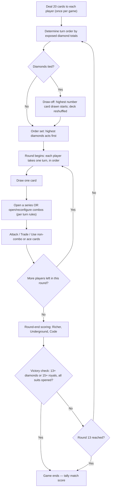
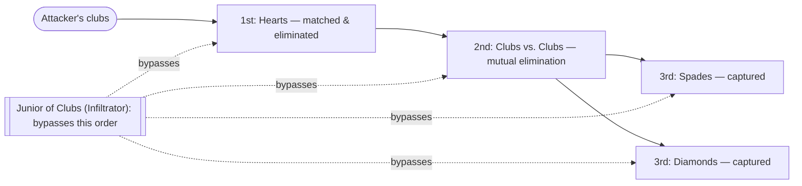
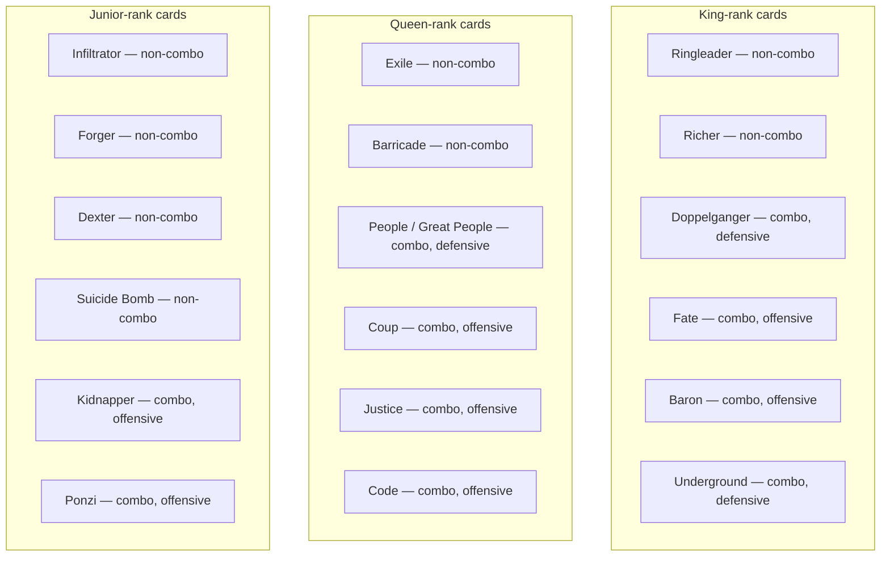

# CGMS (Card Game Mafia State) — Structured Rules Reference

> Historical draft, retained for reference. Current rule updates belong in
> [`GAME_RULES.md`](../../project/GAME_RULES.md); agreed changes and their
> rationale are recorded in the [change notes](../../../CHANGELOG.md).
> This version was reformatted from [`IDEA.docx`](../IDEA.docx)
> and retains its inline amendment history.

## Table of Contents

- [0. Structure & Definitions (Amendment)](#0-structure--definitions-amendment)
- [1. Setup and Basics](#1-setup-and-basics)
  - [1.10 Round Flow — Illustration](#110-round-flow--illustration)
- [2. Play and Card Rules](#2-play-and-card-rules)
  - [2.7 Attack Order — Illustration](#27-attack-order--illustration)
  - [2.8 One Combat Procedure (Amendment)](#28-one-combat-procedure-amendment)
  - [2.9 Instant Effects & Response Order (Amendment)](#29-instant-effects--response-order-amendment)
- [3. Card Reference](#3-card-reference)
  - [3.1 Combos — Illustration](#31-combos--illustration)
  - [3.2 Combos](#32-combos)
  - [3.3 Non-Combo Cards](#33-non-combo-cards)
  - [3.4 Special Cards — Aces](#34-special-cards--aces)
  - [3.5 Numbers (Suits)](#35-numbers-suits)
- [4. End Game and Scoring](#4-end-game-and-scoring)
- [5. Notes for Coding](#5-notes-for-coding)

---

## 0. Structure & Definitions (Amendment)

> The original draft never defines these terms, which is what causes the “declare victory” vs. “highest score” ambiguity flagged in [`CGMS-game-review.md`](../../reports/CGMS-game-review.md) (§1.1–1.2). This section applies that fix going forward.

- **Turn** → one player's actions.
- **Round** → every player takes one turn.
- **Game** → ends at round 13 *or* the moment any individual player hits 13 diamonds / 15 royals — alliances never pool cards or share this trigger; see [2.4 What Counts as an Alliance](#24-what-counts-as-an-alliance).
- **Match** → the 3+ games you total for a final winner.

---

## 1. Setup and Basics

### 1.1 Players, Equipment, Match Structure

> The game is played with two decks of cards (jokers are left out); min three, max four people can play it. A scoreboard is needed. It’s recommended to play at least 3 games; how many rounds a game lasts to declare a winner depends on players and cards; but; a game ends with last round 13 played. The winner is the one with the highest score in the sum of all games.

### 1.2 Winning Conditions

> There’re basically two ways to win the game; one is having 13 or more diamonds cards (numbers only); the other is to have 15 or more royal cards. Importantly, you must have opened all the card series at least once to be able to declare your victory.

> *(amended: reaching either threshold **ends the game immediately** — see [0. Structure & Definitions](#0-structure--definitions-amendment). All players still score normally per the [Scoreboard](#4-end-game-and-scoring); the running **match** total, not the trigger itself, decides the eventual winner. The player who reached the threshold additionally earns a one-time **+50 point trigger bonus** on top of their existing points — see the Scoreboard. That bonus belongs only to them; sharing it with an alliance partner afterward is a voluntary social choice, not enforced or granted by the rules, consistent with [2.4 What Counts as an Alliance](#24-what-counts-as-an-alliance).)*

### 1.3 Card Opening Types

> There’re mainly two types of cards opening: combo and series (aces are special card uses). Combos are unique combinations of cards like twins or four types. While they act like game changers, number card series (just series from now on) are your stamina in either wars or economics. There are also non-combo cards that you can use flexibly.

### 1.4 Deal, Turn Order & Draw

> Each player starts the game with 20 cards in the beginning. It's the diamond series that determines who draws or takes actions first, second, and so on; accordingly, players simultaneously open their numbers of diamonds only. If the diamond series are equal for the opponents in nominal value, the one who draws the highest card number from the deck starts (only numbers are valid). The deck is reshuffled after drawing.
>
> *(amended: original draft read “starts **the round** with 20 cards” — one deal happens per game, not a redeal every round; see [0. Structure & Definitions](#0-structure--definitions-amendment).)*

> Players draw one card in each round following highest to lowest diamonds card order; but, as they add in their diamond series, the order may change. If players capture diamonds, they should openly add them to their series right away (it’s up to you to add the ones drawn later). Additional card drawing can be made via either payment or combos. It’s up to you to use the drawn cards whenever you’d like. Except for aces, you can’t use any unless it’s your turn, though.

> *(amended: “the order may change” is now fixed to a single point in time. The turn order is computed once, at the start of the round — sum of exposed diamonds, ties broken by the highest card drawn, exactly as above — then **frozen**: nobody's position in the turn sequence moves for the rest of that round no matter how their diamond total changes. The order is only recalculated from scratch when the next round begins. This gives every “once per round” card — Exile, Forger, Dexter, Baron, Underground's income, etc. — a fixed boundary to count against; see [0. Structure & Definitions](#0-structure--definitions-amendment).)*

### 1.5 Deck & Reshuffling

> The deck isn’t mixed or rejoined with discarded cards during a round unless it’s run out; so, it’s only when it runs out that all the other discarded cards can it be joined, shuffled, so a new deck is made; however, some cards should immediately return to deck after their use; when this’s the case, it’s up to players to place them somewhere in the deck or shuffle it as they like.

### 1.6 Opening Series vs. Combos

> While you can open either a combo or a series per your turn, you need at least two card series already open to be able to open and use a combo, which’s also true for aces to use. You can use your combo the moment you’re able to open it; however, you can’t open your second card series and combo together. You can open as many combos as you need in your turn when you’ve already opened two or more card series. You can’t open more than one series in your turn.

> You’re able to take back your combos when it’s your turn, but you can’t do the same for the series all or any piece of it. If you open a series, you must put all of it on the table the first time you open it. It’s up to you to put other number cards drawn later on. You’re free to add non-combo cards to your series and use it after you’ve opened the series; some non-combo cards can be used while under attack while others require your turn to come.

> In your turn, you can take back your combos, and how many of them to pick up is up to you but you can open only one combo at a time as long as you’ve got two card series open (falling back to single series doesn’t solely affect combos that’ve been opened beforehand). Non-combo cards can’t be taken back, but they can be sacrificed or used for some other malicious purposes.

> *(amended: paragraph 1's "you can open as many combos as you need" and this paragraph's "you can open only one combo at a time" read as contradictory. Resolved in favor of **one combo at a time** as the standing rule. The one named exception is **Underground**: once active, its own text ("free to open as many combos as you like... change and update as many combos as you need... right away") explicitly overrides this limit — see [3.2 Combos](#32-combos). No other combo grants this.)*

### 1.7 Attacking, Trading & Interacting on Your Turn

> In your turn, you may choose to attack if you’ve opened at least two card series; reasonably, one of them should be clubs if you use the series to attack. You can attack or interact with more than one player, use special or non-combo cards, buy and sell; but, you can’t use the same card series, combo, or special cards more than once in your turn. Your opponents under attack can respond with certain cards and actions, but they must wait their turn to attack you or others. One exception being: any player can play aces without their turn to come.

> In your turn, you can trade with others simultaneously to change the course of your actions; e.g., you may need a card that another player has got, buy and use it against your enemy, including the card seller. Other players should wait for their turn to trade with the rest. You can’t trade any open cards.

### 1.8 Alliances & Collaboration (Informal)

> Some of the rules above are simply starters; you’ll find workarounds of them through combos or collaborations. Similarly, you can agree with an offender to remove penalties applied to you. Card Game Mafia State encourages you to team up with other players in tentative unions or collaborations that benefit your progress and strategy, which can also help slow down other strong opponents. This’s particularly a good strategy if you want to win the game by having the majority of the royal cards. While a single player can declare their victory with 13 diamonds, that’s expected to happen not quite often, which forces parties to emerge to beat others and share the cake.

> However, even if two or more people unite to win the game, it’s always the player with more points who’s considered the winner and decides what to do with earned points (unless there’re equal scores), which comes to collaborating with others doesn’t necessarily mean that you share the loot or get what’s been promised.

> *(amended: to state plainly what this section already implies — being in an alliance grants no mechanical benefit or protection by itself (see [2.4 What Counts as an Alliance](#24-what-counts-as-an-alliance)); its only rules effect is disqualifying Coup and Ponzi for its members. That's intentional: an alliance is a trust mechanic — more binding than an ordinary trade or promise, but with no pooled score, no shared victory, and no other rule enforcing what allies owe each other beyond it. In a digital version this history (who honored an agreed split, who didn't) can double as a player trust/reputation profile.)*

### 1.9 Quitting or Resigning

> Any player has the option to quit the game before a round starts; they put their cards back to the deck, lose all the points collected, and should wait until the next game to be able to be in again. This doesn’t affect the cards that you’ve given to the service of other players. Similar can happen if all agrees to resign when the game comes to a deadlock; in that case, the game is nullified, and nothing is recorded. If a player doesn’t want to resign but also can’t start a meaningful attack or trade because of the lack of powerful cards, then they’re simply applied regular game rules; usually, they wait for something to happen or try this and that.

### 1.10 Round Flow — Illustration

---

## 2. Play and Card Rules

### 2.1 Combos Need Hearts or Clubs to Function

> If your combo cards are defensive, you need hearts (any number, not royals). if they're offensive, you need clubs (any number, not royals). If you lose all the number of hearts or the number of clubs, combos don't function. Any member of your combos is always vulnerable to kidnaps and assassinations unless you protect them with Great People.

### 2.2 Using Aces & Non-Combo Cards

> To respond to an enemy attack or support yours, you can use aces whenever you like during a round; but, you need to wait your turn or be under attack to use some of non-combo cards; therefore, some cards had better be held in hand till the right time comes. Don’t forget that once you put non-combos in series, you can’t take them back in your hand.

### 2.3 Lending Combos to Allies

>  If you agree, you may offer your combos to help others, which you can do whenever it's your turn or theirs. However, don't forget that doing this usually requires a deal and mutual trust because your opponent may declare their victory thanks to you either by catching up with 15 or 13, and they've got the option to share nothing with you.

### 2.4 What Counts as an Alliance

>  You must have given or taken some form of combo with other players to be considered in alliance. Free card exchanges, trades, helping, or promises aren't considered alliance. You can't break it once you've formed it even if you've taken back your cards. One partner may ask to take back their cards, and it's up to the other to prefer giving or keeping them. The given combos and their features can be used only by the taker, and the taker is free to do whatever they like with them, including losing them.
> *(amended: a card always counts toward 13 diamonds / 15 royals for **whoever currently controls it**, full stop — an alliance never pools counts across its members, and there's no separate alliance-level win condition (see [0. Structure & Definitions](#0-structure--definitions-amendment) and [4. End Game and Scoring](#4-end-game-and-scoring)). Being in an alliance grants no mechanical benefit or protection on its own; its only rules effect is disqualifying Coup and Ponzi for its members — see [1.8 Alliances & Collaboration](#18-alliances--collaboration-informal).)*
### 2.5 Combat Basics — Clubs & the Rule of Even

> Attacks are made with clubs (attack points or simply trumps). So, the more clubs, the more kills; you capture or eliminate only number cards.

> There’s the rule of even meaning that you need to match enemy points with yours evenly. For example, if you use clubs of 3, 5, 8, and 10 (26 points in total), then you need to be able to match minimum 26 points of hearts or spades depending on the type of card series you try to attack. Your enemy’s total points can be higher than 26 but not lower. In some cases, your opponents may be left with the lowest numbers like 2 or 3, which can help them evade your attack if you don’t have those exact numbers or a joker of number (closed ace) to replace them. It’s up to attackers to pick up which card they want to attack if the rule is intact, e.g., they can either get “10, 7, 6, 3”, or “9, 9, 6, 2” from enemy to meet 26 points.

### 2.6 Attack Order

> Unless you’ve got the junior of clubs in your series, you can attack your opponents’ card only in such order as hearts, clubs, spades, and diamonds (each series should be finished off to pass to the next):

> Firstly, you eliminate hearts by simply matching them with the exact number of your clubs (you don’t capture but eliminate because numbers of hearts always go to the deck). However, if your opponents have got queen of hearts in that series, you may need to spend your clubs.
>
> *(amended: original read "queen of **clubs**" — the queen of hearts is Barricade, the card that actually forces this exchange; see [3.3 Non-Combo Cards](#33-non-combo-cards).)*
>
> Secondly, clubs to clubs; this, however, eliminates from both parties equally, and the battled clubs from both sides return to the deck following balance rule.
>
> Thirdly, you can capture their spades and diamonds by following the same balance rule with hearts and clubs.

> Namely, except enemy clubs, you don’t need to spend a card to capture. Opponents may prefer to pay to counter your attack, though, which they can do only if they have the junior of spades.

### 2.7 Attack Order — Illustration

### 2.8 One Combat Procedure (Amendment)

> The pieces above (attack order, the rule of even, Infiltrator's bypass, Barricade/Exile) are never written as a single sequence. This amendment states them as one procedure, consistent with [1.7 Attacking, Trading & Interacting on Your Turn](#17-attacking-trading--interacting-on-your-turn): *"You can attack or interact with more than one player... but you can't use the same card series, combo, or special cards more than once in your turn."*

1. On your turn, you may attack **any number of opponents**, one attack at a time, as long as no single card series, combo, non-combo, or special card is used more than once during your turn.
2. For each attack: pick one opponent, one legal target suit on that opponent (respecting attack order unless Infiltrator is open), and **any subset** of your exposed clubs not already spent this turn — you are not required to commit your whole club series.
3. Declare the chosen club cards face up.
4. Defender may respond now (Forger negotiation, Barricade, Suicide Bomb, spending a club to force clubs-vs-clubs, etc.).
5. Check totals match exactly (the "rule of even").
6. Resolve capture/elimination; mark those specific club cards as spent for this turn — the same cards can't be reused against this or any other opponent this turn, but any clubs left unspent remain available for a further attack on a different opponent.
7. A suit counts as "cleared" once its number cards are gone — royals or non-combo cards left behind don't re-open it.

> *(new rule — not in original draft, formalizing [1.7](#17-attacking-trading--interacting-on-your-turn) and [2.6 Attack Order](#26-attack-order) into one sequence. The "once per series/combo/card" limit is per **card**, not per **opponent**: a player may split their exposed clubs across several attacks against several different opponents in the same turn, so long as no single club, series, combo, non-combo, or special card is spent twice.)*

### 2.9 Instant Effects & Response Order (Amendment)

> Confinement, Coup, and Ponzi can all be declared outside your turn, but the draft never says what happens when two of them race, or exactly what being confined does to the rest of your turn. This amendment fixes both, per [`CGMS-game-review.md`](../../reports/CGMS-game-review.md) §1.4.

1. Any instant/out-of-turn effect (Confinement, Coup, Ponzi, or an ace) gets one declaration, then each other player may respond once, in seat order starting to the left of the declarer, before it resolves.
2. **Confinement is the response card**: played in that window, it nullifies — cancels outright — whatever action was just declared. Its owner may play it to protect themself *or* any other player they choose, including an ally or tentative partner, not just its own hand — Ponzi included. It cannot nullify Coup. Coup always resolves as declared once its response window closes; nothing else in the game overrides it.
3. Confinement ends the confined player's turn immediately: the interrupted action doesn't happen, the confined player takes no further actions this turn, and play passes straight to the next player in turn order. The confined player is also invulnerable to any attack for as long as they remain confined — they're effectively taken out of play, like being held in custody, not just skipped. See the amended card text in [3.4 Special Cards — Aces](#34-special-cards--aces).
4. Victory/end-game checks (13 diamonds, 15 royals) only run after the whole response window has closed, not the instant an effect is declared.

---

## 3. Card Reference

### 3.1 Combos — Illustration

### 3.2 Combos

| Combo | Cards Required | Type | Effect (verbatim) |
|---|---|---|---|
| **Doppelganger** | Any two kings | Defensive | They can be used as a joker to replace any card but it can be used in combos only. Unless it’s kidnaped or assassinated, its role is permanent throughout the entire game. They must be kept open on the table once they’re determined (it’s recommended to write down their role once determined). |
| **Fate** | 4 different kings | Offensive | Basically, start over for the opponent. It makes an opponent merge all their cards in the deck and draw the same number of cards (the same early game rules apply to them). If there’re less cards than theirs in the deck, it should be reshuffled with discarded cards included, else only theirs and the deck are mixed. One of the kings returns to the deck after use, and you should put it in the deck before shuffling. |
| **Baron** | Any twin kings + king of diamonds | Offensive | One card series of your opponent can be captured or eliminated entirely free of balance rule if the sum of your clubs is higher than the sum of the series you attack. This can be played once per round; the attack order rule still applies unless you’ve got the junior of clubs. You can eliminate Suicide Bomb without any cost but can’t attack the protected series further in the same turn. Importantly, if your opponent plays Forger against your attack, the regular balance rules apply, meaning the combo's strength is lost. *(amended: "same turn" → **same round**, matching Suicide Bomb's own duration — see [3.3 Non-Combo Cards](#33-non-combo-cards).)* |
| **Underground** | 5 or more kings | Defensive | In your turn, you’re free to open as many combos as you like; you don’t need two card series to be opened; so, you may prefer to use it immediately in the first round, and you can also change and update as many combos as you need, except Doppelganger, and use them right away in your turn. You can freely trade your open cards except aces (in your turn or when other players interact). You get 10 points at the end of each round while you have at least 5 kings, plus 1 point for each king above 5. *(amended: falling below 5 kings immediately stops this income, including the extra-king bonus; income resumes only if you have at least 5 kings at round end. Previously earned points are kept. The other Underground benefits stay unchanged.)* |
| **People / Great People** | Twin queens of hearts (called *Great People* if formed with Doppelganger) | Defensive | The combo is unique; it can protect other combos, except for Suicide Bomb, providing invulnerability to kidnaps and assassinations unless it’s made with Doppelganger (it’s called Great People if it’s formed with the twin queens). You can protect clubs, spades, and diamonds but hearts. If you protect clubs, you can’t use them to attack. |
| **Coup** | Twin queen of diamonds and twin queen of hearts | Offensive | It finishes the game, the owner is the winner. Opponents, except defeated and quit, lose 50 points, and the owner gains 50 points. *(amended: these are adjustments to existing scores, not score resets; previously earned points still count. An opponent unable to cover the deduction goes into debt with a negative score, carried into subsequent games until repaid.)* You can’t use it if you’re in an alliance. You can’t use Doppelganger to make it. You don’t have to wait for your turn to declare it. *(amended: see [2.9 Instant Effects & Response Order](#29-instant-effects--response-order-amendment) — Coup can't be nullified by Confinement or any other response; it always resolves.)* |
| **Justice** | Four different types of queens | Offensive | You can get one card you choose from each opponent; you can pick closed or open cards of opponents, except for open special cards. Each card you capture should be different; so, you can’t capture more than one ten, one ace, one king and so on. One of the queens returns to the deck after use. |
| **Code** | 5 or more queens | Offensive | You should decide how many points one piece of diamonds card will be; your amount can be up to 10, down to 1 (default is 5). You’ve also option to increase default payment points (5 spades) up to 10. If you fall back to 4 or less queens, the rule keeps being effective throughout the game. Your enemies lose 5 points each round if you’re able to preserve it until the end of the round. None of those applies to you; you keep playing default rules. Enemies who don’t have points are in debt with negative points, which are transferred to the next games if they don’t pay them back in the same game. |
| **Kidnapper** | Any twin juniors | Offensive | *(amended: you steal one randomly selected closed ace or royal card from an opponent and may use it right away. If that opponent has any closed aces or royals, select randomly from those eligible closed cards; neither player chooses which card is stolen, and you cannot target an open card instead. Only if they have no closed aces or royals may you choose which of their open cards to steal, excluding open aces and respecting existing protection against kidnapping. Tabletop play relies on players honestly reporting and presenting their eligible closed cards for random selection without revealing their identities beforehand. This ability can be used only once during your own turn.)* When open-card theft is allowed, you can also steal Doppelganger; in this case, you return the Kidnapper back to the deck; but you steal 10 points from the player you’ve taken it from (if they can’t meet 10, they fall minus in scores and be in debt to you). You reassign Doppelganger and so nullify the existing combos made using it. |
| **Ponzi** | Twin clubs and twin spades | Offensive | *(amended: when Ponzi resolves, you steal all the points one opponent has accumulated so far in the current game, transferring those points to your score once. Points they gain afterward, including points awarded at game end, remain theirs; Ponzi creates no ongoing claim to future income.)* All the cards return to the deck after use. You can’t use it if you’re in an alliance. You can’t use Doppelganger to make it. You don’t have to wait for your turn to declare it. *(amended: see [2.9 Instant Effects & Response Order](#29-instant-effects--response-order-amendment) — Confinement, if played in response, nullifies this declaration outright.)* |

### 3.3 Non-Combo Cards

| Card | Requirement | Effect (verbatim) |
|---|---|---|
| **Ringleader** | The king of diamonds | Sacrifice it to gain 10 points. A player can’t sacrifice more than one Ringleader throughout a game. You should take it out from your series (you can’t sacrifice it from a combo). The card is discarded after use. This card is active and ready to use once you’re able to place them in a series in your turn. |
| **Richer** | Any non-diamond king | Each single king in a series gets you 2 points in each round (you can’t have more than one king in a series for Richer to work), and you get points at the end of the round, and you need at least one number card attached to Richer to get the points. You can draw 2 cards if you sacrifice it from your series (you can’t sacrifice it from a combo), and you can use them in the same turn. You can’t sacrifice more than one Richer in a round. All the cards that are sacrificed are discarded, so is Richer. This card is active and ready to use once you’re able to place them in a series in your turn. |
| **Exile** | Queen of clubs | It helps overcome opponent Barricade and saves you spending clubs in cases they’ve got the queen of hearts. It can be used only once during a round. This card is active and ready to use once you’re able to place them in a series in your turn. |
| **Barricade** | The queen of hearts | Your enemies should exchange their clubs with your hearts (like clubs to clubs) following the balance rule unless they have the same type of queen or Exile. You can sacrifice it to merge 5 cards of yours in the deck and draw 5 cards (you can’t sacrifice it from a combo). What’s drawn from the deck can’t be used until the next round begins. The card is discarded after use. This card is active and ready to use once you’re able to place them in a series in your turn. |
| **Infiltrator** | Junior of clubs in the same series | You’re free to start attacking any card series of your opponent except diamonds without obeying attack order. The card goes to the deck after use. This card is active and ready to use once you’re able to place them in a series in your turn. |
| **Forger** | Junior of spades in the same series | You can make your opponent negotiate and buy your spades when they attack any of your card series. The balance rule is followed if your spades meet their attack points; else they must accept the amount available. You can’t negotiate more than one player during a round, and the card goes to the deck after use. This non-combo is unique. You can use this card while under attack (your turn isn’t required as it’s with other non-combos). You must have already opened a spades series to use it. |
| **Dexter** | Junior of diamonds in the same series | If the sum of diamonds points is 20 and higher, you can assassinate any royal card of your opponent except the ones protected by Great People. If your diamonds cards sum is 10 and lower, you’re invulnerable to any ace card attacks. You should be able to give the deck one diamonds card for each assassination. You should exchange one diamonds card of yours with the deck for each defend of an ace attack, else you’re vulnerable to the attack. All the assassinated cards are discarded. This card be used once during the round. This card is active and ready to use once you’re able to place them in a series in your turn. |
| **Suicide Bomb** | Junior of hearts in any series | It protects any series from the attacks; opponents must eliminate it first to start attack. It can be killed with 5 or more points; however, after its sacrifice, the series can’t be attacked any more by anyone during the round. The card is still open to be kidnapped or assassinated. The card is discarded after use. This card is active and ready to use once you’re able to place them in a series in your turn. *(amended: kept as **during the round** — Baron's "same turn" wording is amended to match this duration instead; see [3.2 Combos](#32-combos).)* |

### 3.4 Special Cards — Aces

> Aces aren’t held in hand; they can’t be attacked but kidnapped. You place them closed, separated from other cards. All of them are discarded once used except for the ace of hearts which stays open until the game ends. They can be opened and used only once during any time in a round; to use them doesn’t require your turn to come. They can be kidnapped which is valid only if they’ve not been opened yet. They can be used in wars or trades if they’ve not been used/exposed, and they’re discarded after use. If the card is exposed somehow before the use, it’s discarded; so, it’s important not to discuss it plainly, and players should be cautious not to open them mistakenly.
>
> *(amended: the ace of hearts (Compensation) isn't the only persistent exception — the ace of spades (Inflation) also stays open/in effect after use, per its own card text; see [3.4 Special Cards](#34-special-cards--aces) below.)*

>  All of them are non-combo; they can be used also as any number (sort of a joker of numbers). You can’t use more than one ace card during a round including trades or exchanges. If this’s the case, using them doesn’t gain anything; besides, if they’re used as the joker of numbers, they should be used as closed, and their role shouldn’t be exposed—otherwise, the card is wasted.

| Ace | Suit | Effect (verbatim) |
|---|---|---|
| **Confinement** | Diamonds | The card can be used anytime, but you should use it before your opponent finishes their moves. You terminate any sort of action for a given turn. Confined players are invulnerable to any kind of offence. *(amended: original read "including speaking" — dropped as unadjudicable. See [2.9 Instant Effects & Response Order](#29-instant-effects--response-order-amendment): the owner may play Confinement to protect themself or any other player, including an ally or tentative partner — Ponzi included — but it can't nullify Coup. Once played, the confined player's turn ends immediately, play passes to the next player, and the confined player stays invulnerable to any attack while confined — like being held in custody.)* |
| **Advancement** | Clubs | If used during offence +10 points (applies to clubs), if defense, +10 points in defense (applies to hearts). |
| **Inflation** | Spades | It cuts half the value of your opponent’s spades. They should keep it open in front of them, and their spades are half in value until they make a trade of 20 spades points or more with a trader or the deck. The card is discarded after your opponent has made a trade that’s equivalent to 10 spade points, which actually means that they should make a trade of 20 spades points (20/2 = 10) to be able to remove the penalty. |
| **Compensation** | Hearts | You can draw a card from the deck for each 5 cards you lose in any series. You can use only one throughout the game. |

### 3.5 Numbers (Suits)

| Suit | Role | Effect (verbatim) |
|---|---|---|
| **Diamonds** | Victory, priority, points | Diamonds is the most important card type of numbers. 13 or more pieces of them gain you the game. It’s also critical if you’d like to preserve your priority in making moves. You must keep them under your control particularly through the end of the game because you count and score them after the last round ends. Each piece of diamonds (only numbers, royals aren’t counted) is 5 game points in default (which can be increased or decreased, down to 1, by Code) + the number itself. Three (3) of diamonds is equal to 8 game points, in default, for instance. *(amended: "keep them in your hand" → **under your control** — diamonds are exposed per [1.4 Deal, Turn Order & Draw](#14-deal-turn-order--draw); "Rule" → **Code**, its actual name, which can also lower this value, not just raise it — see [3.2 Combos](#32-combos).)* |
| **Spades** | Money, points | Payment can be made with numbers of spades only. You can buy a card from the deck for 5 or more spade points, meaning that you can draw only one card for 5 points of spades or 9 of spades while you can draw two cards with ten of spades. 5 is the default value, Code can change this up to 10. You should put your spades in the deck, shuffle, and draw your purchased cards only afterwards. Royals of spades are unique; each are equivalent to 10 points (their value can’t be changed by Code) if you’re able to keep them until the end of the last round. Closed aces can’t be used as currency. |
| **Hearts** | Defense | They’re your units of shields to stand against an opponent’s attacks. You need at least one card of hearts to be able to use your defensive abilities. The number of hearts can’t be captured but eliminated, so they always go to the deck. |
| **Clubs** | Offence | Your armory to attack your opponents; they can be considered like trump cards in another games. You can’t use your offensive abilities without one card from clubs. You get 3 points for each card you use to eliminate enemy clubs (defender enemy doesn’t get points). You don’t get points if you attack with Baron. |

---

## 4. End Game and Scoring

> Those are default; they may change in value depending on the use of combo Code.

> The game ends in 13 rounds unless a player or alliance reaches 15 royals or 13 diamond cards.

> *(amended: reaching 13 diamonds or 15 royals ends the game immediately rather than just being an alternate finish line — see [0. Structure & Definitions](#0-structure--definitions-amendment) and [1.2 Winning Conditions](#12-winning-conditions). The original wording's "or alliance reaches" doesn't mean a pooled/collective count: only the individual player who personally controls 13 diamonds or 15 royals triggers this, per [2.4 What Counts as an Alliance](#24-what-counts-as-an-alliance) — an alliance has no separate win condition of its own.)*

### Scoreboard

| Scoring Source | Points | Rule text (verbatim) |
|---|---|---|
| **Victory Trigger** (13 diamonds / 15 royals) | +50, once | *(new rule — not in original draft)* Whoever reaches 13 diamonds or 15 royals gains a one-time +50 points on top of their existing score. The bonus belongs only to that player; sharing it with an alliance is a voluntary choice, not a rule requirement. |
| **Ringleader** (sacrifice) | +10 | Sacrificing Ringleader gains you 10 points, which can be achieved only once per player during a game. |
| **Richer** (non-diamond kings) | +2 / round | Richer (non-diamond kings) gains you two points at the end of a round. |
| **Underground** | +10 / round, +1 per king above 5 | *(amended: awarded at round end only with at least 5 kings. Falling below 5 immediately stops the income and extra-king bonus; previously earned points and all other benefits stay unchanged.)* |
| **Coup** | +50 owner / −50 per opponent | *(amended: original named this "Red army" — renamed to **Coup**, its actual card name; see [3.2 Combos](#32-combos).)* Coup ends the game and adds +50 to the owner’s existing score, deducting 50 from each opponent except defeated or quit players. Previously earned points still count. Scores can fall below zero; unpaid debt carries into subsequent games. |
| **Code** | −5 / round per enemy | Code withdraws 5 points from each player, except for the owner. |
| **Ponzi** | One-time transfer of points gained so far | *(amended: transfers one opponent’s accumulated points in the current game when Ponzi resolves. Later earnings, including end-game awards, remain with that opponent.)* |
| **Diamonds** | +5 + face value, per card | You gain 5 points for each diamond cards + number itself on the cards. You can those scores at the end of a game. |
| **Spade royals** (junior/queen/king) | +10 each | You can 10 points for each of junior, queen, and king of spades. You can those scores at the end of a game. |
| **Clubs used vs. enemy clubs** | +3 each | You gain 3 points for each number of clubs card you use to attack enemy clubs. Only offenders get the points. You’re scored right away. |

---

## 5. Notes for Coding

> *(amended: for Kidnapper, the digital game checks whether the target has any closed aces or royals and randomly selects one of those eligible cards if available. Otherwise, it lets the acting player choose an eligible open card. Enforce the once-per-turn limit and existing kidnapping protections without revealing unselected closed cards.)*

> In Flutter, users have 3 stats in addition to their name. One is trust, second is anyhoo, third is scam and lastly the number of games played. During gameplay possible points a player may get at the end of the game is displayed, over which players bargain with each other. At the end of the game, if winner meets the exact amount, their trust automatically increases, if they offer an amount not less than 40%, anyhoo automatically increases, if they make another offer and it’s not accepted, their scam increases.
