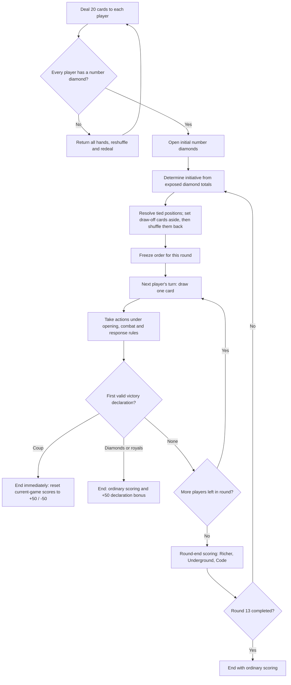
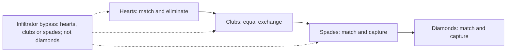
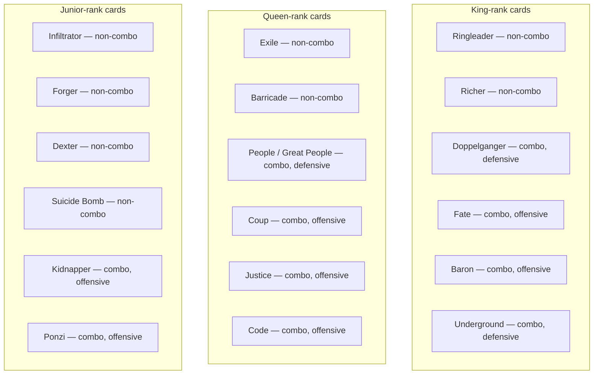

# CGMS (Card Game Mafia State) — Second Draft

This previous draft is retained for reference. Continue rule updates in [GAME_RULES.md](../../project/GAME_RULES.md). This version consolidates the agreed rules from the [first draft](FIRST_DRAFT.md); its rules are preserved here as history. Decisions, explanations, and historical design questions are recorded separately in the [change notes](../../../CHANGELOG.md).

## Table of Contents

- [0. Structure & Definitions](#0-structure--definitions)
- [1. Setup and Basics](#1-setup-and-basics)
  - [1.10 Round Flow — Illustration](#110-round-flow--illustration)
- [2. Play and Card Rules](#2-play-and-card-rules)
  - [2.7 Attack Order — Illustration](#27-attack-order--illustration)
  - [2.8 One Combat Procedure](#28-one-combat-procedure)
  - [2.9 Instant Effects & Response Order](#29-instant-effects--response-order)
- [3. Card Reference](#3-card-reference)
  - [3.1 Combos — Illustration](#31-combos--illustration)
  - [3.2 Combos](#32-combos)
  - [3.3 Non-Combo Cards](#33-non-combo-cards)
  - [3.4 Special Cards — Aces](#34-special-cards--aces)
  - [3.5 Numbers (Suits)](#35-numbers-suits)
- [4. End Game and Scoring](#4-end-game-and-scoring)
  - [4.2 Debt and Automatic Repayment](#42-debt-and-automatic-repayment)
- [5. Notes for Coding](#5-notes-for-coding)

---

## 0. Structure & Definitions

- **Turn**: one player's actions.
- **Round**: every player takes one turn, in the order fixed at the start of that round.
- **Game**: ends at round 13 or upon the first valid declaration of Coup, 13 number diamonds, or 15 royals.
- **Match**: the sequence of games whose scores are totalled to determine the overall winner; at least three games are recommended.
- **Historical suit opening**: a record that a player has opened a particular number-card series at least once in the current game. Losing those cards does not erase that record.
- **Currently open series**: a number-card series presently on the table under the player's control. Historical opening alone does not satisfy a requirement for two currently open series.

## 1. Setup and Basics

### 1.1 Players, Equipment, Match Structure

Use two decks without jokers, three or four players, and a scoreboard. A game lasts at most 13 rounds. The highest cumulative score across the match determines its winner.

### 1.2 Winning Conditions

A player may declare an ordinary victory when they control at least 13 number diamonds or at least 15 royals and have opened all four number-card series at least once during the game. Alliances never pool cards for this purpose.

The first valid victory declaration ends the game. Holding the required cards without declaring does not reserve victory. Coup must be declared before another player's valid diamond or royal victory declaration; it cannot overturn a game that has already ended. Ordinary victory declarations are checked after an action and its responses have resolved, using the resulting holdings. Coup is the immediate exception described below.

For an ordinary victory, everyone scores normally and the declaring player receives a one-time +50 trigger bonus. The bonus belongs to that player; sharing rewards with an ally is voluntary. The highest cumulative match score still determines the match winner.

**Coup:** a player with the required queens who has opened their Clubs series may declare Coup, even outside their turn. Coup does not require two currently open series or a history of opening all four suits. It resolves immediately without a response window and cannot be countered, including by Confinement. Its owner wins that game. Coup replaces current-game scoring with +50 for its owner and −50 for each affected opponent, except defeated or quit players. Earlier current-game points are not counted for anyone; there is no ordinary end-game card scoring or additional threshold bonus. Scores from completed games remain in the match total, and unpaid debts survive; see [4. End Game and Scoring](#4-end-game-and-scoring).

### 1.3 Card Opening Types

There’re mainly two types of cards opening: combo and series (aces are special card uses). Combos are unique combinations of cards like twins or four types. While they act like game changers, number card series (just series from now on) are your stamina in either wars or economics. There are also non-combo cards that you can use flexibly.

### 1.4 Deal, Turn Order & Draw

Deal 20 cards to each player at the beginning of a game. If any player has no number diamonds, return every player's entire hand to the deck, reshuffle, and redeal all hands. Repeat until every player has at least one number diamond. This is an initial-deal rule, not a mid-game redeal when a player later loses diamonds.

Players simultaneously open their initial number diamonds. At the beginning of each round, determine turn order from the sum of exposed diamond values, highest first. Tied players draw number cards to break ties, with the highest drawn number acting first; non-number draws do not determine initiative. Repeat the draw-off among any players still tied. Set aside all draw-off cards, including non-number draws, until all positions are resolved, then shuffle them back into the deck.

Freeze that order for the whole round, even if diamond holdings change. Each player takes one turn and draws one card at its start. Recalculate the order at the beginning of the next round.

Captured diamonds must immediately be added openly to the owner's series. Adding diamonds drawn later is optional. Additional draws are possible through payments or combos. Drawn cards may be kept for later use; normally they can be used only on the owner's turn, subject to the specific out-of-turn permissions for aces, Coup, and Ponzi.

### 1.5 Deck & Reshuffling

The deck isn’t mixed or rejoined with discarded cards during a round unless it’s run out; so, it’s only when it runs out that all the other discarded cards can it be joined, shuffled, so a new deck is made; however, some cards should immediately return to deck after their use; when this’s the case, it’s up to players to place them somewhere in the deck or shuffle it as they like.

### 1.6 Opening Series vs. Combos

On your turn, choose one opening action: **open one new number series, or open/reconfigure one combo**. You cannot open your second number series and a combo in the same turn. Existing combos may still function and be used according to their own requirements and limits. Multiple combos may remain active at the same time.

Normally, opening and using combos requires two number series currently open; the two-series prerequisite also applies to aces. Historical opening of two suits is not enough. Losing a series does not remove already opened combo cards from the table, but requirements for using an ability still apply.

**Underground is the only combo that grants a waiver of the two-open-series prerequisite for opening and using other combos.** It can itself be opened without two series already open. Its owner may open or reconfigure any number of combos and use them immediately on their turn, except that Doppelganger's assigned role remains fixed. This waiver concerns combos; it does not waive ace prerequisites or the four-suit history needed for ordinary victory. Offensive and defensive enabling-suit requirements remain applicable as described in [2.1](#21-combos-need-hearts-or-clubs-to-function). Coup has its own Clubs-only declaration requirement; it does not grant a waiver to other combos.

You may take combos back on your own turn. Number series, or any part of them, cannot be taken back. When first opening a number series, put all numbers of that suit you hold on the table. You may add number cards acquired later. Non-combo cards may be added to an open series and used according to their individual timing rules; they cannot be taken back, though their rules may allow sacrifices or other uses.

Track all four suits' historical opening separately from the series currently open. Historical opening qualifies ordinary victory; current openings qualify actions.

### 1.7 Attacking, Trading & Interacting on Your Turn

Ordinary club attacks on your turn require at least two number series currently open, including an exposed Clubs series. Attacks made through combos follow their own eligibility, including Underground’s waiver for other combos. Each physical club card may participate in only one ordinary attack during your turn. Unused clubs may attack the same or a different opponent; using some clubs does not exhaust the entire series. Each attack must follow the attack order independently.

Other combos, non-combo cards, and special cards retain their own activation limits and the general once-per-turn usage limit where applicable. Responding to an attack does not grant permission to initiate an ordinary attack outside your turn. Aces and other named instant effects have their stated out-of-turn permissions.

During your turn, you may trade with other players and use acquired cards as allowed, including against the seller. Other players wait for their own turns to initiate trades with the rest of the table. Open cards cannot normally be traded; Underground provides its stated exception.

### 1.8 Alliances & Collaboration (Informal)

Players may negotiate, collaborate, and agree with an offender to remove penalties. Temporary cooperation can help weaker players challenge a stronger opponent, but promises about sharing rewards are not mechanically enforced.

Accepting a combo loan forms a permanent alliance for that game, as specified in [2.4](#24-what-counts-as-an-alliance). An alliance grants no pooled score, pooled victory threshold, or automatic protection. Its members cannot use Coup or Ponzi.

The higher-scoring partner decides what to do with their rewards, unless scores are equal. A promised split is a social agreement rather than an automatic allocation. The digital game's trust/reputation features can record whether promises were honoured.

### 1.9 Quitting or Resigning

Any player has the option to quit the game before a round starts; they put their cards back to the deck, lose all the points collected, and should wait until the next game to be able to be in again. This doesn’t affect the cards that you’ve given to the service of other players. Similar can happen if all agrees to resign when the game comes to a deadlock; in that case, the game is nullified, and nothing is recorded. If a player doesn’t want to resign but also can’t start a meaningful attack or trade because of the lack of powerful cards, then they’re simply applied regular game rules; usually, they wait for something to happen or try this and that.

### 1.10 Round Flow — Illustration

The declaration check applies throughout play, not just at the end of a turn or round. Coup takes effect immediately on a valid declaration; ordinary declarations use completed action/response results. Existing debts remain separate from the game-ending score calculation.

## 2. Play and Card Rules

### 2.1 Combos Need Hearts or Clubs to Function

Defensive combos require at least one exposed number heart; offensive combos require at least one exposed number club. Royals do not satisfy these enabling conditions. Losing the enabling number suit stops the corresponding combo abilities, subject to explicit lasting effects such as Code's economic rules. Coup follows its own requirement of having opened Clubs and its immediate declaration rule.

Underground waives the two-open-series requirement for other combos, not their required Hearts or Clubs support. Combo members remain vulnerable to kidnapping and assassination unless protected by Great People.

### 2.2 Using Aces & Non-Combo Cards

To respond to an enemy attack or support yours, you can use aces whenever you like during a round; but, you need to wait your turn or be under attack to use some of non-combo cards; therefore, some cards had better be held in hand till the right time comes. Don’t forget that once you put non-combos in series, you can’t take them back in your hand.

### 2.3 Lending Combos to Allies

If you agree, you may offer your combos to help others, which you can do whenever it's your turn or theirs. However, don't forget that doing this usually requires a deal and mutual trust because your opponent may declare their victory thanks to you either by catching up with 15 or 13, and they've got the option to share nothing with you.

### 2.4 What Counts as an Alliance

Giving and accepting a combo loan is an explicit alliance agreement for the rest of that game. Free individual-card exchanges, ordinary trades, help, and promises alone do not create an alliance. Returning the loaned cards does not end the alliance.

A lender may ask for cards back, but the recipient may return or keep them. Only the recipient controls and uses the loaned combo and its features, including the ability to lose its cards. A card counts toward victory for whoever currently controls it; allies never pool their counts and have no separate alliance victory.

Alliance membership disqualifies Coup and Ponzi. Reward-sharing promises remain voluntary.

### 2.5 Combat Basics — Clubs & the Rule of Even

Attacks are made with clubs (attack points or simply trumps). So, the more clubs, the more kills; you capture or eliminate only number cards.

There’s the rule of even meaning that you need to match enemy points with yours evenly. For example, if you use clubs of 3, 5, 8, and 10 (26 points in total), then you need to be able to match minimum 26 points of hearts or spades depending on the type of card series you try to attack. Your enemy’s total points can be higher than 26 but not lower. In some cases, your opponents may be left with the lowest numbers like 2 or 3, which can help them evade your attack if you don’t have those exact numbers or a joker of number (closed ace) to replace them. It’s up to attackers to pick up which card they want to attack if the rule is intact, e.g., they can either get “10, 7, 6, 3”, or “9, 9, 6, 2” from enemy to meet 26 points.

### 2.6 Attack Order

Unless you’ve got the junior of clubs in your series, you can attack your opponents’ card only in such order as hearts, clubs, spades, and diamonds (each series should be finished off to pass to the next):

Firstly, you eliminate hearts by simply matching them with the exact number of your clubs (you don’t capture but eliminate because numbers of hearts always go to the deck). However, if your opponents have got queen of hearts in that series, you may need to spend your clubs.

Secondly, clubs to clubs; this, however, eliminates from both parties equally, and the battled clubs from both sides return to the deck following balance rule.

Thirdly, you can capture their spades and diamonds by following the same balance rule with hearts and clubs.

Namely, except enemy clubs, you don’t need to spend a card to capture. Opponents may prefer to pay to counter your attack, though, which they can do only if they have the junior of spades.

### 2.7 Attack Order — Illustration

Each arrow indicates target order, not permission to reuse the same club cards.

### 2.8 One Combat Procedure

1. On your turn, choose one opponent and one legal target suit, respecting attack order and Infiltrator's restriction against bypassing directly to diamonds.
2. Choose any subset of your exposed clubs that has not participated in another attack this turn; the whole Clubs series need not be committed.
3. Declare those clubs face up and the intended attack.
4. Resolve permitted responses using [2.9](#29-instant-effects--response-order), including the defender's applicable Forger, Barricade, Suicide Bomb, and ace effects.
5. Check that the attack is still legal and that the selected attacking and defending totals match exactly under the rule of even.
6. Resolve capture or elimination according to the target suit and response effects. Mark the participating physical clubs as used for this turn. A club being used is distinct from being returned to the deck: only effects that require an exchange or payment remove it.
7. Unused clubs may make a further attack on the same or another opponent. Check attack order again before that attack. A suit is cleared when its number cards are gone; royals or non-combo cards left behind do not reopen it.

### 2.9 Instant Effects & Response Order

**Coup and victory declarations:** a valid Coup resolves immediately, with no response window. It may be declared outside its owner's turn, but never after a valid ordinary victory declaration has ended the game. The first valid victory declaration wins this race; ordinary turn/seat priority does not delay Coup. Coup cannot be nullified by Confinement or any other response.

For other actions and instant effects:

1. Declare one action. Finish that action and its permitted responses before starting an unrelated action, subject to Coup's immediate exception.
2. Each other player has one opportunity to make a permitted response or pass, in seat order starting to the declarer's left. This does not grant new powers to cards that cannot respond in that situation.
3. Resolve each response immediately. A response does **not** open another response window. Later players respond to the original action as it now stands. If it has been canceled, there is no pending action left to respond to and its window ends.
4. If the action survives all responses, resolve it. Check ordinary victory eligibility using the resulting holdings, after the window closes. A threshold victory must be declared; merely possessing the cards is not a prior declaration.
5. For competing ordinary action declarations, the active player has priority; otherwise follow turn order among players legally able to declare. This priority does not override the first-valid-victory-declaration rule or Coup's immediate exception.

**Confinement:** as a permitted response, it cancels the pending action outright, including Ponzi, but never Coup. Its owner may protect themself or another player, including an ally. The confined player's turn ends immediately; they take no further actions that turn, and play passes to the next player. The confined player is invulnerable to attacks while confined.

**Example:** Alice declares Ponzi. Bob responds with Confinement to protect its target. Confinement resolves immediately and cancels Ponzi; there is no second response window in which to counter Bob's response. If Bob passes instead, Carol gets her response opportunity, then Ponzi resolves if it was not canceled. A valid Coup declaration ends the game immediately instead of waiting through this sequence.

## 3. Card Reference

### 3.1 Combos — Illustration

### 3.2 Combos

| Combo | Cards Required | Type | Effect |
|---|---|---|---|
| **Doppelganger** | Any two kings | Defensive | They can be used as a joker to replace any card but it can be used in combos only. Unless it’s kidnaped or assassinated, its role is permanent throughout the entire game. They must be kept open on the table once they’re determined (it’s recommended to write down their role once determined). |
| **Fate** | 4 different kings | Offensive | Basically, start over for the opponent. It makes an opponent merge all their cards in the deck and draw the same number of cards (the same early game rules apply to them). If there’re less cards than theirs in the deck, it should be reshuffled with discarded cards included, else only theirs and the deck are mixed. One of the kings returns to the deck after use, and you should put it in the deck before shuffling. |
| **Baron** | Any twin kings + king of diamonds | Offensive | One opponent series can be captured or eliminated without exact matching if the sum of your clubs is higher than that series. Once per round; attack order still applies unless Infiltrator permits bypassing it. You can eliminate Suicide Bomb without a cost, but cannot attack its protected series again during the same round. If Forger responds, the regular balance rule applies and Baron loses its special strength for that attack. |
| **Underground** | 5 or more kings | Defensive | You may open Underground without two number series already open. It is the only combo that lets you open and use other combos without the normal two-open-series prerequisite. On your turn, open or reconfigure any number of combos and use them immediately, except that Doppelganger cannot change its assigned role. Required Hearts/Clubs support still applies. You may trade open cards except aces on your turn or when others interact with you. At round end, gain 10 points with at least 5 kings, plus 1 for each king above 5. Falling below 5 kings stops all this income; previously earned points and the other Underground benefits remain. Income resumes when you again have at least 5 kings at round end. |
| **People / Great People** | Twin queens of hearts (called *Great People* if formed with Doppelganger) | Defensive | The combo is unique; it can protect other combos, except for Suicide Bomb, providing invulnerability to kidnaps and assassinations unless it’s made with Doppelganger (it’s called Great People if it’s formed with the twin queens). You can protect clubs, spades, and diamonds but hearts. If you protect clubs, you can’t use them to attack. |
| **Coup** | Both queens of diamonds and both queens of hearts | Offensive | Having opened Clubs is sufficient series eligibility; two currently open series and all-four-suit history are not required. You cannot use it while allied or form it with Doppelganger. Declare at any time before another valid victory declaration ends the game. Coup resolves immediately without responses and cannot be countered, including by Confinement. Its owner wins the game. Discard all earlier current-game scoring for everyone: the owner scores +50, affected opponents score −50, except defeated or quit players. Do not add ordinary end-game card points or a threshold bonus. Existing unpaid debts survive; the −50 obligation is owed to the system. |
| **Justice** | Four different types of queens | Offensive | You can get one card you choose from each opponent; you can pick closed or open cards of opponents, except for open special cards. Each card you capture should be different; so, you can’t capture more than one ten, one ace, one king and so on. One of the queens returns to the deck after use. |
| **Code** | 5 or more queens | Offensive | Set opponents’ per-number-diamond scoring bonus from 1 to 10 (default 5); optionally set their normal deck-purchase price from 5 to 10 spade points. Your own values remain the defaults. These economic settings last for the game even if the combo breaks. Only a later declared Code can replace or reverse them. There may be only one governing Code on the table: declaring a new Code nullifies the previous one, including its settings and recurring penalty; the newest owner and settings govern, with no stacking. Nullification does not itself discard the former owner’s physical cards. Enemies also lose 5 points at round end while the current Code is intact and functioning. Uncovered deductions become debt to the system. |
| **Kidnapper** | Any twin juniors | Offensive | Once during your own turn, steal a randomly selected closed ace or royal from an opponent and use it immediately. If they have any eligible closed cards, you must select randomly from those cards; neither player chooses the result. Only if they have no closed aces or royals may you choose an open card instead, excluding open aces and respecting kidnapping protection. Tabletop players honestly report and present eligible closed cards without revealing their identities beforehand. When open-card theft is allowed, you may steal Doppelganger: return Kidnapper to the deck, reassign Doppelganger, and nullify the combos relying on its former role. Its former owner owes you 10 points. Transfer whatever points they can pay now; any shortfall is player debt. You receive the outstanding points only when they are automatically repaid from the debtor’s later earnings, per [4.2](#42-debt-and-automatic-repayment). |
| **Ponzi** | Both jacks of clubs and both jacks of spades | Offensive | When it resolves, transfer one opponent’s available positive current-game points to your score once. It takes no previous-game points or future earnings, including later end-game awards. There is no minimum-score targeting restriction: you may target a player with a low, zero, or negative score. A small positive balance yields only that amount; zero or negative points yield nothing and create no debt or future claim. The combo cards return to the deck after use. You cannot use it while allied or form it with Doppelganger. It may be declared outside your turn, subject to normal eligibility requirements. Confinement can cancel it in the response window. |

### 3.3 Non-Combo Cards

| Card | Requirement | Effect |
|---|---|---|
| **Ringleader** | The king of diamonds | Sacrifice it to gain 10 points. A player can’t sacrifice more than one Ringleader throughout a game. You should take it out from your series (you can’t sacrifice it from a combo). The card is discarded after use. This card is active and ready to use once you’re able to place them in a series in your turn. |
| **Richer** | Any non-diamond king | Each single king in a series gets you 2 points in each round (you can’t have more than one king in a series for Richer to work), and you get points at the end of the round, and you need at least one number card attached to Richer to get the points. You can draw 2 cards if you sacrifice it from your series (you can’t sacrifice it from a combo), and you can use them in the same turn. You can’t sacrifice more than one Richer in a round. All the cards that are sacrificed are discarded, so is Richer. This card is active and ready to use once you’re able to place them in a series in your turn. |
| **Exile** | Queen of clubs | It helps overcome opponent Barricade and saves you spending clubs in cases they’ve got the queen of hearts. It can be used only once during a round. This card is active and ready to use once you’re able to place them in a series in your turn. |
| **Barricade** | The queen of hearts | Your enemies should exchange their clubs with your hearts (like clubs to clubs) following the balance rule unless they have the same type of queen or Exile. You can sacrifice it to merge 5 cards of yours in the deck and draw 5 cards (you can’t sacrifice it from a combo). What’s drawn from the deck can’t be used until the next round begins. The card is discarded after use. This card is active and ready to use once you’re able to place them in a series in your turn. |
| **Infiltrator** | Junior of clubs in the same series | You’re free to start attacking any card series of your opponent except diamonds without obeying attack order. The card goes to the deck after use. This card is active and ready to use once you’re able to place them in a series in your turn. |
| **Forger** | Junior of spades in the same series | You can make your opponent negotiate and buy your spades when they attack any of your card series. The balance rule is followed if your spades meet their attack points; else they must accept the amount available. You can’t negotiate more than one player during a round, and the card goes to the deck after use. This non-combo is unique. You can use this card while under attack (your turn isn’t required as it’s with other non-combos). You must have already opened a spades series to use it. |
| **Dexter** | Junior of diamonds in the same series | If the sum of diamonds points is 20 and higher, you can assassinate any royal card of your opponent except the ones protected by Great People. If your diamonds cards sum is 10 and lower, you’re invulnerable to any ace card attacks. You should be able to give the deck one diamonds card for each assassination. You should exchange one diamonds card of yours with the deck for each defend of an ace attack, else you’re vulnerable to the attack. All the assassinated cards are discarded. This card be used once during the round. This card is active and ready to use once you’re able to place them in a series in your turn. |
| **Suicide Bomb** | Junior of hearts in any series | It protects any series from the attacks; opponents must eliminate it first to start attack. It can be killed with 5 or more points; however, after its sacrifice, the series can’t be attacked any more by anyone during the round. The card is still open to be kidnapped or assassinated. The card is discarded after use. This card is active and ready to use once you’re able to place them in a series in your turn. |

### 3.4 Special Cards — Aces

Aces aren’t held in hand; they can’t be attacked but kidnapped. You place them closed, separated from other cards. Used aces are discarded except the ace of hearts (Compensation), which stays open until the game ends, and the ace of spades (Inflation), which stays open until its removal condition is met. They can be opened and used only once during any time in a round; to use them doesn’t require your turn to come. They can be kidnapped which is valid only if they’ve not been opened yet. They can be used in wars or trades if they’ve not been used/exposed, and they’re discarded after use. If the card is exposed somehow before the use, it’s discarded; so, it’s important not to discuss it plainly, and players should be cautious not to open them mistakenly.

All of them are non-combo; they can be used also as any number (sort of a joker of numbers). You can’t use more than one ace card during a round including trades or exchanges. If this’s the case, using them doesn’t gain anything; besides, if they’re used as the joker of numbers, they should be used as closed, and their role shouldn’t be exposed—otherwise, the card is wasted.

| Ace | Suit | Effect |
|---|---|---|
| **Confinement** | Diamonds | May be played outside your turn before a pending action finishes. As a response, it cancels that action, including Ponzi, but cannot stop Coup. It may protect its user or another player. The confined player takes no further actions that turn, their turn ends immediately, and they are invulnerable to attacks while confined. Follow [2.9](#29-instant-effects--response-order). |
| **Advancement** | Clubs | If used during offence +10 points (applies to clubs), if defense, +10 points in defense (applies to hearts). |
| **Inflation** | Spades | It cuts half the value of your opponent’s spades. They should keep it open in front of them, and their spades are half in value until they make a trade of 20 spades points or more with a trader or the deck. The card is discarded after your opponent has made a trade that’s equivalent to 10 spade points, which actually means that they should make a trade of 20 spades points (20/2 = 10) to be able to remove the penalty. |
| **Compensation** | Hearts | You can draw a card from the deck for each 5 cards you lose in any series. You can use only one throughout the game. |

### 3.5 Numbers (Suits)

| Suit | Role | Effect |
|---|---|---|
| **Diamonds** | Victory, priority, points | Diamonds is the most important card type of numbers. Controlling 13 or more number diamonds permits an ordinary victory declaration if all four suits have previously been opened. It’s also critical if you’d like to preserve your priority in making moves. Keep them under your control through the game’s end to score them at an ordinary ending; Coup awards no diamond points. Each piece of diamonds (only numbers, royals aren’t counted) is 5 game points in default (which can be increased or decreased, down to 1, by Code) + the number itself. Three (3) of diamonds is equal to 8 game points, in default, for instance. |
| **Spades** | Money, points | Payment can be made with numbers of spades only. You can buy a card from the deck for 5 or more spade points, meaning that you can draw only one card for 5 points of spades or 9 of spades while you can draw two cards with ten of spades. 5 is the default value, Code can change this up to 10. You should put your spades in the deck, shuffle, and draw your purchased cards only afterwards. Royals of spades are unique; each are equivalent to 10 points (their value can’t be changed by Code) if you keep them until an ordinary game ending; Coup awards no spade-royal points. Closed aces can’t be used as currency. |
| **Hearts** | Defense | They’re your units of shields to stand against an opponent’s attacks. You need at least one card of hearts to be able to use your defensive abilities. The number of hearts can’t be captured but eliminated, so they always go to the deck. |
| **Clubs** | Offence | Your armory to attack your opponents; they can be considered like trump cards in another games. Offensive abilities require a number club, except that Coup follows its separate declaration requirement. You get 3 points for each card you use to eliminate enemy clubs (defender enemy doesn’t get points). You don’t get points if you attack with Baron. |

---

## 4. End Game and Scoring

A game ends at round 13 or with the first valid declaration of Coup, 13 number diamonds, or 15 royals. Ordinary threshold declarations require the declaring player to have opened all four suits historically, and only that player's controlled cards count.

An ordinary game ending retains earned points and adds the applicable end-game card scores. An ordinary threshold declarer also gains the one-time +50 bonus.

**Coup replaces this calculation.** Ignore everyone's earlier current-game scoring, including earlier earnings and transfers. Assign +50 to the Coup owner and −50 to each affected opponent, keeping the existing defeated/quit exclusions. Do not add diamond points, spade-royal points, or an ordinary threshold bonus. Coup's +50 is a new award and follows the debt-repayment rules like any other receipt. Its opponents’ −50 is a system obligation. Completed-game match scores and unpaid debts are not erased.

The highest cumulative match total determines the overall winner. Track score changes and outstanding obligations so the same debt is not deducted twice: the debt ledger enforces the obligation already recorded, rather than imposing a second penalty.

### 4.1 Scoreboard

| Scoring Source | Points | Rule |
|---|---|---|
| **Ordinary victory declaration** | +50, once | Awarded to the eligible 13-diamond or 15-royal declarer. Rewards are not automatically shared. No such bonus applies to Coup. |
| **Ringleader** | +10 | Sacrifice once per player per game. |
| **Richer** | +2 per eligible king / round | Awarded at round end under Richer’s conditions. |
| **Underground** | +10 / round, +1 per king above 5 | Awarded at round end only with at least 5 kings. Below 5, income stops; other benefits remain. |
| **Coup** | +50 owner / −50 per affected opponent | Replaces earlier current-game scoring; no ordinary end-game card awards. Existing debts remain separate and survive. |
| **Code** | −5 / round per enemy | Only the latest governing Code applies; recurring loss needs the combo intact and functioning. Unpaid loss is system debt. |
| **Kidnapper takes Doppelganger** | 10 owed to Kidnapper’s owner | Credit only actual payments. Any unpaid remainder is player debt, paid automatically from later receipts. |
| **Ponzi** | One-time transfer | Takes available positive points earned so far in the current game, with no future claim. Zero/negative targets yield zero. |
| **Diamonds** | Default +5 + face value per number card | At ordinary game end; Code can change the per-card bonus. No award at a Coup ending. |
| **Spade royals** | +10 each | At ordinary game end; no award at a Coup ending. |
| **Clubs used against enemy clubs** | +3 per attacking club card | Awarded immediately to the attacker, not the defender. Baron grants no combat points. |

### 4.2 Debt and Automatic Repayment

Every unpaid obligation records the debtor, the creditor (the system or a named player), the outstanding amount, and when it arose. Scores may be negative; changing games does not forgive unpaid debt.

- **System debt:** unpaid penalties such as Code’s deductions and Coup’s −50 obligation are owed to the system. Repayment reduces the obligation without awarding points to another player.
- **Player debt:** for example, kidnapping Doppelganger creates a 10-point obligation to Kidnapper’s owner. Pay what is available immediately and record the unpaid remainder. The creditor does not score an unpaid promise.
- **Automatic repayment:** whenever a debtor receives points, apply those points to the oldest outstanding debt first, regardless of creditor. Continue to the next debt if points remain; the debtor keeps only the remainder after obligations are paid. Actual payments to a player are credited at payment time and are themselves receipts subject to that player’s debts.
- **Coup and debt:** a current-game score reset does not cancel any unpaid system or player debts. Apply the Coup scoring result without charging existing debts again. Resetting scores does not reverse completed debt settlements.
- **Bookkeeping:** record each obligation and each actual repayment once. Reducing an already-recorded negative obligation is repayment, not another subtraction of the same amount. An unpaid player receivable is not spendable or scored income for its creditor.

**Recorded score versus available points:** charge the debtor the full obligation once when it arises. Pay what is available and record any shortfall as debt; credit a player creditor only for what is paid. Record later gross earnings as positive score entries, even when those earnings are immediately allocated to repay debt. Because the obligation was already charged, automatic repayment does not create another negative score entry for the debtor. Allocated points are no longer available to spend or to lose through Ponzi. Thus recorded current-game earnings, available points, and outstanding debt are distinct values.

If Coup removes a current-game score entry for a debt that is still unpaid, retain the outstanding amount as a separate carried debt adjustment exactly once. Do not recreate the paid portion. A debt whose negative entry is already retained in a completed-game total gets no additional deduction. Coup’s own −50 entry already records its new system obligation and must not be deducted a second time.

| Accounting example | Recorded scores | Actual payments and debt |
|---|---|---|
| Game 1 ends with Coup: affected player had no other debt | Game 1 result −50; match total −50 | System debt 50; no second −50 ledger charge. |
| That player earns 50 in Game 2 | Game 2 records +50; match total becomes 0 | All 50 pays the system debt; outstanding debt and available points both become 0. |
| A player starts at 0 and owes another player 10 for Doppelganger | Debtor records −10; creditor records 0 until paid | Player debt 10. |
| The debtor then earns 6 | Debtor records +6, bringing their total to −4; creditor records +6 on receipt | 6 is transferred; 4 remains owed. Do not deduct another 6 from the debtor’s score. |
| Coup resets a game in which an affected opponent still owes 4 to another player | Coup result −50, plus carried unpaid adjustment −4; total effect −54 | Preserve player debt 4 and add system debt 50. Neither obligation is charged again. |

**Player-debt example:** a player with no points loses Doppelganger and owes its kidnapper 10. The kidnapper receives 0 initially. The debtor next earns 6: all 6 go immediately to the kidnapper, leaving 4 owed. When the debtor earns another 8, the kidnapper receives the remaining 4 and the debtor keeps 4, assuming no other debts.

**Multiple-debt example:** a player owes the system 5 from an older penalty and another player 10 from a later theft. An 8-point receipt first pays the system 5, then pays the player 3; 7 remains owed to that player. If the player debt were older, it would be paid first.

## 5. Notes for Coding

Implement separate state for suit-opening history, currently open number series, per-physical-club usage, and combo opening/reconfiguration allowances. Underground’s waiver and Coup’s declaration requirement must be checked explicitly.

Record valid victory declarations in order. Close the game on the first valid declaration; a later Coup cannot overturn it. Coup is immediate and bypasses the ordinary response sequence. Other actions use one response opportunity per other player in seat order, with immediate response resolution and no nested windows.

For Kidnapper, check whether the target has closed aces or royals and select randomly from them. Otherwise let the acting player choose an eligible open card. Enforce the existing turn limit and protections without exposing unselected closed cards.

Track one governing Code. A later declaration replaces its owner and settings; breaking its cards does not clear the persistent settings. Separately check eligibility for its round-end penalty.

Maintain system and player debt records with creation order. Automatically allocate every point receipt to the debtor’s oldest outstanding obligation, crediting a player creditor only for amounts actually received. Preserve unpaid obligations across games and Coup resets, without double-counting negative scores. Tabletop play uses the same accounting honestly; the digital game enforces it.

In Flutter, player profiles include their name, trust, anyhoo, scam, and number of games played. During gameplay, display possible end-game points for bargaining. If a winner meets an agreed amount, trust increases; if they offer at least 40%, anyhoo increases; if they make another offer and it is rejected, scam increases.
