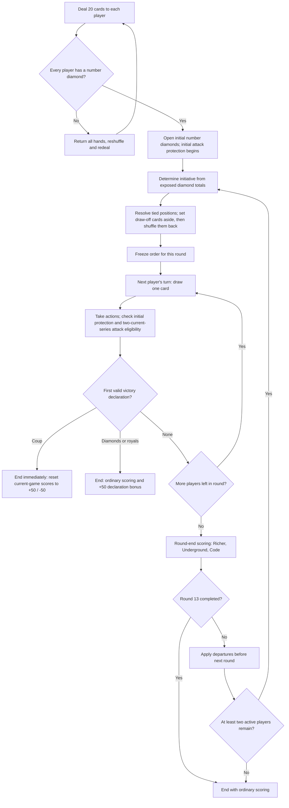
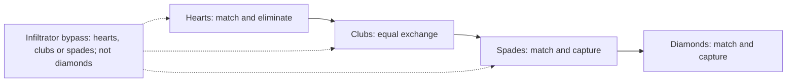
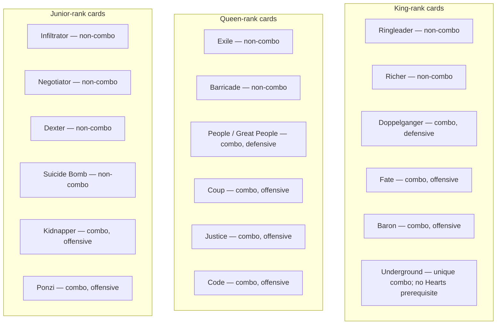

# CGMS (Card Game Mafia State) — Game Rules

The canonical CGMS rules, finalized on 2026-09-28 with the accepted Q01–Q12, F01–F10, N01–N07 and T01–T03 decisions. The ability schedule, acquisition/visibility tables, transaction procedures and financial lifecycle are normative. The [decision and scenario register](../design/RULES-IMPLEMENTATION-QUESTIONS.md) maps them to implementation and test obligations; the [change notes](../../CHANGELOG.md) record adoption history. Earlier [drafts](../design/drafts/README.md) and [reviews](../reports/README.md) are historical evidence. Finalizing these rules does not establish implemented or tested gameplay.

## Table of Contents

- [0. Structure & Definitions](#0-structure--definitions)
- [1. Setup and Basics](#1-setup-and-basics)
  - [1.10 Round Flow — Illustration](#110-round-flow--illustration)
- [2. Play and Card Rules](#2-play-and-card-rules)
  - [2.7 Attack Order — Illustration](#27-attack-order--illustration)
  - [2.8 One Combat Procedure](#28-one-combat-procedure)
  - [2.9 Instant Effects & Response Order](#29-instant-effects--response-order)
  - [2.10 Negotiator Resolution](#210-negotiator-resolution)
  - [2.11 Protection and Doppelganger](#211-protection-and-doppelganger)
  - [2.12 Ability Lifecycle and Costs](#212-ability-lifecycle-and-costs)
  - [2.13 Acquisition and Visibility](#213-acquisition-and-visibility)
  - [2.14 Restricted Cards](#214-restricted-cards)
  - [2.15 Trade and Loan Proposals](#215-trade-and-loan-proposals)
  - [2.16 Deck Purchases](#216-deck-purchases)
- [3. Card Reference](#3-card-reference)
  - [3.1 Combos — Illustration](#31-combos--illustration)
  - [3.2 Combos](#32-combos)
  - [3.3 Non-Combo Cards](#33-non-combo-cards)
  - [3.4 Special Cards — Aces](#34-special-cards--aces)
  - [3.5 Numbers (Suits)](#35-numbers-suits)
- [4. End Game and Scoring](#4-end-game-and-scoring)
  - [4.2 Debt and Automatic Repayment](#42-debt-and-automatic-repayment)
  - [4.3 Promises and Reputation](#43-promises-and-reputation)
  - [4.4 Financial Lifecycle](#44-financial-lifecycle)
- [5. Notes for Coding](#5-notes-for-coding)

---

## 0. Structure & Definitions

- **Turn**: one player's actions.
- **Round**: every player takes one turn, in the order fixed at the start of that round.
- **Game**: ends at round 13, upon the first valid declaration of Coup, 13 number diamonds, or 15 royals, or when departures leave fewer than two active players. Unanimous resignation instead nullifies the game.
- **Seat order**: fixed numbered seats assigned at game setup; “left” follows that cyclic order. Round initiative may change, but seat numbers do not.
- **Number card**: a printed rank from 2 through 10. Royals are jacks (also called juniors), queens and kings. Every card has its own physical identity, including the two copies in the double deck.
- **Match**: a fixed, visible number of financially finalized, non-nullified games, chosen before play; default three. Cumulative score determines rank; equal totals share a rank. A nullified game does not consume a game slot.
- **Historical suit opening**: a record that a player has opened a particular number-card series at least once in the current game. Losing those cards does not erase that record.
- **Currently open series**: a number-card series presently on the table under the player's control. Historical opening alone does not satisfy a requirement for two currently open series.
- **Initial attack protection**: a player cannot be attacked until they have first opened a second distinct number-card series in the current game. This protection ends permanently at that opening; losing a series later does not restore it.

## 1. Setup and Basics

### 1.1 Players, Equipment, Match Structure

Use two decks without jokers, three or four players, and a scoreboard. A game lasts at most 13 rounds. Set the visible game count before the match starts (default three); it cannot change during that match. The highest cumulative score after that many financially finalized games determines the match winner or shared winners. Distinguish the ordinary threshold declarer, the Coup game winner, the highest-scoring player in an ordinary game, and the cumulative match ranking: these need not identify the same person.

### 1.2 Winning Conditions

A player may declare an ordinary victory when they control at least 13 number diamonds or at least 15 royals and have opened all four number-card series at least once during the game. Alliances never pool cards for this purpose. Hidden cards under the declarer's control count as well as exposed cards; count every physical card once. Cards restricted by Barricade still count toward these possession thresholds; they cannot be actively used for Coup before availability under §2.14. Doppelganger contributes its two physical kings to the royal count, with no extra virtual card. The declarer publicly reveals enough qualifying cards to prove the chosen threshold; historical openings must also be verified. In the digital game, the server validates privately first and rejects an invalid claim without publishing its cards. At a physical table, an invalid claim does not end the game, but information voluntarily revealed remains known. A victory claim creates no response window.

The first valid victory declaration ends the game. Holding the required cards without declaring does not reserve victory. Coup must be declared before another player's valid diamond or royal victory declaration; it cannot overturn a game that has already ended. Ordinary victory declarations are checked after an action and its responses have resolved, using the resulting holdings. Coup is the immediate exception described below.

For an ordinary victory, everyone scores normally and the declaring player receives a one-time +50 trigger bonus. The bonus belongs to that player; sharing rewards with an ally is voluntary. The highest cumulative match score still determines the match winner.

**Coup:** a player with the required queens who has opened their Clubs series may declare Coup, even outside their turn. Coup does not require two currently open series or a history of opening all four suits. It resolves immediately without a response window and cannot be countered, including by Confinement; a player already confined may declare a legal Coup. Its owner wins that game. Coup replaces current-game scoring with +50 for its owner and −50 for each affected opponent, except defeated or quit players. Earlier current-game points of active participants are replaced; departed players retain their result and passive receipts under [1.9](#19-quitting-or-resigning). There is no ordinary end-game card scoring or additional threshold bonus. Scores from completed games remain in the match total, and unpaid debts survive; see [4. End Game and Scoring](#4-end-game-and-scoring).

### 1.3 Card Opening Types

There’re mainly two types of cards opening: combo and series (aces are special card uses). Combos are unique combinations of cards like twins or four types. While they act like game changers, number card series (just series from now on) are your stamina in either wars or economics. There are also non-combo cards that you can use flexibly.

### 1.4 Deal, Turn Order & Draw

Deal 20 cards to each player at the beginning of a game. If any player has no number diamonds, return every player's entire hand to the deck, reshuffle, and redeal all hands. Repeat until every player has at least one number diamond. This is an initial-deal rule, not a mid-game redeal when a player later loses diamonds.

Players simultaneously open their initial number diamonds. At the beginning of each round, determine turn order from the sum of exposed diamond values, highest first. Tied players draw number cards to break ties, with the highest drawn number acting first; non-number draws do not determine initiative. Repeat the draw-off among any players still tied. Set aside all draw-off cards, including non-number draws, until all positions are resolved, then shuffle them back into the deck. If the draw and discard supplies are exhausted before all tied positions are resolved, use rotating seat priority for only the unresolved positions: start at seat 1 in round 1, advance the starting seat by one each round cyclically, and skip departed players. Earlier resolved positions stay fixed.

Initial diamonds are each player's first series. Every player starts under initial attack protection: nobody may attack them before they first open a second distinct series. They also cannot initiate an attack with fewer than two number series currently open.

Freeze that order for the whole round, even if diamond holdings change. Each player takes one turn and draws one card at its start. Recalculate the order at the beginning of the next round.

Captured diamonds must immediately be added openly to the owner's series. Adding diamonds drawn later is optional. Additional draws are possible through payments or combos. Drawn cards may be kept for later use; normally they can be used only on the owner's turn, subject to the specific out-of-turn permissions for aces, Coup, and Ponzi.

### 1.5 Deck & Reshuffling

Keep the draw pile and discard pile separate. Recycle and shuffle discards only when the draw pile is empty. Cards explicitly **returned to the deck** instead join the draw pile and are shuffled into it before the next draw. Batch returns from one action before shuffling, unless a card rule specifies an earlier shuffle. Players cannot choose insertion positions.

If the draw pile and recyclable discards together cannot supply a mandatory draw, draw as many cards as exist; the missing cards create no future entitlement. For an optional purchase, check availability after including the payment cards that return to the deck. Reject the purchase without payment if the requested quantity is unavailable. Initiative exhaustion uses [1.4](#14-deal-turn-order--draw); the initial-deal diamond guarantee applies only during setup.

### 1.6 Opening Series vs. Combos

On your turn, choose one opening action: **open one new number series, or open/reconfigure one combo**. You cannot open your second number series and a combo in the same turn. Existing combos may still function and be used according to their own requirements and limits. Multiple combos may remain active at the same time.

Normally, opening and using combos requires two number series currently open; the two-series prerequisite also applies to aces. Historical opening of two suits is not enough. Losing a series does not remove already opened combo cards from the table, but requirements for using an ability still apply.

**Underground is the only combo that grants a waiver of the two-open-series prerequisite for opening and using other combos.** It can itself be opened without two series already open. Underground is also uniquely exempt from the Hearts prerequisite: opening and using it, including its income and other benefits, never requires an exposed Hearts series. Its owner may open or reconfigure any number of combos and use them immediately on their turn, except that Doppelganger's assigned role remains fixed. This waiver concerns combos; it does not waive ace prerequisites or the four-suit history needed for ordinary victory. It also does not override [1.7's attack eligibility](#17-attacking-trading--interacting-on-your-turn): initiating any attack still requires two currently open number series, and initially protected players cannot be attacked. Other combos retain their own Hearts or Clubs support requirements as described in [2.1](#21-combos-need-hearts-or-clubs-to-function). Coup has its own Clubs-only declaration requirement; it does not grant a waiver to other combos.

You may take combos back on your own turn. Number series, or any part of them, cannot be taken back. When first opening a number series, put all numbers of that suit you hold on the table. You may add number cards acquired later. Restoring a historically opened suit whose number cards are all gone is an addition on your turn, not a new opening, and does not consume the turn's opening allowance. The series is currently open again only when it contains at least one number card. Non-combo cards may be added to an open series and used according to their individual timing rules; they cannot be taken back, though their rules may allow sacrifices or other uses.

Track all four suits' historical opening separately from the series currently open. Historical opening qualifies ordinary victory; current openings qualify actions.

### 1.7 Attacking, Trading & Interacting on Your Turn

**Attack eligibility applies to everyone:** a player who has not yet opened a second distinct number series cannot be attacked by anyone. Opening that second series ends this initial protection permanently, even if they later lose a series. Separately, a player with fewer than two number series currently open cannot initiate any attack. These restrictions apply to ordinary club attacks and attacks through combos, non-combo cards, or aces; Underground does not bypass them. They do not prohibit voluntary trades or non-attacking abilities. Coup remains a victory declaration governed by its separate rules, rather than an attack.

Ordinary club attacks on your turn additionally require an exposed Clubs series. Attacks made through combos must satisfy their own eligibility as well as the attack restrictions above. Each physical club card may be committed to only one ordinary attack during your turn, even if that attack is later canceled or invalidated. An initially illegal declaration commits nothing. Negotiator may adjust the committed set only as specified in [2.10](#210-negotiator-resolution). Unused clubs may attack the same or a different eligible opponent; using some clubs does not exhaust the entire series. Each attack must follow the attack order independently.

**Example:** Alice opens Clubs after her initial Diamonds and can now attack. Bob has opened only Diamonds, so Alice cannot attack him. Once Bob opens Hearts, his initial protection ends. If Bob later loses all his Hearts, he remains attackable, but cannot initiate attacks until he again has two number series currently open.

Other combos, non-combo cards, and special cards follow the explicit timing and per-player allowances in [2.12](#212-ability-lifecycle-and-costs). Responding to an attack does not grant permission to initiate an ordinary attack outside your turn. Aces and other named instant effects have their stated out-of-turn permissions.

During your turn, you may trade with other players and use acquired cards as allowed, including against the seller. Other players wait for their own turns to initiate trades with the rest of the table. Open cards cannot normally be traded with other players; Underground provides its stated exception. Offers and acceptance follow [2.15](#215-trade-and-loan-proposals). Buying from the deck is the separate Spade-payment action in [2.16](#216-deck-purchases), which permits payment from hand or exposed Spades without Underground.

### 1.8 Alliances & Collaboration (Informal)

Players may negotiate, collaborate and make voluntary reward-sharing promises. Promises do not force a transfer; debt forgiveness requires the explicit consent and accounting in [4.2](#42-debt-and-automatic-repayment).

Successfully resolving an accepted combo loan forms an exclusive two-player alliance for the rest of the game, as specified in [2.4](#24-what-counts-as-an-alliance). An alliance grants no pooled score, pooled victory threshold or automatic protection. Neither member can use Coup. Allied Ponzi automatically pays half to its user and half to that user's sole partner. Other sharing remains voluntary and follows the promise/reputation rules in [4.3](#43-promises-and-reputation).

### 1.9 Quitting or Resigning

A player may quit or voluntarily surrender before the next round starts. “Defeated” means that voluntary surrender; weak cards, empty series and a negative score do not automatically eliminate anyone. Until the departure takes effect at that boundary, ordinary rules still apply.

At departure, end persistent Ace effects targeting that player and discard their active-effect Aces under §3.4. Then return all personal cards currently controlled by that player to the deck, including cards borrowed from someone else. Departure of an Inflation caster alone does not end an effect targeting a remaining player. Cards previously lent to another player remain with their current controller. Remove the departing player's positive net current-game score and available points, preserving any negative net result and all unpaid debts without charging an obligation twice. Completed-game results and completed payments remain unchanged. The player cannot act, receive card-based round income, or receive end-game card awards for the rest of this game, but may rejoin the next game.

Keep the departed player's ledger active for actual creditor repayments and mandatory allied Ponzi shares; these later receipts score normally and first repay the recipient's own debts. The alliance persists, no replacement partner may join, and the remaining partner is still barred from Coup. Departed players are excluded from Coup's replacement scoring: their departure result and subsequent passive receipts remain recorded.

Two active players continue normally. Apply all departures declared for a round boundary together. If fewer than two remain, end with ordinary scoring for any remaining player; there is no automatic +50 threshold bonus. With no active players there are no end-game card awards. A player unable to act meaningfully still follows normal turn rules until a legal ending or departure occurs.

**Unanimous resignation:** all players whose match accounting is affected, including departed participants, may agree to nullify a deadlocked game. Restore its complete start-of-game financial snapshot: scores, match corrections, available balances, outstanding debts and payment records. The game contributes no competitive result or reputation outcome. A digital audit may retain the canceled game's history, clearly marked void; it has no financial effect.

### 1.10 Round Flow — Illustration

The declaration check applies throughout play, not just at the end of a turn or round. Coup takes effect immediately on a valid declaration; ordinary declarations use completed action/response results. Existing debts remain separate from the game-ending score calculation.

## 2. Play and Card Rules

### 2.1 Combos Need Hearts or Clubs to Function

Defensive combos require at least one exposed number heart, **except Underground, which requires no Hearts series to open or function**. Offensive combos require at least one exposed number club. Royals do not satisfy these enabling conditions. Losing the enabling number suit stops the corresponding combo abilities, subject to explicit lasting effects such as Code's economic rules. Losing Hearts does not disable Underground's income or its other benefits. Coup follows its own requirement of having opened Clubs and its immediate declaration rule.

Underground waives the two-open-series requirement for other combos, not their required Hearts or Clubs support. Its own Hearts exemption is unique and does not extend to other defensive combos. Combo members remain vulnerable to kidnapping and assassination unless protected by Great People.

### 2.2 Using Aces & Non-Combo Cards

Use the allowed activation timing, support, decision inputs and costs in [2.12](#212-ability-lifecycle-and-costs). A permission to respond applies only to the described pending action; it does not authorize an unrelated nested action. Once attached to a series, non-combo cards cannot be taken back into the hand.

### 2.3 Lending Combos to Allies

Offer and accept an intact, already-exposed combo loan at an action boundary on either the lender’s or the recipient’s turn. Acceptance starts the transfer action under §2.15; successful resolution transfers physical control of the exposed formation and forms or confirms the alliance atomically. A proposal, acceptance alone or canceled transfer creates no alliance. It is custody transfer, not a new opening or reconfiguration, so it does not consume the recipient’s opening allowance. The recipient still needs the support and timing required to use its abilities. Lending can let the recipient reach a victory threshold; sharing remains voluntary. Acquisition, return and lasting effects follow [2.13](#213-acquisition-and-visibility) and the Underground/Code rules.

### 2.4 What Counts as an Alliance

Successfully resolving a consensual combo loan creates the explicit alliance agreement for the rest of the game. Both players must be unallied, or already allied to each other for an additional loan. A player in an alliance cannot accept or give a combo loan to a third player. Alliances contain exactly two players and are disjoint: a three-player game permits at most one, and a four-player game at most two. There may be zero alliances before any are formed. Free individual-card exchanges, ordinary trades, help and promises alone do not create an alliance.

Returning loaned cards, quitting or surrendering does not dissolve the alliance. A lender may ask for cards back, but the recipient may return or keep them. Only the recipient controls the loaned physical formation and can activate its abilities or lose its cards. Previously earned player-owned effects are separate: the lender keeps earned Underground privileges and a governing Code retains its recorded declarer/settings until replaced. Successfully resolving a valid Underground loan grants the recipient their own lasting privilege, so both partners can retain it. A card counts toward victory for its current controller; allies never pool their counts and have no separate alliance victory.

Alliance membership disqualifies Coup, but not Ponzi. An allied Ponzi gives exactly half the stolen amount directly to the user and half directly to the sole partner, even if that partner has departed. Then apply each recipient's debts under [4.2](#42-debt-and-automatic-repayment). Never first credit the whole amount to the user, and never round a fractional share. Other reward-sharing promises remain voluntary. An unallied Ponzi user receives the whole amount, subject to their own debts; there is no theft cap.

**Example:** Alice and Bob are allied; Carol and Dan may form a separate alliance. If Alice steals 30 points with Ponzi, Alice and Bob each receive 15. If Alice owes 6, her share repays 6 and leaves 9 available; Bob's gross share remains 15 before his own debts. With 11 stolen points, each receives 5.5. Alice cannot join Carol's alliance or create a third partnership.

### 2.5 Combat Basics — Clubs & the Rule of Even

An ordinary club attack chooses a nonempty subset of available exposed physical Clubs and a frozen, nonempty subset of one eligible enemy number series. Define:

- **A (attack total)** = the effective values of the committed physical Clubs + the committed attack modifier.
- **D (defense total)** = the effective values of the frozen target number cards + the applicable defense modifier.
- Ordinary matching requires **A = D**, both at legal declaration and again after responses. Use exact rational values; Inflation halves targeted number Spades. Never round a match.

A numerical ace supplies its declared 2–10 value to either A or D for one combat. On defense it may protect the targeted subset in any of the defender's own number series. Advancement adds 10 to A on offense, or 10 to D only when the targeted number series is Hearts. Add a modifier once, not once per card; it is a virtual combat value and is never a captured card, currency or support. The one-ace-per-round allowance still prevents a player from supplying both named Advancement and a numerical ace in that round. Dexter prevention removes an eligible hostile ace modifier before final revalidation.

Responses cannot change the frozen physical targets or add attack Clubs, except Negotiator's adjustment. A legal defensive increase can therefore make an originally exact attack fail: A=8 versus a targeted Heart 8 becomes A=8, D=18 after defensive Advancement. The committed Club remains used; there is no elimination or successful-exchange cost.

**Baron:** target the entire eligible number series and require A strictly greater than its whole effective total plus any applicable defense modifier. Apply this inequality again after responses. Protection and attack order still apply. Negotiator replaces Baron's comparison only for its cancellation/payment procedure. Suicide Bomb is its own named target with the separate A≥5 destruction threshold; it has no targeted number subset for a defensive number/Heart modifier.

**Physical exchange:** whenever successful Clubs-versus-Clubs or Barricade combat requires an exchange, return the committed physical attack Clubs and the eliminated target number cards. Do not require physical Club face values alone to equal the effective total, and never manufacture payment cards for virtual points. For example, Club 5 plus Advancement 10 can eliminate Hearts 7+8 against Barricade: return Club 5 and both Hearts; discard the used ace under its lifecycle. Ordinary Clubs-versus-Clubs awards 3 per attacking physical Club actually used in the successful elimination, never per virtual point or ace; Baron awards none.

### 2.6 Attack Order

Unless you’ve got the junior of clubs in your series, you can attack your opponents’ card only in such order as hearts, clubs, spades, and diamonds (each series should be finished off to pass to the next):

First, eliminate Hearts by the effective matching formula in §2.5. Eliminated number Hearts return to the deck. A functioning Barricade can also require returning the physical attack Clubs.

Second, Clubs versus Clubs returns both the committed physical attack Clubs and the eliminated target Clubs on a successful effective match; virtual modifier values add no physical payment.

Third, capture Spades or Diamonds by the same effective matching formula and the acquisition rules in §2.13.

Namely, except enemy clubs, you don’t need to spend a card to capture. Opponents may prefer to pay to counter your attack, though, which they can do only if they have the junior of spades.

### 2.7 Attack Order — Illustration

Each arrow indicates target order, not permission to reuse the same club cards.

### 2.8 One Combat Procedure

1. On your turn, confirm that you have at least two number series currently open and that your opponent has permanently left initial attack protection. Choose one legal target suit and the intended target cards, respecting attack order, protections and Infiltrator's restriction against bypassing directly to diamonds.
2. Choose a subset of exposed Clubs not already used this turn and any legally declared combat modifier. Validate the declaration with §2.5 A/D totals, modifier scope and an explicit card exception where applicable; restricted cards cannot supply active use. An illegal declaration is rejected without costs or usage.
3. On accepting a legal declaration, immediately mark its physical Clubs **used for this turn**. They remain on the table until an effect explicitly removes them.
4. Resolve permitted responses using [2.9](#29-instant-effects--response-order), including applicable Negotiator, Barricade, Suicide Bomb and ace effects. Once this window begins, the attacker cannot change the target, add Clubs or retarget cards, except for Negotiator's forced club adjustment in [2.10](#210-negotiator-resolution).
5. If the attack survives, revalidate its legality and matching totals in the resulting state. If canceled or no longer legal, it has no capture/elimination effect. Already paid costs and resolved responses stand; committed Clubs remain used. Do not charge a cost that is due only on successful resolution.
6. Resolve a surviving legal attack's capture or elimination and any required exchange or payment. “Used” does not itself mean returned to the deck. Ordinary Clubs-versus-Clubs scoring occurs only on successful elimination; Baron grants no combat points.
7. Unused Clubs may make another attack, with fresh eligibility and attack-order checks. A suit is cleared when its number cards are gone; unsupported royals left behind do not reopen it.

### 2.9 Instant Effects & Response Order

**Coup and victory declarations:** a valid Coup resolves immediately without a response window, including while an effect awaits required player input and between atomic response resolutions in an existing window. The Coup exception permits an already-confined player to declare it; confinement still bars ordinary actions and ordinary threshold declarations. It never interrupts half of a resolved effect or reverses a completed valid ending. Ordinary victory declarations are checked after the current action and responses finish. The first valid declaration ends the game; merely holding qualifying cards does not reserve victory.

For other actions and instant effects:

1. Declare one action. Finish it and its permitted responses before starting an unrelated action, subject to Coup's immediate exception. Nonblocking proposal records in §2.15 do not themselves start this procedure; their accepted transfer does.
2. Each other active, non-confined player has one opportunity to respond or pass, in fixed seat order starting to the declarer's left. Automatically skip departed and confined seats as ineligible; this is not a pass command, timeout or inferred consent. The separate legal Coup permission still applies to confined players. Never skip an otherwise eligible disconnected player. This grants no new power to a card that cannot respond in that situation.
3. Resolve each response through its required decision stages without a nested response window; “immediately” does not eliminate player choices. Later players respond to the original action as it now stands. Cancellation ends that window because no pending action remains. Dexter's permitted prevention of a hostile ace is part of that ace's resolution, not another response window.
4. Resolve the surviving action, then all earned Compensation draws in ascending fixed seat order under the deferred-draw rule below, then automatic point settlement. A canceled original action still completes any draws earned from already resolved responses. Check any ordinary victory declaration against the completed resulting state.
5. Competing ordinary actions use active-player priority, then round turn order among legally eligible players. That priority does not postpone an eligible victory declaration.

**Deferred Compensation draws:** after the action and all its responses finish, batch its returns and perform the required shuffle before drawing. Queue each player's earned Compensation draws in ascending fixed seat order, independent of initiative, declarer and target-selection order. Complete one recipient's entire owed quantity before advancing to the next, drawing one card at a time under §1.5 recycling/exhaustion rules. Each five qualifying losses consumes that five-loss entitlement even if no card remains; keep only the unearned remainder, with no future claim for missing cards. Persist queue position, counters and committed random outcomes if processing spans atomic transitions. No ordinary action or ordinary victory may interleave with this queue. Coup retains its existing right to interrupt between atomic transitions, preserving completed draws and abandoning the uncommitted remainder when the board closes.

**Example:** Bob in seat 2 and Carol in seat 3 each have Compensation remainder four. Alice's Justice takes one exposed number card from each and returns its queen to an otherwise exhausted supply. Bob draws that queen first; Carol receives no card and no later entitlement. Both loss counters return to zero.

**Confinement:** targets the actor of a pending action and cancels that action, including Ponzi, unless Dexter legally prevents the ace. It cannot stop Coup. Its user may protect themself or another player. The confined player cannot act except to declare a legal Coup, and is immune to attacks until the **start of their next scheduled turn**, when confinement expires before drawing or acting. If that player is the active player, end their current turn immediately and advance play. If they acted out of turn, the current active player's turn continues. Confinement never skips an additional future turn.

**Example:** during Carol's turn Alice declares Ponzi. Bob confines Alice; Ponzi is canceled, Carol continues her turn, and Alice's confinement expires at the start of Alice's next scheduled turn. If Alice had been the active player, her turn would end. Bob's ace has no nested response window, although an eligible Dexter may prevent it as part of its resolution.

**Required decisions inside effects:** persist an effect identifier, decision identifier, required actor, decision kind, stage and authorized choices. An accepted activation cannot be withdrawn. A valid answer advances exactly one stage; retries return the recorded result. Decisions inside Negotiator, Justice and Dexter do not create another response opportunity. A disconnect preserves the same decision and any committed random outcome. Coup may close the board while input is awaited, preserving earlier committed costs and learned information but abandoning uncommitted movements and resolution-only costs.

- Negotiator first validates that activation is legal and consumes its round allowance. If adjustment is required, request the attacker’s maximum-valued Club subset, then the defender’s matching Spade subset. Only the final mutation marks added Clubs used, transfers Spades, returns the jack and cancels the attack. The original Clubs remain used throughout.
- Justice proceeds by eligible opponent in fixed seat order. Persist each selected/sampled card as reserved and reveal only authorized information to the recipient, updating the used-rank set. Never sample again on retry. After all choices, atomically transfer the reserved cards and return the chosen Justice queen. A Coup before that mutation leaves reserved cards with their prior controllers; the audit retains already learned information. Captured Diamonds become public upon transfer.
- A hostile ace facing eligible Dexter requests prevent/pass and, for prevention, its Diamond payment. This is an ace-resolution stage, including when the ace is itself a response. Apply the chosen payment and prevention or the surviving ace effect atomically; an invalid answer changes nothing.

**Digital ordering and admission:** use one authoritative server processing order, never client timestamps. Authenticate and deduplicate a victory intent, serialize it under the current match state, require its immutable game instance ID to match the current game, reject an already-closed board, and validate current eligibility/holdings. Within that same game instance, do not reject a victory intent solely because an unrelated expected state version changed. Loss of a required card, alliance formation or another actual eligibility change still invalidates it. Ordinary threshold declarations are admitted only at a completed-action boundary; Coup may use the explicit intermediate boundaries above. Ordinary card-selection commands retain expected-version checks. Only one valid ending commits; authorized identical retries return their original recorded result before current-game admission checks. Every game-scoped command, including settlement, must name its immutable game ID; turn/window/effect/decision commands also name the relevant IDs. Reject a first submission for another game even if its actor now qualifies. Each nullified replacement has a fresh game ID despite reusing a match slot. Never retarget a queued intent to another game.

**Disconnection:** preserve the pending turn, response, effect decision or settlement decision. Disconnection implies neither pass, departure, refusal nor forfeit. Reconnection restores the same authorized state. Technical hibernation may stop idle computation while keeping durable state and the exact waiting actor; it cannot change outcomes. This untimed ruleset has no automatic timeout or bot takeover, and unanimous resignation still requires every affected participant’s consent.

### 2.10 Negotiator Resolution

Negotiator is the jack of Spades attached to its controller's exposed Spades series. Once per round, that controller may use it while receiving a club attack on any of their series. It requires at least one unrestricted exposed number Spade available for payment. In this procedure, the Spade payment pool excludes §2.14 restricted cards, and added Clubs must also be unrestricted. Use A from §2.5 for the committed attack value, retaining its attack modifier throughout adjustment. Spade payment is the sum of effective physical number-Spade values, including Inflation, with no defensive ace value: numerical aces cannot pay currency. A previously resolved defense modifier remains committed for any surviving combat, but does not increase payment. Transfers move physical Spades, not scoreboard points.

1. If a subset of the defender's exposed number Spades exactly matches the currently committed attack total, the defender selects such a subset.
2. Otherwise, if their entire eligible number-Spade payment pool is smaller than the attack total, they give all those eligible number Spades. This is the existing shortfall exception to exact matching.
3. Otherwise, the attacker must adjust their attack to the **largest positive exact common total** obtainable from a nonempty subset of their originally committed Clubs plus any otherwise unused exposed Clubs, and a subset of the defender's exposed number Spades. They may remove, swap or add Clubs; maximizing the matching total is required. Clubs already used in an earlier attack are unavailable. Keep already committed combat modifiers fixed; this adjustment cannot introduce a new ace or change the target. If several club subsets achieve the maximum, the attacker chooses among them; the defender then chooses a Spade subset with that same value.
4. If no positive exact common total exists even with that adjustment, Negotiator has no legal activation: do not transfer Spades, return the jack or consume its once-per-round allowance. The original attack continues with its original Clubs and effects. This boundary is different from merely lacking a subset for the original attack total.
5. Accepting legal activation consumes its round use. After any required choices, atomically transfer the selected Spades into the attacker’s hand, return Negotiator to the deck and cancel the attack. No cards are captured or eliminated by that attack and it earns no club-combat score. All originally committed Clubs remain used even if removed from the adjusted set; any added Clubs also become used. Adjustment and payment resolve within the same response, with no new window.

Negotiator removes Baron's superior-strength exception for this negotiation; use the regular balance procedure above. A failed activation does not consume Baron or alter the original attack beyond costs already committed under its own rules.

**Example:** the original attack uses Clubs 4 and 6 (10); an unused Club 5 is available. The defender's exposed Spades are 6 and 9 (15), with no subset worth 10. The attacker must add Club 5 for a maximum exact match of 15, and receives both Spades. The attack is canceled and all three Clubs are used. If only Clubs 4 and 6 were available, adjustment would instead select Club 6 for a match of 6; Club 4 would still count as used. If those were Clubs 4 and 4 against Spades 3 and 7, there would be no positive common sum and the original attack would continue.

### 2.11 Protection and Doppelganger

**Great People** is the natural pair of heart queens. **People** is one heart queen plus Doppelganger assigned to the other heart queen slot. Each functioning formation chooses exactly one public protection target at a time:

- Either formation may protect one of its owner's Clubs, Spades or Diamonds number series against club attacks, including Baron. Protected Clubs cannot attack.
- Great People may instead protect one other combo controlled by its owner against kidnapping and assassination. People has no combo-protection ability.
- Neither formation may protect itself, **another People or Great People formation**, Hearts, or Suicide Bomb. People formations cannot protect each other in a chain.

Declare the target when opening the formation. Changing the target is a combo reconfiguration on the owner's turn and consumes the normal opening/reconfiguration allowance unless Underground grants its exception. Losing the formation, its required Hearts support, or other current eligibility stops its protection.

Doppelganger's two physical kings jointly replace **one** recorded rank-and-suit slot in **one** formation. The same kings cannot simultaneously act as printed kings in another combo. Their assigned role remains fixed throughout the game, including after Fate or a return to the deck, except for the explicit kidnapping or assassination exception. Record that assignment against the physical pair; each king belongs to at most one binding. They remain two physical royals for victory and scoring, with no third virtual card.

Kidnapper's special Doppelganger theft moves both kings, permits reassignment and breaks the old dependent formation. Assassinating one physical king discards that king and breaks the substitution; release the binding and leave its surviving king in its current zone and control, unassigned. An already-exposed survivor remains exposed; a remote concealed survivor is neither revealed nor moved. Notify only viewers authorized to know its metadata. Other physical cards in the broken dependent combo remain on the table. A broken People formation does not automatically turn into Great People, and other invalid formations gain no ability without a legal reconfiguration. Doppelganger cannot form Coup or Ponzi.

Binding state is independent of formation state: **active** (jointly controlled, exposed, allocated to the recorded slot and supported), **dormant together** (jointly controlled but not functioning), or **dormant separated** (different control/zones). Dormant bound kings remain physical royals but cannot join another formation or attachment, including Richer or a new pair. Reunion permits normal reconfiguration into the original slot; it grants no automatic activation or free reconfiguration. Fate, Justice, trade and ordinary deck returns preserve the binding. Kidnapper’s special theft explicitly permits reassignment; assassination releases it. Expose only authorized binding metadata; never identify the current hidden location or controller of a partner king.

### 2.12 Ability Lifecycle and Costs

Only `playing` permits these abilities. A main action starts when no action/response/decision is pending. `Own` means that controller's turn at such a boundary; `Any idle` permits any eligible player at an idle boundary; `Response` means the player's one authorized response opportunity to the original action; `Inside` is a required decision in the currently resolving effect, not another response. No action is legal while confined except Coup; its explicit at-any-time declaration rule takes precedence over confinement. Already completed effects are never rolled back by Coup.

Every accepted legal activation consumes its allowance immediately, even if canceled. Initially illegal declarations consume nothing. Quotas belong to `(player, ability, interval)`, never physical copies, formations or current card custody. `Turn-cycle` starts at game start and then at the start of each of that player's scheduled turns; out-of-turn use belongs to the current cycle. Round quotas reset only when the next round starts; game quotas reset only at the next game. Fate, reconfiguration, lending, acquiring another copy and return of cards do not refresh the same player's quota. Ordinary Clubs are the explicit physical-card exception: each physical Club can be committed once during its controller's turn, as already specified. Passive effects do not consume activation quotas.

Combo support: normal two-current-series prerequisite (waived by earned Underground) plus exposed number Clubs for offensive combos or exposed number Hearts for defensive combos. Underground needs neither; Coup requires historical Clubs only. A combo containing Doppelganger also needs functioning defensive substitution support, including Hearts; otherwise its missing slot is not supplied. Non-combo support is the exposed number series explicitly stated in the table; no additional generic combo support applies. Aces need two current series, unaffected by Underground. Every attack still needs two current series and a target that has left initial protection; attack immunity applies.

Recheck applicable support at activation and immediately before unresolved effects commit. If it is lost, the effect fails, consumed allowances and earlier committed effects stand, and resolution-only costs are unpaid. Support loss never revokes an already earned Underground privilege or Code settings. Attached royals without their required number-card support supply no passive ability and cannot activate. Opening, taking back and reconfiguring cards use their normal own-turn boundaries; no card may be allocated to two formations or to a formation and an attachment at once. Destinations and visibility use §2.13 unless the schedule names a more specific rule.

`Cancel: keep` below means retain the formation/card and pay no resolution-only cost, but keep the consumed allowance. `Spent` means the named earlier commitment remains spent. A named “success” is legal effect resolution, even if it steals zero points or an eligible Justice opponent yields no card. Ordinary legal cancellation does not refund a quota. A Coup during an unfinished effect closes it: keep earlier committed costs/random information; abandon its uncommitted transfers, draws and resolution costs. No partially applied card movement.

**Ability schedule**

| Ability | Timing / support / inputs | Allowance / declaration cost | Resolution cost and cancellation |
|---|---|---|---|
| Accepted trade / combo loan | Idle boundary in proposal's originating turn; parties/terms/eligibility revalidated under §2.15; acceptor is action actor | No proposal reservation or opening cost; supplying an Ace consumes its supplier's shared round use only at legal acceptance | Revalidate and commit every transfer/alliance together after responses; cancellation/failure transfers nothing and creates no alliance; committed Ace allowance stays consumed. |
| Deck purchase | Own idle; integer quantity and unrestricted own number Spades under §2.16 | No card payment at acceptance; no separate purchase quota | Revalidate exact price/payment/full supply, then return/shuffle/draw atomically; cancel or invalid resolution: keep payment and draw nothing. |
| Ordinary Clubs | Own; exposed Clubs; choose legal target and unused Club subset | Physical Clubs used at acceptance | Apply attack result/exchange; cancel retains used Clubs on table. |
| Doppelganger | Own opening/reconfiguration; defensive combo; fixed pair and replacement slot | Opening allowance; no activation quota | None; §2.11 binding rules apply even if substitution stops. |
| Fate | Own; offensive combo; eligible opponent | Turn-cycle; no card payment at acceptance | Return one chosen Fate king immediately before the reset shuffle, then reset target cards atomically; cancel: keep. |
| Baron | Own; offensive combo; legal club attack | Round; original Clubs used at acceptance | No consumable Baron card cost; cancel retains round use and Club usage. Bomb exception below. |
| Underground | Own opening or successfully resolved valid combo loan; formation allocation | Opening rule/loan transfer; passive thereafter | No consumed cards; privilege and formation income separated in §3.2. |
| People / Great People | Own opening/reconfiguration; defensive combo; one public target | Opening/reconfiguration allowance | Passive while formation/support valid; no activation cost or defensive-use quota. |
| Coup | Any time including pending-input boundaries; historical Clubs, four real queens, unallied | No quota or consumable cost; cannot respond | Atomic board closure and Coup accounting; never a half-effect interruption. |
| Justice | Own; offensive combo; eligible opponents in fixed seat order | Turn-cycle; no card payment at acceptance | Return one chosen Justice queen after its selection sequence resolves, including zero captures; cancel before resolution: keep. |
| Code declaration | Own; non-attacking global declaration; offensive combo support with Underground waiver; select legal settings | Turn-cycle; no card cost | Replace governing declaration/settings; cancel leaves old Code governing. Penalty is passive from the functioning declarer's formation, requires the declarer not confined and two current series, and excludes departed/initially protected/confined opponents at round end. |
| Kidnapper | Own; offensive combo; eligible opponent | Once per own turn; no card cost at acceptance | Normal theft has no combo cost. Special Doppelganger theft returns every physical card allocated to the Kidnapper formation and moves both stolen kings with debt settlement; cancel: keep. Returned substitute kings retain their own binding. |
| Ponzi | Any idle; offensive combo; eligible target | Turn-cycle; no card cost at acceptance | Return all four jacks after legal resolution, including zero stolen; cancel: keep jacks, retain used quota. |
| Ringleader | Own; king attached to any own number-supported series | Game; no card payment at acceptance | Discard king and award 10 together; cancel: keep. |
| Richer income | Round end; non-diamond king, exactly one king attached to that supported series | Passive; one award per eligible physical king | No cost; no income if support invalid at award boundary. |
| Richer sacrifice | Own; same supporting-series conditions | Round; no card payment at acceptance | Discard king, draw up to two under supply rule; cancel: keep. |
| Exile | Own attack declaration; queen attached to own supported Clubs; attack facing Barricade | Round at accepted bypass; Clubs used normally | No card cost; bypass is committed with declaration and round use remains if attack canceled. |
| Barricade passive | When own Hearts attacked; queen attached to own supported Hearts | Passive | Successful elimination exchanges attacking Clubs under balance unless applicable exception; canceled attack has no exchange. |
| Barricade sacrifice | Own; same support; queen plus five other controlled cards | Turn-cycle; no card payment at acceptance | Discard queen, return five selected cards, draw up to five; mark each resulting physical card restricted until next round under §2.14. Cancel: keep all selected cards. |
| Infiltrator | Own attack declaration; jack attached to supported Clubs; non-Diamond bypass target | Turn-cycle; return jack upon accepted bypass declaration | Its bypass and jack return are already committed; spent even if later attack is canceled. |
| Negotiator | Response to incoming club attack; jack attached to supported Spades; selections in §2.10 | Round on legal activation; no positive-common-match means illegal, no quota | Atomically mark newly added Clubs used, transfer selected Spades to attacker, return jack, cancel attack after final decision. Original Club use stands throughout. Abort before commit: no added usage/payment/card return; accepted quota stays used. |
| Dexter assassination | Own; jack attached to supported Diamonds, prepayment total ≥20; exposed legal enemy royal | One shared round use with prevention | Return one selected own number Diamond and discard target together; cancel: keep Diamond and royal. |
| Dexter prevention | Inside hostile ace resolution targeting controller; same attachment, prepayment total 1–10; choose prevention/pass and payable Diamond | Same shared round use; accept only a legal payable choice | Return chosen Diamond and prevent ace effect atomically; hostile ace's consumed quota stands and its ace is discarded. Not available for Coup. |
| Suicide Bomb passive/destruction | Bomb attached to own supported series; enemy must attack Bomb first with effective Club total ≥5; Baron uses its exception | Passive; attacker commits Club usage / Baron round use | Ordinary successful destruction: return attacking physical Clubs, discard Bomb, mark protected series immune to club attacks for rest of round. Baron discards Bomb with no Club-return cost. Cancellation: no destruction/removal. Kidnapping/assassination does not trigger the destruction shield. |
| Confinement | Response to a pending action; target its actor (self/third-party defense permitted); ace prerequisites | Shared one-ace-per-round at acceptance | Discard ace when resolution finishes, including Dexter prevention; otherwise cancel pending action/apply confinement atomically. |
| Advancement | Own attack declaration for +10 Clubs; response to incoming attack for +10 Hearts | Shared ace quota at accepted use; modifier committed | Reveal/discard ace after combat resolves or is canceled; spent if canceled. Dexter prevention removes its modifier, not usage/discard. |
| Inflation | Own main action against an eligible opponent, or response to an attack on controller targeting that attacker only; ace prerequisites | Shared ace quota; duplicate active target is illegal and costs nothing | On resolution move ace into the public active-effect zone/apply effect; Dexter prevention discards ace without effect. Cancellation before resolution retains ace but quota consumed. |
| Compensation | Own main action or response to an attack on controller before its losses; ace prerequisites | Shared ace quota plus game activation at acceptance | Move ace into the public active-effect zone/create counter on resolution; cancellation keeps ace but consumed allowances stand. Persist remainder; deferred draws use only qualifying later losses. |
| Numerical ace | Own attack declaration or incoming-combat response; declare 2–10, face hidden | Shared ace quota at acceptance; combat value committed | Reveal/discard after combat resolves or is canceled; cannot also use named power. |
| Ace trade/exchange | Accepted legal player-to-player transaction under §2.15; never deck-purchase currency | Shared one-ace-per-round of the player supplying the ace | Complete transaction once; failed/canceled accepted transaction retains quota but no transfer. Recipient's quota is unaffected until they use/transfer it. |

### 2.13 Acquisition and Visibility

Acquisition is not automatically a new number-series opening. Apply this table to physical cards; retain the normal action timing and opening allowance unless a named exception permits immediate use. Publicly seen identity is retained in authorized history even when the card later enters a concealed zone; history does not authorize revealing an unseen draw or tracking it through a hidden shuffle.

| Acquisition | Destination and use | Disclosure / history |
|---|---|---|
| Initial deal | Aces in concealed Ace area; all number Diamonds exposed simultaneously; other cards in hand | Own hidden faces only; initial Diamonds public. |
| Ordinary or extra draw | Aces in concealed Ace area, others in hand; optional later Diamond addition on own turn | Public hand/Ace counts; drawn faces private. Barricade draws retain their next-round use restriction. |
| Club capture | Captured number Diamonds immediately exposed in Diamond series; captured Spades in hand | Captured identities already public; Spade receipt does not open that suit. |
| Justice | Captured number Diamonds immediately exposed, overriding private capture; Aces in concealed Ace area; other numbers/royals in hand | Recipient sees sampled card; all see captured Diamonds at transfer. Do not reveal unselected cards or hidden rank counts. |
| Kidnapper | Ordinary stolen royal in hand or Ace in concealed Ace area, with stated immediate-use permission; special Doppelganger theft exposes both kings for legal reassignment | Closed stolen identity private to recipient; publicly stolen identities remain known. Do not disclose unselected eligible identities. |
| Negotiator | Paid number Spades in attacker's hand; no automatic Spade opening | Transfer identity/quantity public; normal future use/opening timing. |
| Voluntary trade | Acquired Aces in concealed Ace area; other cards in hand; ordinary opening/use timing | Identities disclosed to parties; public source identities remain known. Publish zone counts, not previously secret faces. Open-card trading still needs Underground's exception. |
| Successfully resolved combo loan | Intact formation remains exposed under recipient control; not a new opening/reconfiguration; use needs recipient support/timing | Physical cards, custody and alliance public; lasting privileges follow §2.4/§3.2. |
| Voluntary return of loan | Intact formation remains exposed; surviving individual cards return exposed/unassigned and do not automatically rebuild a former combo | Return only currently controlled borrowed physical cards. No remote reclaim; partial return invalidates dependent formation. |
| Fate reset | Return controlled personal cards then redraw that count, excluding persistent Aces in the active-effect zone; drawn Aces concealed, all drawn number Diamonds exposed, others in hand; preserve §2.14 restrictions | Old public knowledge remains historical; new hidden faces and dormant partner locations stay private. |
| Resolved Inflation / Compensation | Public active-effect zone with source, target, target custodian and named expiry; excluded from personal inventory and Fate count | Public physical identity, source, target, effect and counter; source is historical, not a right to replay/trade the Ace. |
| Return to deck / discard | Named destination under §1.5; no residual ownership/control; preserve any §2.14 restriction until its boundary | Publicly returned/discarded identities remain in history; public face knowledge cannot track a card through a hidden shuffle. |

| Information | Controller / authorized recipient | Other players |
|---|---|---|
| Hand and concealed Ace area | Exact own faces and separate counts | Public hand size and public concealed-Ace count; no faces or hidden royal/eligible-rank breakdown. This intentionally reveals the Ace category through counts. |
| Exposed series, attached royals, formations, active ace effects | Physical identities, values, legal public targets/settings | Same public information. |
| Card availability | Controller knows own physical cards’ availability; a forced public exposure discloses that card’s remaining restriction | Keep concealed cards’ availability private; no cross-shuffle tracking through restriction metadata. |
| Hidden random choice / private binding metadata | Only required selection results and own authorized metadata | No unselected identities, hidden partner location, random seed or private option list. |
| Public history after concealment | Retain legitimately observed facts | Same legitimately public history; no invented loss of knowledge or new tracking through shuffle. |
| Pending decisions | Required actor, stage and own permitted options | Public waiting actor/stage; options/results only where their effect authorizes them. |
| Trade/loan proposals | Named parties see exact terms, revisions and their legal controls | Publicly known cards stay known; no previously hidden offer identities or private terms leak to other seats. Proposals do not imply a public alliance or reserved cards. |

Apply these permissions consistently to snapshots, events, history, reconnect, action previews, tooltips, accessibility labels, bot observations and logs. Replacing a hidden face within the same publicly authorized category must not change an observer's projection, except when a specific legal effect deliberately discloses it.

### 2.14 Restricted Cards

Every physical card drawn by Barricade receives `available_from_round = current round + 1` in this game. A new restriction uses the later of its existing and new boundary. Until that round starts, the card cannot be voluntarily traded, returned as a voluntary loan, paid, sacrificed, opened, attached, used to open/reconfigure a combo, supply an attack/defense modifier, activate an ability or declare Coup. These exclusions govern physical cost cards too: a restricted Diamond cannot pay Dexter and a restricted Spade cannot pay Negotiator. Do not accept an ability whose required payment has no legal unrestricted selection.

The card still belongs to its current controller for ordinary 13-Diamond/15-royal possession counts and end-game card scoring. Mandatory exposure of captured or Fate-drawn number Diamonds still occurs, without clearing the marker. Such mandatory exposed number cards may supply passive series existence and initiative/scoring values; they cannot be chosen for an active attack, payment or other prohibited use until available. An opponent may still attack or capture them under normal rules; forced losses count for Compensation where otherwise eligible.

The marker follows the physical card through involuntary theft/capture, Fate, deck return, discard, shuffle and redraw until its round boundary. It overrides Kidnapper's immediate-use permission. Forced movement is allowed; it never grants premature active use. Keep hidden-card metadata private and reveal a marker only with the card's otherwise authorized view; it must not identify where a shuffled card went. At the start of the next round clear every expired marker, wherever its card is located, before initiative draws. Game closure ends these game-scoped markers; a new game's cards begin unrestricted. Cards restricted by a round-13 draw never become actively usable on that closed board.

### 2.15 Trade and Loan Proposals

An ordinary trade offer may be initiated only during its maker's turn. An intact exposed combo loan may be offered during either the lender's or recipient's turn under §2.3. Create or revise an offer only at a legal idle boundary while playing; its parties must be active and not confined. Each proposal records an immutable offer ID, revision, exact parties/cards/terms, game ID and the turn in which it was created. Editing terms requires a new revision and fresh acceptance; a revision does not extend the original turn's expiry. Hidden card terms are visible only to the named parties; other seats retain only already-public knowledge and authorized resulting state changes.

Proposals are nonblocking: they reserve no cards, opening allowances or Ace usage, form no alliance, open no response window and never prevent another legal action or End turn. The maker may withdraw and the recipient may decline an unanswered proposal. Withdraw/decline are proposal-record operations, not card activations or response windows; serialize them with acceptance. Unanswered proposals expire when their originating turn ends, or earlier when the board closes or either party departs. Silence is not acceptance or refusal. A loan may be proposed afresh on either party's later turn; never carry an old proposal automatically into that turn or another game.

Acceptance names the exact offer ID and revision. Both parties must still be eligible, the original turn/game must still be current, and no other action/response/effect or automatic draw/settlement may be pending. Revalidate the exact cards, controllers, current availability, trade restrictions, transfer quotas and alliance compatibility. Receiving an intact loan does not require the support needed to use its ability; check that support at ability use. A failed acceptance transfers/reserves nothing and consumes no allowance. If current terms cannot be honored, show the offer as invalid for acceptance until revised or otherwise closed; this does not block play. A stale revision cannot authorize changed terms.

Legal acceptance starts one ordinary transfer action, with the accepting player as its actor/declarer even when accepting on the other party's turn. This exception permits the specified acceptance, not unrelated out-of-turn actions. Use the ordinary response sequence beginning to that actor's left; Confinement targets that actor. The accepted action cannot be withdrawn or revised. Each player supplying an Ace consumes their applicable Ace allowance at legal acceptance, as §2.12 specifies; merely offering an Ace does not consume it. Ordinary trade/loan acceptance has no additional quota or opening cost.

After responses, revalidate the unresolved transfer and atomically move all agreed cards and create any required alliance/loan-derived privilege. No partial exchange or early alliance is permitted. Cancellation or invalid resolution transfers nothing and creates no alliance, while earlier resolved responses and committed allowances remain. The offer closes as canceled/failed; it does not reopen automatically. Completed, declined, withdrawn and expired proposals cannot be accepted again. Authority order determines whether acceptance or withdrawal/expiry wins; an identical accepted-command retry returns the original result rather than making another transfer. Reconnection restores the same offer revision/status and accepted action, if any.

### 2.16 Deck Purchases

At an own-turn idle boundary, choose a positive integer quantity `q` and specific unrestricted number Spades that you control in your hand or exposed Spades series. No Underground privilege or generic two-series prerequisite is needed for this currency action. Royals and Aces cannot pay; §2.14 restrictions apply. Choose any `q` affordable by that payment, not necessarily the maximum. Its exact effective value must be at least `q × current per-card price`; excess gives no change, refund or future credit. Code sets the applicable price (default 5, range 5–10), and Inflation halves the payer's physical number-Spade values before comparison.

Validate ownership, restrictions, affordability and full supply before accepting the action. Supply includes the draw pile, recyclable discards and every selected payment card that would return to the deck. If fewer than `q` cards can be supplied, reject without payment. The accepted purchase uses the ordinary response procedure with its buyer as actor; payment is a resolution-only cost. After responses revalidate the same quantity and physical payment against current exact values and supply. Failure or cancellation returns no payment and draws nothing; it does not resize the purchase automatically.

On success, atomically return all selected Spades, shuffle them into the draw pile, draw exactly `q` cards using ordinary recycling, and apply acquisition/visibility rules. Concealed payment selections remain private to the payer until the cards are publicly returned; already-exposed selections remain public. Removing the last number Spade closes that current series but does not erase its historical opening. Value the complete transaction while Inflation remains active; only then remove a qualifying Inflation under §3.4. No response or Coup can interrupt half of this mutation, and retry never repeats its payment or random draws.

**Examples at price 5 without Inflation:** 5 or 9 Spade points buys one card; 10 can buy a chosen one or two. If both piles are empty and the payment is one Spade 10, choosing one succeeds because the returned card supplies that draw, while choosing two rejects without payment. Drawn cards use normal acquisition and availability rules, even if the buyer redraws their own payment.

## 3. Card Reference

All attacks described below are subject to [1.7's attack eligibility](#17-attacking-trading--interacting-on-your-turn), including initial target protection and the attacker's two-current-series requirement. A card's targeting permission does not bypass those restrictions.

### 3.1 Combos — Illustration

### 3.2 Combos

| Combo | Cards Required | Type | Effect |
|---|---|---|---|
| **Doppelganger** | Any two kings | Defensive | Replaces one fixed rank-and-suit slot in one combo. Its two physical kings cannot also serve another combo. Record the assignment and keep the pair exposed when assigned. Kidnapping, assassination and broken formations follow [2.11](#211-protection-and-doppelganger). Not permitted in Coup or Ponzi. |
| **Fate** | 4 different kings | Offensive | Reset one opponent's personal cards: return every physical card in their hand, concealed Ace area, series, attachments, formations or exposed unassigned cards, including borrowed cards, to the deck and draw the same count under [1.5](#15-deck--reshuffling). Exclude public persistent Aces in the active-effect zone from both the return and redraw count; their effects and Compensation remainder remain active. Return one Fate king before shuffling. Separate drawn aces and expose all drawn number Diamonds, preserving restricted-card markers; do not apply the initial diamond guarantee or redeal. Preserve scores, debts, alliances, historical openings, permanently lost initial attack protection, usage counters and fixed Doppelganger assignments. Card-dependent abilities stop without their required cards; explicit lasting Code settings and earned Underground benefits persist. Fate losses do not count for Compensation. |
| **Baron** | Any twin kings + king of diamonds | Offensive | One entire eligible opponent number series can be captured or eliminated when A is strictly greater than its whole effective value plus applicable defense modifiers under §2.5. Once per round; attack order still applies unless Infiltrator permits bypassing it. You can eliminate Suicide Bomb without a cost, but cannot attack its protected series again during the same round. On a legal Negotiator activation, Baron loses its superior-strength exception for the negotiation; a rejected activation leaves the original attack intact. Follow [2.10](#210-negotiator-resolution). |
| **Underground** | 5 or more kings | Unique; no Hearts prerequisite | You may open Underground without two number series already open and without an exposed Hearts series. No Hearts series is needed for its income or any other Underground benefit. It is the only combo that lets you open and use other combos without the normal two-open-series prerequisite. On your turn, open or reconfigure any number of combos and use them immediately, except that Doppelganger cannot change its assigned role. Other combos still require their own Hearts/Clubs support. All attacks remain subject to [1.7](#17-attacking-trading--interacting-on-your-turn): Underground cannot bypass initial attack protection or let a player with fewer than two currently open series initiate attacks. You may trade open cards except aces on your turn or when others interact with you. Opening a valid formation or successfully resolving a valid Underground loan earns its recipient a lasting privilege through this game, separate from card custody; the lender keeps their earned privilege. At round end, gain 10 points only with at least 5 kings allocated to your currently functioning Underground formation, plus 1 per allocated king above 5. Exclude hidden kings, kings used in another formation/attachment and bound kings supplying another slot. Falling below 5 allocated kings stops income, not earned privileges. Income resumes only with a legally functioning formation. |
| **People / Great People** | One heart queen + Doppelganger / natural twin heart queens | Defensive | Choose one public target under [2.11](#211-protection-and-doppelganger). Either protects one own Clubs, Spades or Diamonds number series from club attacks including Baron; protected Clubs cannot attack. Only natural Great People may instead protect one other combo from kidnapping and assassination. Neither may protect itself, another People or Great People, Hearts or Suicide Bomb. |
| **Coup** | Both queens of diamonds and both queens of hearts | Offensive | Having opened Clubs is sufficient series eligibility; two currently open series and all-four-suit history are not required. You cannot use it while allied or form it with Doppelganger. Declare at any time before another valid victory declaration ends the game. Coup resolves immediately without responses and cannot be countered, including by Confinement. Its owner wins the game. Replace earlier current-game scoring for active participants: the owner scores +50 and affected opponents −50. Departed players retain their departure result and passive receipts under [1.9](#19-quitting-or-resigning). Do not add ordinary end-game card points or a threshold bonus. Existing unpaid debts survive; the −50 obligation is owed to the system. |
| **Justice** | Four different types of queens | Offensive | In fixed seat order starting to your left, take at most one eligible card from each opponent, excluding open aces. General attack eligibility and immunity still apply; People/Great People do not prevent Justice capture because their protection covers club attacks, kidnapping or assassination only. For an open selection, choose the card identity; for a closed selection, sample uniformly among eligible hidden cards whose ranks have not already been captured in this activation. No eligible card yields no capture from that opponent. Each captured rank must differ (e.g. at most one ten, ace or king). Only the recipient sees a captured hidden card, except captured number Diamonds become public at transfer under §2.13; never expose unselected cards. This authorized private inspection is not premature ace exposure. Return one Justice queen after use, even if some opponents yielded nothing. |
| **Code** | 5 or more queens | Offensive | Set opponents’ per-number-diamond scoring bonus from 1 to 10 (default 5); optionally set their normal deck-purchase price from 5 to 10 spade points. The recorded declarer’s own values remain the defaults. These economic settings last for the game even if the combo breaks. Only a later declared Code can replace or reverse them. Lending or losing the cards stops the former formation’s recurring penalty but does not transfer the economic exemption or declarer identity. A recipient may make a new legal declaration under their own support/timing/quota. There may be only one governing Code on the table: declaring a new Code nullifies the previous one, including its settings and recurring penalty; the newest owner and settings govern, with no stacking. Nullification does not itself discard the former owner’s physical cards. Declaration is a non-attacking global economic action: its settings apply to every opponent regardless of initial protection or Confinement, with only normal Code combo support (including Underground's waiver). The recurring −5 is hostile and occurs only while the declarer is active, not confined, has two current number series and the governing formation functions. At that round-end boundary, charge only active opponents who have lost initial protection and are not confined. No extra response window or activation quota is created by this passive penalty. Uncovered deductions become debt to the system. |
| **Kidnapper** | Any twin juniors | Offensive | Once during your own turn, steal a randomly selected closed ace or royal from an opponent and use it immediately if unrestricted; §2.14 availability takes precedence. If they have any eligible closed cards, you must select randomly from those cards; neither player chooses the result. Only if they have no closed aces or royals may you choose an open card instead, excluding open aces and respecting kidnapping protection. Tabletop players honestly report and present eligible closed cards without revealing their identities beforehand. When open-card theft is allowed, you may steal Doppelganger: return Kidnapper to the deck, reassign Doppelganger, and nullify the combos relying on its former role. Its former owner owes you 10 points. Transfer whatever points they can pay now; any shortfall is player debt. You receive the outstanding points only when they are automatically repaid from the debtor’s later earnings, per [4.2](#42-debt-and-automatic-repayment). |
| **Ponzi** | Both jacks of clubs and both jacks of spades | Offensive | When it resolves, steal one eligible opponent's available positive current-game points once, without a cap. If you are unallied, you receive the whole amount. If you are allied, automatically divide the stolen amount equally among you and your sole alliance partner, with exact fractional shares when needed. Credit each share directly to its recipient and apply that recipient's debts; see [2.4](#24-what-counts-as-an-alliance). It takes no previous-game points or future earnings, including later end-game awards. There is no minimum-score targeting restriction: you may target a player with a low, zero, or negative score, provided they are otherwise an eligible attack target. A small positive balance yields only that amount; zero or negative points yield nothing and create no debt or future claim. The combo cards return to the deck after use. You cannot form it with Doppelganger. It may be declared outside your turn, subject to normal eligibility and [1.7's attack restrictions](#17-attacking-trading--interacting-on-your-turn). Confinement can cancel it in the response window. |

### 3.3 Non-Combo Cards

| Card | Requirement | Effect |
|---|---|---|
| **Ringleader** | The king of diamonds | Sacrifice it to gain 10 points. A player can’t sacrifice more than one Ringleader throughout a game. You should take it out from your series (you can’t sacrifice it from a combo). The card is discarded after use. This card is active and ready to use once you’re able to place them in a series in your turn. |
| **Richer** | Any non-diamond king | Each single king in a series gets you 2 points in each round (you can’t have more than one king in a series for Richer to work), and you get points at the end of the round, and you need at least one number card attached to Richer to get the points. You can draw 2 cards if you sacrifice it from your series (you can’t sacrifice it from a combo), and you can use them in the same turn. You can’t sacrifice more than one Richer in a round. All the cards that are sacrificed are discarded, so is Richer. This card is active and ready to use once you’re able to place them in a series in your turn. |
| **Exile** | Queen of Clubs attached to your Clubs series | Requires at least one supporting exposed number Club. Once per round, bypass Barricade for one attack so that it does not require exchanging your attacking Clubs. An unsupported queen has no Exile ability. |
| **Barricade** | Queen of Hearts attached to your Hearts series | Requires at least one supporting exposed number Heart. Passively makes attackers exchange their Clubs for eliminated Hearts under the balance rule, unless that attacker has a functioning Barricade of their own or uses Exile for that attack. You may sacrifice this queen from a series, never a combo, to return five other controlled cards to the deck and draw five under [1.5](#15-deck--reshuffling). Discard the sacrificed queen. Each drawn physical card is restricted under §2.14 until the next round, including after forced movement, Fate or redraw; ordinary possession thresholds and mandatory Diamond exposure still apply. An unsupported queen has no Barricade ability. |
| **Infiltrator** | Junior of clubs in the same series | You’re free to start attacking any card series of your opponent except diamonds without obeying attack order. The card goes to the deck after use. This card is active and ready to use once you’re able to place them in a series in your turn. |
| **Negotiator** | Jack of Spades attached to your Spades series | Once per round while under a club attack, pay the attacker exposed number Spades and cancel the attack. Follow [2.10](#210-negotiator-resolution), including mandatory maximum exact matching with committed and unused Clubs when adjustment is needed. Return Negotiator to the deck only on legal activation. |
| **Dexter** | Jack of Diamonds attached to your Diamonds series | One activation total per round, for attack or defense. Before payment, total exposed number Diamonds: at least 20 permits assassinating one exposed enemy royal on your turn, respecting Great People and attack eligibility; 1–10 permits preventing one hostile ace effect, including Confinement; 11–19 permits neither. Pay one exposed number Diamond to the deck for either use. No payable Diamond means no activation. Assassinated cards are discarded. Ace prevention is part of that ace's resolution without a nested response window; it cannot stop Coup. |
| **Suicide Bomb** | Junior of hearts in any series | Attached to a number-supported series, it prevents club attacks on that series until destroyed. An ordinary attack destroys it with at least 5 effective Club points: commit those Clubs normally, then return them to the deck on successful destruction and discard the Bomb. Baron waives that Club-return cost. After either successful club destruction, the series is immune to club attacks for the rest of the round. Kidnapping/assassination remains possible and does not create this destruction shield; a canceled attack creates none. |

### 3.4 Special Cards — Aces

Place aces closed, separate from the hand. They cannot be attacked as series cards; Kidnapper may take eligible closed aces. Used aces are discarded except resolved Compensation and Inflation, which move into the public active-effect zone defined below. An unused ace exposed without an authorized card effect is wasted and discarded. Authorized private inspection by a new controller is not public exposure.

**Persistent Ace custody and expiry:** on resolution, record the source player, affected target, physical card identity, custodian and expiry separately. The target is custodian (Compensation targets its own user), but the active-effect zone is outside personal playable inventory. Neither source nor custodian may play, trade, borrow, sacrifice or otherwise reuse that Ace. It remains part of the 104-card inventory and is publicly identified. Fate on source or target neither returns it nor counts it for redraw; Inflation continues, and Compensation keeps its counter and continues counting eligible later losses. A duplicate Inflation remains illegal while this effect persists.

Inflation ends at its named qualifying transaction, or when its target departs or the board closes; source departure alone does not end it. Compensation ends when its target departs or the board closes. On target departure discard those effect Aces before returning the player's remaining personal cards; any unearned Compensation remainder expires without a draw. At board closure, finish only the draws/settlement already required by the ending procedure, evaluate the ending state, then discard all active-effect Aces and clear their live modifiers/counters. Coup does not finish an abandoned pending effect or its uncommitted draws. No new gameplay draw occurs during post-board financial settlement. Recycling a discarded Ace never refunds a player allowance.

A player may use at most **one ace per round**, including numerical use, trade or exchange. Normal two-current-series prerequisites apply. Ace timing does not grant permission to initiate an attack without [1.7](#17-attacking-trading--interacting-on-your-turn) eligibility.

Instead of its named power, a closed ace may represent one declared integer from **2 through 10** for a single attack or defense. Announce the value while its suit and identity remain hidden. It is a temporary combat value only: it cannot open a series, satisfy a support prerequisite, count as a number card for victory, or pay as currency. After that use resolves or is canceled, reveal and discard it; this normal reveal does not retroactively invalidate its combat value. It cannot also apply its named power. A numerical ace already committed to an attack retains its declared value during any Negotiator adjustment.

| Ace | Suit | Effect |
|---|---|---|
| **Confinement** | Diamonds | Cancel the actor's pending action, including Ponzi, unless Dexter prevents this ace. End the target's current turn only if they are the active player. They cannot act and are immune to attacks until their next scheduled turn starts; expiry occurs before they draw or act. No additional turn is skipped. Cannot stop Coup. Follow [2.9](#29-instant-effects--response-order). |
| **Advancement** | Clubs | If used during offence +10 points (applies to clubs), if defense, +10 points in defense (applies to hearts). |
| **Inflation** | Spades | One active Inflation per target; reject a duplicate without consuming the ace or allowance. Halve number-Spade values for currency, combat and Negotiator using exact fractions. Keep the ace in the public active-effect zone until one completed voluntary trade or deck purchase spends at least 20 printed number-Spade points. Value that transaction with Inflation still active, then discard the ace. Canceled transactions, forced Negotiator payments and cumulative smaller trades do not clear it. Spade-royal end-game awards remain 10. Fate preserves the effect; departure/closure cleanup follows the active-effect rule. |
| **Compensation** | Hearts | One activation per player per game; keep it in the public active-effect zone. Fate preserves the effect and remainder; target departure/board closure ends it under the active-effect rule. After activation, count involuntary losses from the owner's exposed series, including royals attached there. Every five losses earns one draw after the current action and all its responses resolve, under §2.9's ascending fixed-seat deferred queue and §1.5 availability; an exhausted draw creates no later entitlement. Carry any remainder across actions and rounds. Exclude voluntary trades, payments, sacrifices, losses from combos and all Fate resets. |

### 3.5 Numbers (Suits)

| Suit | Role | Effect |
|---|---|---|
| **Diamonds** | Victory, priority, points | Diamonds is the most important card type of numbers. Controlling 13 or more number diamonds permits an ordinary victory declaration if all four suits have previously been opened. It’s also critical if you’d like to preserve your priority in making moves. Keep them under your control through the game’s end to score them at an ordinary ending; Coup awards no diamond points. Each piece of diamonds (only numbers, royals aren’t counted) is 5 game points in default (which can be increased or decreased, down to 1, by Code) + the number itself. Three (3) of diamonds is equal to 8 game points, in default, for instance. |
| **Spades** | Money, points | Only number Spades pay for chosen-quantity deck purchases under [2.16](#216-deck-purchases). Use unrestricted cards from hand or exposed Spades, current Code price and effective Inflation values; return payment, shuffle, then draw the full purchased quantity atomically. Each Spade royal retained until an ordinary game ending scores 10, unchanged by Code or Inflation. Coup awards no Spade-royal points. Aces are never currency. |
| **Hearts** | Defense | They’re your units of shields to stand against an opponent’s attacks. Defensive combos need an exposed number Heart, with Underground exempt. Non-combo and ace prerequisites are explicitly listed in §2.12; this suit description adds no extra support requirement. The number of hearts can’t be captured but eliminated, so they always go to the deck. |
| **Clubs** | Offence | Your armory to attack your opponents; they can be considered like trump cards in another games. Offensive combos require an exposed number Club; Coup follows its separate declaration requirement. Non-combo and ace prerequisites use §2.12. All attacks still require §1.7 eligibility. You get 3 points for each card you use to eliminate enemy clubs (defender enemy doesn’t get points). You don’t get points if you attack with Baron. |

---

## 4. End Game and Scoring

A game ends at round 13, with the first valid declaration of Coup, 13 number diamonds, or 15 royals, or when departures leave fewer than two active players. Unanimous resignation instead nullifies it under [1.9](#19-quitting-or-resigning). Ordinary threshold declarations require the declaring player to have opened all four suits historically, and only that player's controlled cards count.

An ordinary game ending retains earned points and adds the applicable end-game card scores. An ordinary threshold declarer also gains the one-time +50 bonus.

**Coup replaces this calculation.** First clear active participants’ existing current-game available balances; completed repayments remain recorded and are not reversed. Then replace active participants' earlier current-game scoring, including earlier earnings and transfers; retain departed players' recorded results and passive receipts. Assign +50 to the Coup owner and −50 to each affected opponent, excluding departed players as specified in [1.9](#19-quitting-or-resigning). Do not add diamond points, spade-royal points, or an ordinary threshold bonus. Coup's +50 is a new award and follows the debt-repayment rules like any other receipt. Its opponents’ −50 is a system obligation. Completed-game match scores and unpaid debts are not erased.

The highest cumulative match total determines the overall winner. Track score changes and outstanding obligations so the same debt is not deducted twice: the debt ledger enforces the obligation already recorded, rather than imposing a second penalty.

### 4.1 Scoreboard

| Scoring Source | Points | Rule |
|---|---|---|
| **Ordinary victory declaration** | +50, once | Awarded to the eligible 13-diamond or 15-royal declarer. Rewards are not automatically shared. No such bonus applies to Coup. |
| **Ringleader** | +10 | Sacrifice once per player per game. |
| **Richer** | +2 per eligible king / round | Awarded at round end under Richer’s conditions. |
| **Underground** | +10 / round, +1 per king above 5 | Awarded at round end only with at least 5 kings allocated to a functioning Underground; Hearts are not required. Below 5 allocated kings, income stops; earned privileges remain. |
| **Coup** | +50 owner / −50 per affected opponent | Replaces earlier current-game scoring; no ordinary end-game card awards. Existing debts remain separate and survive. |
| **Code** | −5 / round per enemy | Only the latest governing Code applies. Recurring loss needs its active non-confined declarer, two current series and functioning combo; skip initially protected, confined and departed opponents. Global economic settings remain independent. Unpaid loss is system debt. |
| **Kidnapper takes Doppelganger** | 10 owed to Kidnapper’s owner | Credit only actual payments. Any unpaid remainder is player debt, paid automatically from later receipts. |
| **Ponzi** | One-time transfer, uncapped | Takes available positive points earned so far in the current game, with no future claim. Unallied user receives all; allied user and their sole alliance partner receive equal shares automatically, each subject to the recipient's debts. Zero/negative targets yield zero. |
| **Diamonds** | Default +5 + face value per number card | At ordinary game end; Code can change the per-card bonus. No award at a Coup ending. |
| **Spade royals** | +10 each | At ordinary game end; no award at a Coup ending. |
| **Clubs used against enemy clubs** | +3 per attacking club card | Awarded immediately to the attacker, not the defender. Baron grants no combat points. |

### 4.2 Debt and Automatic Repayment

Every unpaid obligation records the debtor, the creditor (the system or a named player), the outstanding amount, and when it arose. Scores may be negative; changing games within a match does not forgive unpaid debt. At match end, archive outstanding obligations with the final results; an independent new match starts without those debts.

- **System debt:** unpaid penalties such as Code’s deductions and Coup’s −50 obligation are owed to the system. Repayment reduces the obligation without awarding points to another player.
- **Player debt:** for example, kidnapping Doppelganger creates a 10-point obligation to Kidnapper’s owner. Pay what is available immediately and record the unpaid remainder. The creditor does not score an unpaid promise.
- **Automatic repayment:** whenever a debtor receives points, apply those points to the oldest outstanding debt first, regardless of creditor. Continue to the next debt if points remain; the debtor keeps only the remainder after obligations are paid. Actual payments to a player are credited at payment time and are themselves receipts subject to that player’s debts.
- **Allied Ponzi receipts:** first divide the stolen amount equally among the user and their sole alliance partner, then apply automatic repayment separately to each recipient's share. One recipient's debts do not reduce another recipient's gross share. Preserve exact fractional shares when needed.
- **Coup and debt:** a current-game score reset does not cancel any unpaid system or player debts. Apply the Coup scoring result without charging existing debts again. Resetting scores does not reverse completed debt settlements.
- **Bookkeeping:** record each obligation and each actual repayment once. Reducing an already-recorded negative obligation is repayment, not another subtraction of the same amount. An unpaid player receivable is not spendable or scored income for its creditor.

**Recorded score versus available points:** charge the debtor the full obligation once when it arises. Pay what is available and record any shortfall as debt; credit a player creditor only for what is paid. Record later gross earnings as positive score entries, even when those earnings are immediately allocated to repay debt. Because the obligation was already charged, automatic repayment does not create another negative score entry for the debtor. Allocated points are no longer available to spend or to lose through Ponzi. Thus recorded current-game earnings, available points, and outstanding debt are distinct values.

If Coup removes a current-game score entry for a debt that is still unpaid, retain the outstanding amount as a separate carried debt adjustment exactly once. Do not recreate the paid portion. A debt whose negative entry is already retained in a completed-game total gets no additional deduction. Coup’s own −50 entry already records its new system obligation and must not be deducted a second time. Old available balances are cleared before applying these new obligations and the +50 award; a player with 20 available and no prior debt therefore receives −50 and system debt 50, not debt 30. See §4.4 for all financial boundaries.

| Accounting example | Recorded scores | Actual payments and debt |
|---|---|---|
| Game 1 ends with Coup: affected player had no other debt | Game 1 result −50; match total −50 | System debt 50; no second −50 ledger charge. |
| That player earns 50 in Game 2 | Game 2 records +50; match total becomes 0 | All 50 pays the system debt; outstanding debt and available points both become 0. |
| A player starts at 0 and owes another player 10 for Doppelganger | Debtor records −10; creditor records 0 until paid | Player debt 10. |
| The debtor then earns 6 | Debtor records +6, bringing their total to −4; creditor records +6 on receipt | 6 is transferred; 4 remains owed. Do not deduct another 6 from the debtor’s score. |
| Coup resets a game in which an affected opponent still owes 4 to another player | Coup result −50, plus carried unpaid adjustment −4; total effect −54 | Preserve player debt 4 and add system debt 50. Neither obligation is charged again. |

**Player-debt example:** a player with no points loses Doppelganger and owes its kidnapper 10. The kidnapper receives 0 initially. The debtor next earns 6: all 6 go immediately to the kidnapper, leaving 4 owed. When the debtor earns another 8, the kidnapper receives the remaining 4 and the debtor keeps 4, assuming no other debts.

**Multiple-debt example:** a player owes the system 5 from an older penalty and another player 10 from a later theft. An 8-point receipt first pays the system 5, then pays the player 3; 7 remains owed to that player. If the player debt were older, it would be paid first.

**Settlement order and cycles:** compute all simultaneous gross awards or Ponzi shares first. Queue those receipts by fixed ascending seat number. Process each receipt fully against the recipient's oldest debts by creation sequence; a payment to a player appends a new creditor receipt to the same FIFO queue. No new action, obligation or victory check may interleave with this settlement. System payments terminate at the system. Preserve exact rational values: do not round, net reciprocal debts, forgive residuals or stop at a fixed iteration limit.

Settlement terminates for finite frozen obligations and rational receipts: choose a common denominator D for all amounts. Every positive repayment removes at least 1/D from the finite total outstanding debt, and this phase creates no new debt. An implementation may batch repeated cycle payments only if its final balances, recorded gross receipts, payment order and remaining debts are equivalent to the FIFO procedure.

**Cycle example:** Alice owes Bob 1, Bob owes Alice 1, and Alice earns 1/3. With no other debts or receipts, that 1/3 circulates for three round trips, extinguishes both obligations, and leaves Alice with 1/3 available. Each actual creditor receipt is recorded; neither debt is forgiven or subtracted from recorded score a second time. This is a rational-accounting example, not a three-member alliance.

**Forgiveness:** a named player creditor may forgive a specified unpaid remainder; system debt forgiveness requires unanimous consent of all affected match participants. Remove only that unpaid amount and apply an equal nonspendable correction linked to the debtor's effective recorded negative charge, as specified below. It is not a gross receipt, creates no available points and triggers no repayment chain. Do not reverse paid transfers or credit the creditor for forgiven money. Forgiving a debt does not disable Code or another persistent rule; those effects change only through their own legal mechanisms.

**Forgiveness provenance across games:** if the offset negative charge is in a financially finalized game, preserve that game's immutable score and append a match-level correction linked to the debt ID, original charge ID, exact forgiven amount, consent/operation ID and the game instance in which forgiveness occurs. The match total includes finalized game results, any live game result, retained carried-debt adjustments and these match corrections exactly once. The correction creates no available cash or creditor income and survives subsequent Coup replacement; show it separately from game scores. Nullification of the game that created the correction restores both the adjustment set and debts from its start snapshot.

If the offset charge is still part of this game's replaceable score, apply the correction within this game's nonspendable score instead: Coup replaces the charge and its correction together. Do not turn forgiveness of a same-game penalty into an extra Coup bonus. Track charge lineage through carried unpaid adjustments so only the still-effective negative amount is corrected, regardless of how often a game score is replaced. A retry of the same forgiveness operation changes neither debt nor corrections again. For example, finalized Game 1 score −10/debt 10, followed by forgiveness in Game 2 and a Game 2 Coup win, totals −10 + match correction 10 + Coup 50 = 50, with no cash generated by forgiveness.

### 4.3 Promises and Reputation

A reputation-eligible promise is explicitly offered and accepted with an identified recipient, a fixed amount or percentage of a named award ID, and an engine-evaluable typed condition. In v1, the condition is occurrence of that named award for the named payer in the origin game; a threshold bonus, Coup award, Ringleader activation or particular ordinary-end scoring award are distinct IDs. Free-text negotiation alone creates no server-interpreted promise. Record the origin game and actual matching award before permitting payment settlement. Record those terms when accepted. The percentage base is that award; the 40% reputation threshold below is **40% of the promised amount**, never 40% of the entire reward pool.

Resolve existing debts before the payer offers available points for voluntary sharing. Count a recipient's actual gross receipt as delivered even when it immediately repays that recipient's debts. Mandatory Ponzi shares are outside reputation. A promise never forces a transfer or creates player debt.

Settle each promise when its named award occurs and full payment, explicit refusal, rejection of a reduced final offer, or acceptance followed by actual payment of that final offer is recorded. Acceptance alone does not count as payment. The post-board settlement phase in §4.4 permits these decisions and transfers. Classify reputation only after the game has ended and all triggered promises from that payer to that recipient are settled. Aggregate their promised amounts and actual qualifying payments across all named awards in the game. Record at most one outcome for that **ordered** payer/recipient pair, using this precedence:

1. **Scam +1:** any reduced final offer was rejected, or the payer explicitly refused an agreed transfer. An accepted partial offer that the payer then refuses also belongs here; this outcome takes precedence over payments on the pair's other promises.
2. Otherwise, **Trust +1:** the full aggregate promised amount was actually paid.
3. Otherwise, **Anyhoo +1:** the reduced final offers were accepted and paid, and total delivery is at least 40% but less than 100% of the aggregate promised amount.
4. An accepted, paid partial amount below 40% gives no positive outcome. No accepted promise, no triggered condition, or a zero realized promised amount yields no reputation outcome.

Use only conditions and awards that actually occur: a promise of ordinary end-game proceeds does not silently become a promise of Coup proceeds. Disconnection alone is not refusal. A still-pending triggered promise keeps the pair's classification pending, with no invented timeout or provisional profile increase. A nullified game produces no reputation result. For example, a fully paid Ringleader promise followed by an explicitly refused Coup promise to the same recipient yields one Scam outcome, not both Trust and Scam.

### 4.4 Financial Lifecycle

The lifecycle is **playing → board closed / settlement → financially finalized → next game**. A valid ending closes the board immediately and fixes its card awards or Coup replacement. No later gameplay, victory declaration, draw or card transfer is legal. Automatic debt settlement completes before a voluntary financial decision; it cannot be interrupted midway by another command. Results can be provisional for sharing/reputation while the board outcome is already final.

| Boundary | Recorded score / payments | Available points and debt | Next permitted phase |
|---|---|---|---|
| Ordinary ending (round limit, threshold, or fewer than two active players) | Preserve earned scores; award eligible end-game cards and any valid threshold bonus once. Departed players receive no card awards. | Credit each award to this game's pool and settle oldest debts in §4.2 order. | Board closed / settlement. |
| Coup | Replace active participants' prior game score entries; preserve departed results and completed payments. Retain only unpaid carried adjustments whose original negative entries were removed, exactly once. Apply owner +50 and each affected opponent −50 once. | Clear active players' old available balances first; preserve all outstanding debts; add the new system obligations, then settle new +50 receipts. Departed cash and passive-receipt rules remain. | Board closed / settlement; no ordinary card awards. |
| Departure at round boundary | Retain negative net current-game result; remove positive net result, preserving debt charges once. Completed payments/results remain. | Clear departing player's available balance; keep all unpaid debts. Later creditor/Ponzi receipts enter this game's pool and score normally. | Playing if at least two remain; otherwise ordinary ending. |
| Accepted voluntary sharing | Attribute the debit and gross recipient credit to the origin game, using a unique transfer ID; qualifying gross receipt satisfies the promise even when redirected to debts. | Spend only payer's available balance after their prior debts settle; recipient receipt follows FIFO debt settlement. No borrowing or promised-but-unpaid credit. | Same playing/settlement phase; board stays closed after an ending. |
| Unanimous nullification | Restore all start-of-game financial score/payment/match-correction records and suppress this game's reputation/result. Keep void history only as audit. | Restore start-of-game available balances and exact outstanding debts, including departed participants. | Close as void; the replacement game occupies the same match slot. |
| Financial finalization | Freeze this game's final score, transfers and one reputation outcome per eligible ordered pair; separately recorded later cross-game forgiveness corrections do not rewrite this result. | Close every remaining available balance in this game's pool; carry outstanding debts only. Cash expiration is not another negative score entry. | Next game allowed, or completed match if configured count reached. |
| Next game | Preserve completed-game scores/payment history and match corrections; take a new start financial snapshot. Use a new immutable game ID, including for a nullified replacement at the same match slot. | Start available balances at zero; preserve match debts and their original charge provenance. Reset game-scoped cards/alliances/effects/quotas. | Playing after new deal/setup. |

During **board closed / settlement**, allow only reads/reconnect, origin-game voluntary point transfers, fulfillment/final offers for existing triggered promises, final-offer accept/reject, explicit refusal, debt forgiveness with required consent, unanimous nullification consent and finish-settlement. Do not accept new promises after board closure. Untriggered promises close without an outcome. Mandatory allied Ponzi distributions and existing payments cannot be redirected retroactively. A departed participant may still perform these financial decisions, but no gameplay.

Each affected participant must explicitly finish settlement. Finish requires their unresolved triggered promises and incoming/outgoing final offers to be resolved; they may explicitly refuse their own promised payment, with the stated reputation consequence. An accepted reduced offer needs actual payment or explicit refusal; silence never completes it. After finishing, a participant cannot start another discretionary transfer/offer, though mandatory creditor receipts still apply and may change the pending result until global finalization. Finalize only after all affected participants finish and all automatic settlement work is complete. An absent player may therefore delay the next game indefinitely under the accepted untimed policy.

**Examples:** at Coup, an active opponent with score 20, available 20 and no debt becomes score −50, available 0, debt 50. An opponent with an unpaid 4-point charge removed by Coup records −50 plus carried −4 and owes 54; a negative charge retained in a prior completed game receives no new carried deduction. An ordinary ending's remaining unspent 12 contributes to that game's recorded score but expires as cash on finalization; a next-game Ponzi cannot steal it.

## 5. Notes for Coding

This document defines the canonical rules. The [resolved decision register](../design/RULES-IMPLEMENTATION-QUESTIONS.md) supplies Q01–Q12 and adopted F01–F10/N01–N07/T01–T03 traceability and required fixtures; the [roadmap](../planning/ROADMAP.md) tracks future implementation. Accepted rules do not imply that an engine or tests already exist.

Track physical card identities, ownership/control, exposed and hidden zones, currently open series and historical openings independently. Persist per-turn club commitment, opening allowances, per-round abilities, once-per-game effects, confinement expiry, Doppelganger assignments and the Compensation remainder. Fate changes personal cards without resetting that unrelated game state or active persistent Aces. Barricade availability markers follow physical cards through Fate/shuffles and expire at the next round boundary.

Represent alliances as disjoint permanent pairs for the game; reject third-partner combo loans. Use exact rational ledgers, ordered obligations and deterministic FIFO settlement for every receipt, including two-way Ponzi shares, departed creditors and debt cycles. Preserve outstanding debt through Coup and between games in the same match. Use exact batched settlement with reproducible compressed audit records and durable bounded progress; validate equivalence against small unbatched FIFO traces. Large rational denominators must not trigger rounding, forgiveness or outcome-changing iteration cutoffs; retries resume the same computation instead of restarting it. Retain start-of-game accounting snapshots for unanimous nullification.

Validate hidden victory claims privately before revealing proof. Hidden-card choices use authoritative random selection from eligible physical cards, never client-supplied identities or leaked unselected cards. Replays must preserve the actual random outcome and the authorized public/private projections.

Serialize actions and responses, validate legality before commitment, and record costs separately from successful effects. Persist effect-specific decisions, quota intervals, reserved random outcomes, known public history and per-seat visibility. Victory admission requires the intent's immutable game ID and uses current eligibility within it rather than a blanket stale-version rejection. Keep board closure, origin-game settlement, financial finalization and next-game admission separate. Use the fixed response sequence, explicit Dexter prevention, Negotiator adjustment and Coup boundary rules. Persist nonblocking offer IDs/revisions/expiry separately from accepted transfer actions. Queue earned Compensation draws by fixed seat with resumable position and randomness. Purchases carry explicit quantity and physical payment, committing only the full legal purchase. A disconnection preserves pending decisions; reconnection restores the same authoritative state.

Track a single governing Code and explicit lasting Underground benefits separately from card-dependent income. Model active persistent Aces, per-physical-card availability and cross-game forgiveness corrections as explicit state with the lifecycles above. Reputation uses accepted promise records and actual payments, with one aggregate outcome per ordered player pair per game. Profiles may display trust, anyhoo, scam and game counts, but presentation does not change adjudication.
