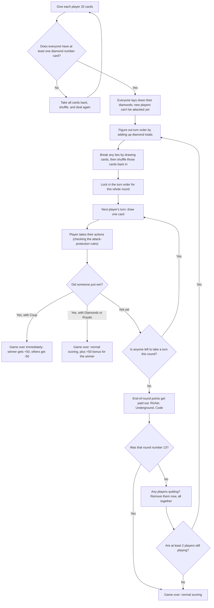
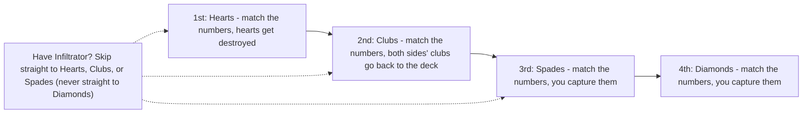
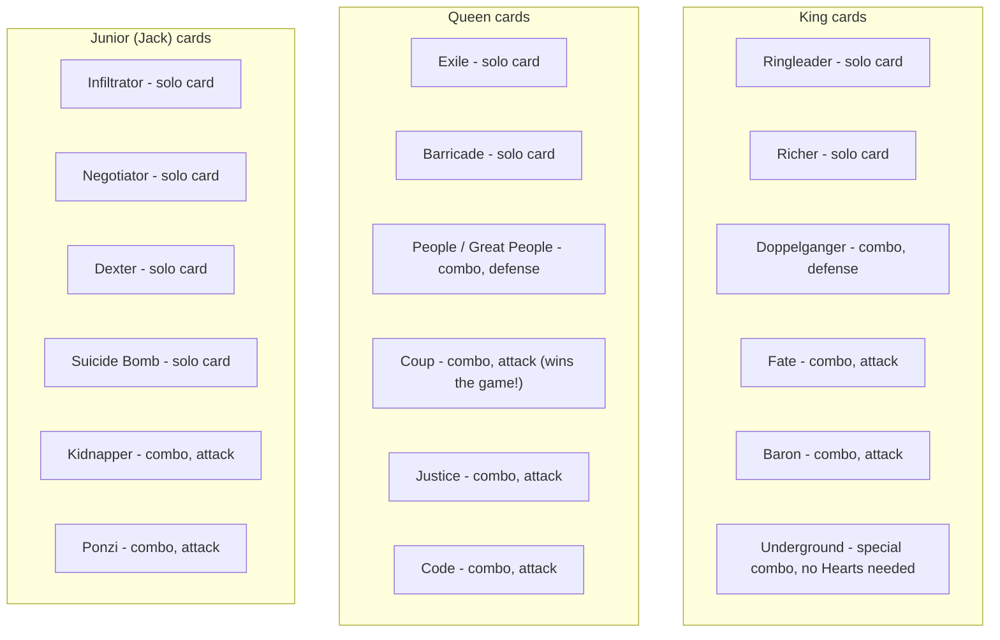

# CGMS (Card Game Mafia State) — Rules for Everyone (Simplified)

> **What is this file?** This is the same rulebook as [GAME_RULES.md](GAME_RULES.md), just explained in easy, everyday words — the kind of explanation you'd give a 12-year-old. Every single rule from the real rulebook is in here too. Nothing is skipped, shortened away, or left out on purpose. The section numbers (like "1.2" or "3.4") are exactly the same in both files, so you can always jump to the matching section in the "grown-up" version if you want to see the official wording. If the two files ever seem to say something different, the official [GAME_RULES.md](GAME_RULES.md) is always the one that counts — this file is just a friendlier explanation of it, not a replacement for it.
>
> **A quick word about the theme:** CGMS stands for "Card Game Mafia State." It's a card game about rival card "families" competing for cards, money, and points. Some cards have dramatic names like "Kidnapper," "Assassinate," or "Confinement" — that's just the game's theme (like how Monopoly sends you "to jail" or Clue has a "murder weapon"). It's all just cards and rules, nothing real.
>
> **Where these rules came from:** the official rulebook was finalized on 2026-09-28, after working through a long list of tricky rule questions (labeled Q01–Q12, F01–F10, N01–N07, and T01–T03) — those same short codes show up again in the [roadmap](../planning/ROADMAP_SIMPLIFIED.md) so the building work can be checked against each decision. The ability list, the "who can see what" tables, the trade/purchase steps, and the end-of-game money rules are all official and binding, not just suggestions. Older drafts and review reports are kept only as historical records of how the rules got here — they don't change anything written here now.

## Table of Contents

- [0. Words You'll See All the Time](#0-words-youll-see-all-the-time)
- [1. Setting Up and the Basics](#1-setting-up-and-the-basics)
  - [1.10 Round Flow — Picture Version](#110-round-flow--picture-version)
- [2. Playing the Game and Card Rules](#2-playing-the-game-and-card-rules)
  - [2.7 Attack Order — Picture Version](#27-attack-order--picture-version)
  - [2.8 The Steps of One Attack](#28-the-steps-of-one-attack)
  - [2.9 Instant Cards and Who Gets to React](#29-instant-cards-and-who-gets-to-react)
  - [2.10 Negotiator, Step by Step](#210-negotiator-step-by-step)
  - [2.11 Protection Cards and Doppelganger](#211-protection-cards-and-doppelganger)
  - [2.12 How Long Abilities Last and What They Cost](#212-how-long-abilities-last-and-what-they-cost)
  - [2.13 Where Cards Go and Who Can See What](#213-where-cards-go-and-who-can-see-what)
  - [2.14 Cards That Are "On Cooldown" (Restricted)](#214-cards-that-are-on-cooldown-restricted)
  - [2.15 Offering Trades and Loans](#215-offering-trades-and-loans)
  - [2.16 Buying Cards from the Deck](#216-buying-cards-from-the-deck)
- [3. Every Card, Explained](#3-every-card-explained)
  - [3.1 Combos — Picture Version](#31-combos--picture-version)
  - [3.2 Combo Cards](#32-combo-cards)
  - [3.3 Solo Cards (Not Combos)](#33-solo-cards-not-combos)
  - [3.4 Aces — The Secret Cards](#34-aces--the-secret-cards)
  - [3.5 The Four Number Suits](#35-the-four-number-suits)
- [4. How the Game Ends and How Scoring Works](#4-how-the-game-ends-and-how-scoring-works)
  - [4.2 Owing Points (Debt) and How It Gets Paid Back](#42-owing-points-debt-and-how-it-gets-paid-back)
  - [4.3 Promises and Your Reputation](#43-promises-and-your-reputation)
  - [4.4 The Money Lifecycle of a Game](#44-the-money-lifecycle-of-a-game)
- [5. Notes for Anyone Programming This Game](#5-notes-for-anyone-programming-this-game)

---

## 0. Words You'll See All the Time

Before anything else, here are the basic words this rulebook uses over and over. Learn these first and the rest gets much easier.

- **Turn**: everything one player does when it's their go.
- **Round**: one full lap of the table — every player takes exactly one turn, in whatever order was set for that round.
- **Game**: one full match of CGMS. A game ends when: round 13 finishes, OR someone correctly declares **Coup**, OR someone legally has 13 or more number diamonds, OR someone legally has 15 or more royal cards (jacks/queens/kings), OR so many players quit that fewer than two are left playing. There's also a special case: if **everyone agrees**, the whole game can be canceled instead of ended (see [1.9](#19-quitting-or-giving-up)).
- **Seat order**: every player is given a numbered seat at the very start, and that seat number never changes for the whole game. "The player to your left" always means the next seat number in that fixed order. (Who goes *first* in a round can change — that's a different thing, called turn order — but the seat numbers themselves are frozen forever.)
- **Number card**: any card printed with a rank from 2 up to 10. Cards that are NOT number cards are called **royals**: jacks (this game calls them "juniors"), queens, and kings. Remember you're playing with **two whole decks** shuffled together, so there are two physical copies of every card (two 7 of Hearts, two King of Spades, etc.) — the game always treats those two copies as two separate, individual cards, never as one "double" card.
- **Match**: a match is a set number of complete games played back-to-back (the default is 3 games, but the group picks the number before starting and it can't change mid-match). Whoever has the most points added up across every game in the match wins the match; if two or more players are perfectly tied, they share the win. A game that got canceled (see "unanimous resignation" in [1.9](#19-quitting-or-giving-up)) does not count as one of the match's games — it's like it never happened.
- **Historical suit opening**: a permanent note of "yes, this player has, at some point in this game, put down at least one card of this number suit." Once it happens, it's true for the rest of the game, even if the player later loses every card of that suit.
- **Currently open series**: this means *right now*, at this exact moment, the player has at least one card of that number suit sitting on the table in front of them. This is different from "historical suit opening" above — having opened a suit in the past doesn't count if you don't currently have any cards of it on the table.
- **Initial attack protection**: every player starts the game safe from attacks. Nobody can attack you until *you* have opened your second different number series. The moment that happens, your protection is gone forever — even if you later lose that second series completely, you can still be attacked from then on.

## 1. Setting Up and the Basics

### 1.1 Players, Equipment, and How a Match Works

You need **two full decks of cards with the jokers removed**, **3 or 4 players**, and something to keep score with (a scoreboard, paper, or an app). One game lasts at most 13 rounds. Before the match starts, everyone agrees on how many games make up the match (the usual answer is 3), and that number is locked in — it cannot change partway through. After that many games are finished, whoever has the highest total score across all of them wins the match (or several players share the win if tied).

Four different things can each be a different person, so don't mix them up:
1. The player who **declares an ordinary victory** (13 diamonds or 15 royals) in one game.
2. The player who **wins with Coup** in one game.
3. The player with the **highest score at the end of one ordinary game** (this can be someone other than the declarer, once all the end-of-game points are added up!).
4. The player who wins the **whole match** (highest total across every game).

### 1.2 How to Win a Game

**The normal way to win:** you can declare victory the moment you control **13 or more number diamonds**, OR **15 or more royal cards** (jacks + queens + kings, all suits combined) — but only if you have **opened all four number suits at some point during this game** (Clubs, Hearts, Spades, and Diamonds — this uses the permanent "historical opening" record from Section 0, not what's currently on the table). A few extra details:
- Alliances (see [1.8](#18-alliances-and-working-together-informal)) never combine or "pool" their cards together for this — each player must reach the threshold on their own.
- Both your hidden cards and your cards on the table count toward the 13/15 total — but each physical card only counts once, obviously.
- Cards that are temporarily "restricted" by Barricade (see [2.14](#214-cards-that-are-on-cooldown-restricted)) still count toward your 13/15 total, even though you can't actively use them yet — and specifically, they can't be used to declare **Coup** either, until they stop being restricted.
- Doppelganger's two kings count as two royal cards toward your 15-royals total, exactly like normal — there's no secret "third card" bonus.
- To declare, you show enough cards to prove you've hit the number, and you also have to be able to show you really did open all four suits at some point. On a computer/app version, the game checks this secretly first and simply rejects you (without showing your cards to anyone) if your claim isn't actually true. At a physical table, a wrong claim doesn't end the game — but anything you showed while trying stays known to everyone. Either way, trying to declare doesn't give anyone else a chance to react first — there's no window for opponents to respond to a victory claim.
- **Whoever declares first and correctly, wins immediately.** Just quietly holding the right cards without declaring doesn't reserve your win for later — someone else could win first. The only card that can "jump the queue" ahead of an ordinary victory is Coup (below); Coup has to be declared before someone else's already-valid diamond/royal declaration, and once a game has already ended, nothing can undo that.
- Ordinary declarations (diamonds/royals) are only checked once a whole action and all of its reactions have completely finished playing out.
- If you win the normal way, you also get **one extra one-time bonus of +50 points** on top of your normal score. That bonus belongs only to you — sharing it with a teammate is entirely your choice, not a rule.

**Coup — the instant-win card:** if you have the right queens (see the "Coup" combo card in [3.2](#32-combo-cards) for exactly which two pairs of queens you need) and you have opened your Clubs at some point in the game, you may declare Coup **at any time, even when it's not your turn.** Coup does *not* need you to have two series currently open, and it does *not* need you to have historically opened all four suits — those requirements are just for ordinary victories. Once declared, Coup resolves **immediately**, with **zero chance for anyone to react**, and it **cannot be blocked or stopped by anything, including Confinement** — even a player who is currently confined is still allowed to declare a legal Coup. Whoever declares Coup instantly wins that game. Instead of normal scoring, Coup replaces the whole game's score for every player still playing: the Coup player gets **+50**, and every affected opponent gets **−50** (players who already quit or were defeated are skipped — see [1.9](#19-quitting-or-giving-up)). All the points those players earned earlier in that same game are wiped out and replaced by this +50/−50. There's no diamond/royal-card scoring and no +50 threshold bonus when Coup ends the game. Scores from *previous, already-finished* games in the match are completely safe and untouched, and any points owed as debt still have to be paid (see [Section 4](#4-how-the-game-ends-and-how-scoring-works)).

### 1.3 The Two Ways to Put Cards Down

There are basically two ways to get cards "in play": **combos** and **series** (aces are their own special thing, explained in [3.4](#34-aces--the-secret-cards)). A **combo** is a special, unique set of cards (like two kings, or four different queens) that gives you a powerful ability — combos are the "game-changers." A **series** (short for "number-card series") is simply all the number cards of one suit that you've laid face-up on the table — these are your everyday muscle for fighting and for making money. There are also a handful of **non-combo cards** (single royal cards) that you can use more flexibly, on their own.

### 1.4 Dealing Cards, Turn Order, and Drawing

**Dealing:** everybody gets dealt **20 cards** at the start of a game. If any single player ends up with **zero** number diamonds in their starting hand, then **everyone's** entire hand goes back into the deck, it gets reshuffled, and everybody is dealt a fresh new hand of 20 — repeat this as many times as it takes until every player has at least one diamond. (This redeal rule is only for the very start of the game — it does *not* apply again later if someone loses all their diamonds mid-game.)

**Turn order:** at the start of the game, everyone lays down all the number diamonds from their hand at the same time — this is everyone's very first series. Then, at the start of every round, turn order is decided by adding up the value of everyone's showing diamonds: **highest total goes first**. If two or more players are exactly tied, those tied players draw cards from the deck to break the tie — highest number drawn acts first (only number cards count for this; drawing a royal or ace doesn't decide anything). If people are still tied after that, they draw again. All the cards used in these tie-breaking draws (numbers and non-numbers alike) are set aside until every tied spot is fully sorted out, then shuffled back into the deck together. If the deck and the discard pile together run dry before every tie is broken, the game switches to a fallback rule just for the leftover unresolved spots: start with seat 1 in round 1, and then move the "starts here" seat forward by one seat every round (skipping anyone who has quit). Any tied spots that were already resolved before the cards ran out stay exactly as decided.

Your very first diamonds count as your first series. As explained in [Section 0](#0-words-youll-see-all-the-time), the moment you laid down your diamonds you're under "initial attack protection" — nobody can touch you in a fight until you open a *second* different suit. You also can't start any attack of your own until you currently have two series open on the table.

Whatever order gets set at the start of a round is **frozen for that entire round**, even if diamond totals change partway through — it only gets recalculated at the start of the *next* round. Each player, on their turn, draws exactly **one card** at the very start of their turn.

Whenever you capture diamond cards from an opponent, you must add them face-up to your own diamond series **right away** — you don't get to hide them. Diamonds you simply *draw* yourself, though, you can add to your series whenever you like (it's optional, and not urgent). You can also get extra card draws by paying for them or by using certain combos. In general, any card you're holding can only be **used** on your own turn — the specific exceptions are aces, Coup, and Ponzi, which are all allowed to be used outside of your turn under their own specific rules.

### 1.5 The Deck and Shuffling Rules

Keep the **draw pile** (face-down cards left to draw) and the **discard pile** (used-up cards) as two separate piles. Only combine and reshuffle the discard pile back into the draw pile once the draw pile is completely empty. Some card effects say a card gets "**returned to the deck**" instead of discarded — those cards go straight into the draw pile and get shuffled in before anyone draws again. If one single action returns several cards at once, shuffle them all in together in one batch (unless that specific card's rule says to shuffle sooner). Nobody ever gets to choose *where* in the deck a returned card lands.

If, at some moment, the draw pile plus everything reshuffle-able in the discard pile still isn't enough to cover a **mandatory** draw (like a forced deal), just draw as many cards as actually exist — you don't get to claim the missing ones later, ever. For an **optional** purchase (like buying cards, see [2.16](#216-buying-cards-from-the-deck)), check whether enough cards are available by counting in even the cards you're about to pay with, if that payment is heading back into the deck. If there still aren't enough cards for the amount you're trying to buy, the whole purchase is simply refused and you don't pay anything. (Running out of cards for turn-order draws follows the separate rule in [1.4](#14-dealing-cards-turn-order-and-drawing); the "everyone must have a diamond" guarantee only applies to the very first deal of the game.)

### 1.6 Opening a New Series vs. Opening a Combo

On your turn, you get to do exactly **one** of these two "opening" actions: **open one brand-new number series**, OR **open or rearrange one combo**. You cannot do both in the same turn — you can't open your second series *and* a combo on the same turn. Combos you already have on the table keep working normally, following their own rules and limits, and you're allowed to have several different combos active at once.

Normally, to open or use any combo (or an ace) you need to **currently** have two number series open on the table — just having opened two suits at some point in the past isn't enough. If you lose a series later, any combo cards already sitting on the table stay there — but the *usage* requirements for that combo's ability still have to be met to actually use it.

**Underground is special** — it's the *only* combo that lets you skip the "two series currently open" rule, both for opening Underground itself and for opening/using every *other* combo you own. Underground is also the *only* combo that never needs an open Hearts series either (every other defensive combo does). If you have Underground, on your turn you may open or rearrange **as many combos as you like** and use them **immediately** — the one exception is that Doppelganger's assigned role, once picked, can never change. Important limits on this superpower: it only waives the *combo* rules — it does **not** let you skip an ace's own requirements, and it does **not** let you skip the four-suit history you need for an ordinary victory. It also does **not** let you break the attacking rules in [1.7](#17-attacking-trading-and-doing-things-on-your-turn): you still need two series currently open to start an attack, and you still can't attack someone who's under initial protection. Every other combo still needs its own Hearts or Clubs support as described in [2.1](#21-combos-need-hearts-or-clubs-to-work). And Coup has its own separate "opened Clubs" requirement that Underground doesn't touch at all.

You're allowed to pick combos back up into your hand on your own turn. **Number series can never be picked back up, not even partly** — once a suit is opened, those cards stay on the table (though you might be able to *sacrifice* some of them through specific card effects). The very first time you open a series, you must put down **every** card of that suit you're currently holding — you can't hold some back. Any more cards of that suit you get later can be added whenever you like. If a suit you had once opened is completely empty (you lost every card of it), and you get a new card of that same suit, putting it down again counts as just "adding to it," not a new opening — so it doesn't use up your turn's one opening action. A series only counts as "currently open" while it has at least one number card sitting in it. Solo (non-combo) royal cards can be added to an already-open series and used following their own individual timing rules — they can never be picked back up into your hand either, though their own specific rules might let you sacrifice or otherwise use them up.

Keep two separate mental notes for each of the four suits: whether it's ever been opened (historical — used for ordinary victories) and whether it's currently open right now (used for everything else, like combos and attacking).

### 1.7 Attacking, Trading, and Doing Things on Your Turn

**Who can be attacked, and who can attack — this applies to everyone, all the time:** a player who hasn't yet opened a second different number series **cannot be attacked by anyone** (initial attack protection). The moment they open that second series, this protection disappears **permanently** — even if they later lose that whole series again, they stay attackable forever after. Separately, a player who currently has **fewer than two** number series open **cannot start any attack themselves.** These two rules apply to *every* kind of attack — plain club attacks, attacks through combos, attacks through solo cards, and attacks through aces. Underground does **not** let you skip these rules. None of this stops *voluntary* trades or non-attacking abilities, though — it's only about attacks. Coup is not considered an "attack" at all — it's a special instant-win declaration with its own separate rules.

A plain club attack on your turn also requires you to currently have an open Clubs series. Attacks made through combos need to satisfy both their own combo requirements *and* these attack-eligibility rules. Every single physical club card can only be committed to **one** ordinary attack per turn — even if that attack later gets canceled or turns out illegal, that club is still "spent" for the turn. (If a declared attack was illegal from the very start, though, nothing gets spent at all.) Negotiator is the only thing allowed to add extra clubs to an already-declared attack ([2.10](#210-negotiator-step-by-step)). Any clubs you didn't use yet can still start another attack — on the same opponent or a different eligible one — since using *some* of your clubs doesn't use up the whole series. Every attack you make has to separately follow the attack order rules ([2.6](#26-the-order-you-must-attack-in)).

**Example:** Alice has opened Diamonds and then Clubs, so she can now attack. Bob has only opened Diamonds so far, so Alice can't touch him yet. Once Bob opens Hearts too, his protection ends for good. Even if Bob later loses every single Heart he has, he can still be attacked — he just can't start attacks of his own again until he once more has two series open at the same time.

Other combos, solo cards, and special cards follow their own specific timing rules and per-player limits, all listed together in [2.12](#212-how-long-abilities-last-and-what-they-cost). Just because you got to react to someone's attack doesn't mean you've earned the right to start your own attack outside your turn. Aces and other "instant" cards have their own stated exceptions for acting outside your turn.

On your turn, you can trade with other players and immediately use whatever you got from the trade however the rules allow — including using it against the very player you traded with! Other players have to wait for their own turn if *they* want to start a trade with the rest of the table. You normally can't trade cards that are already lying open on the table (Underground gives its owner a specific exception to this). How offers and acceptances actually work is covered in [2.15](#215-offering-trades-and-loans). Buying cards straight from the deck by paying spades is a totally separate action covered in [2.16](#216-buying-cards-from-the-deck) — you can do that with spades from your hand *or* from your open Spades series, and you don't need Underground for it.

### 1.8 Alliances and Working Together (Informal)

Players are free to talk, team up, and make voluntary promises to share rewards with each other. A promise is just a promise, though — it never *forces* anyone to actually hand over points. Truly forgiving someone's debt requires clear, explicit agreement and follows the accounting rules in [4.2](#42-owing-points-debt-and-how-it-gets-paid-back).

If you successfully complete an accepted **combo loan** (lending an already-open combo to another player), that creates an **exclusive two-player alliance** for the rest of the game — the full rules for this are in [2.4](#24-what-actually-counts-as-an-alliance). Being in an alliance does **not** let you combine scores, combine victory thresholds, or give you any automatic protection — none of that. Neither member of an alliance is ever allowed to use Coup. If one allied player uses Ponzi, it automatically splits the stolen points in half between the user and their one ally. Every other kind of reward-sharing between players stays completely voluntary and is tracked through the promise/reputation system in [4.3](#43-promises-and-your-reputation).

### 1.9 Quitting or Giving Up

A player can quit or voluntarily give up (this is called being "**defeated**") any time before the *next* round begins. Just having weak cards, an empty series, or a negative score does **not** automatically kick anyone out of the game — only *choosing* to quit does that. Right up until the moment a quit officially takes effect (at that round boundary), normal rules still apply to that player as usual.

**What happens when a player leaves:** first, any ongoing Ace effects targeting that player end, and their own "still active" Aces get discarded (see [3.4](#34-aces--the-secret-cards)). Then, every card currently under that player's control goes back to the deck — including any cards they had *borrowed* from someone else. (If the player who leaves was the one who cast Inflation on somebody else, that Inflation effect keeps going on its target — the caster leaving doesn't cancel it.) Cards that the leaving player had *lent out* to someone else stay right where they are, with whoever currently controls them. Whatever *positive* score that player had earned in this game gets wiped away, but if their score was actually negative, that negative number sticks around, and so does every debt they owed — nobody gets charged for the same debt twice. Anything from games *already finished* stays exactly as it was. From this point on, the departed player can't act, can't earn any more round-based income, and can't get any end-of-game card bonuses for the rest of this particular game — but they're welcome to rejoin fresh in the next game of the match.

Even though they've left, the departed player's ledger stays "open" for two things: (1) if someone actually owes them money and pays it back later, they still receive it and it scores normally (after first paying off any of *their own* debts); and (2) if they were in an alliance and their partner uses Ponzi, they still automatically get their mandatory half-share. Their alliance itself keeps existing — nobody new can join it as a replacement, and their still-active partner is still banned from using Coup. If a Coup happens later in that game, departed players are **not** included in the +50/−50 reset — their departure result and any later small payments they receive stay exactly as recorded.

As long as **two** active players remain, the game continues completely normally. If several players all quit at the same round boundary, apply all of those departures together at once. If that drops the game down to **fewer than two** active players, the game ends right there using ordinary scoring for whoever (if anyone) is left — there's no automatic +50 bonus in that case. If it drops to **zero** active players, nobody gets any end-of-game card bonuses at all. A player who technically *can* still take a turn, but has no strong or useful options left, still just follows the normal turn rules until the game legally ends or they choose to depart.

**Unanimous resignation (canceling a deadlocked game):** if every player whose scores/money would be affected — including anyone who already departed — agrees together, they can cancel a game that's become hopelessly stuck. This completely restores everything back to exactly how it was at the very start of that game: scores, match-level corrections, available points, debts, and payment records, all reset as if the game never happened. This canceled game doesn't count as a win, a loss, or a result for anyone's reputation. A computer version might keep a private record of the canceled game for auditing purposes, clearly marked as "void," but that record has zero effect on anyone's actual points or standing.

### 1.10 Round Flow — Picture Version

This win-check happens constantly throughout play — not just at the end of a turn or a round. Coup takes effect the very instant it's declared; ordinary victories are only checked once a full action and all reactions to it are completely finished. Any debts a player owes are tracked completely separately from this end-of-game score calculation — owing points doesn't stop the game from ending.

## 2. Playing the Game and Card Rules

### 2.1 Combos Need Hearts or Clubs to Work

Any **defensive** combo needs you to currently have at least one open number Heart — **except Underground, which never needs Hearts at all.** Any **offensive** combo needs you to currently have at least one open number Club. Royal cards never count for this — it has to be a number card. If you lose the suit that's powering a combo, that combo's abilities simply stop working (unless a rule specifically says an effect keeps lasting anyway, like Code's economic settings, which stick around even after Code itself stops functioning). Losing Hearts never turns off Underground's income or any of its other benefits — Underground genuinely doesn't care about Hearts. Coup has its own separate requirement (having opened Clubs at some point) plus its own instant-declaration rule.

Remember, Underground only waives the "two series currently open" rule for your other combos — it does **not** waive their Hearts or Clubs requirement. Underground's own personal exemption from ever needing Hearts is unique to Underground itself and doesn't spread to any other defensive combo. Also remember: any combo card can still be **kidnapped or assassinated** unless it's specifically protected by a Great People formation.

### 2.2 Using Aces and Solo (Non-Combo) Cards

Every ace and every solo royal card has its own specific rules for exactly when you're allowed to use it, what it needs, what choices it asks you to make, and what it costs — all of that is collected together in [2.12](#212-how-long-abilities-last-and-what-they-cost). If a card gives you permission to "react" to something, that permission is *only* for reacting to that specific pending thing — it doesn't let you go off and start some unrelated action instead. Once a solo card has been attached to one of your series, it can never go back into your hand.

### 2.3 Lending Combo Cards to Your Ally

You can offer, and someone can accept, a loan of an already-open, fully-intact combo. This offer can happen on either the lender's turn or the recipient's turn, as long as it's at a proper pause in the action (see [2.15](#215-offering-trades-and-loans) for exactly how offers/acceptances work). Accepting the offer kicks off a transfer action; if that transfer finishes successfully, it moves physical control of the whole combo formation to the new player **and** forms (or confirms) an alliance between the two of you, both at the same instant. Just making the offer, or just accepting it, doesn't create an alliance by itself — only a transfer that actually goes all the way through does. Also, receiving a loaned combo this way is **not** a "new opening" and doesn't use up your one opening-action for the turn — it's simply a change of who's holding it. The new holder still needs to meet the normal requirements (like having the right suit support) before they can actually *use* the combo's ability. A loan can even help the recipient reach a victory threshold — but whether they share the win with you afterward is entirely up to them, not a rule. What happens to the cards after all this — where they go, who can see what, and any lasting effects — follows [2.13](#213-where-cards-go-and-who-can-see-what) plus the specific Underground/Code rules.

### 2.4 What Actually Counts as an Alliance

Successfully completing a combo loan that both players agreed to creates a real, explicit alliance for the rest of the game (see [2.3](#23-lending-combo-cards-to-your-ally)). Both players need to currently have **no** alliance already — unless they're already allied *to each other*, in which case they can still make another loan between themselves. A player who's already in an alliance can never accept or give a combo loan to some *third* player. Alliances are always exactly **two** people, and they never overlap with each other: in a 3-player game there can be at most **one** alliance total; in a 4-player game there can be at most **two** alliances at once (meaning everyone could be paired up). It's also fine to have **zero** alliances if nobody's made one yet. Just trading cards for free, doing ordinary trades, helping each other out, or making promises does **not**, by itself, create an alliance.

Once formed, an alliance **cannot be undone** — not by giving loaned cards back, not by quitting, not by surrendering. The original lender is allowed to *ask* for their cards back, but it's completely up to the recipient whether to actually return them or keep them. Only the player currently holding the loaned combo can activate its ability or risk losing its cards — the original lender has no more control over it. A few things stay separate and personal to each player, though: the lender keeps any Underground privilege *they* personally earned, and a governing Code keeps its recorded owner and settings until a *newer* Code replaces it. If an Underground loan is successfully completed, the new recipient earns **their own** personal lasting privilege too — so both allies can end up holding the privilege at the same time. For victory-counting purposes, a card always counts for whoever currently controls it — allied players never combine or pool their card counts, and there's no special "alliance victory."

Being in an alliance blocks you from ever using **Coup** — but it does **not** block **Ponzi**. If an allied player successfully uses Ponzi, the stolen amount is automatically split exactly in half: half goes straight to the user, half goes straight to their one ally — even if that ally has already quit the game. After the split, each recipient's own personal debts get paid from their share, following the normal debt rules in [4.2](#42-owing-points-debt-and-how-it-gets-paid-back). The full amount is never credited to the user first and then shared — it's split from the very start. If the split produces a fraction (like half of an odd number), that exact fraction is used — nothing gets rounded off. Every other kind of reward-sharing between players stays completely voluntary. A player with **no** alliance who uses Ponzi keeps the entire stolen amount for themselves (still subject to their own debts) — there's no upper limit on how much Ponzi can steal.

**Example:** Alice and Bob are allied together; that means Carol and Dan are still free to form their own, separate alliance. If Alice steals 30 points with Ponzi, she and Bob each get 15. If Alice happened to owe 6 points in debt, her share of 15 first pays off that 6, leaving her with 9 actually available — meanwhile Bob's share is still a full 15 before his own debts (if any) are subtracted. If the stolen amount had been 11 instead, they'd each get exactly 5.5. Alice cannot also join Carol's alliance, and no group of three can ever form one shared alliance.

### 2.5 Fighting with Clubs — the Rule of "Exactly Even"

An ordinary club attack works like this: you pick **at least one** of your own showing Club cards to use, and you pick **at least one** card from **one** eligible series belonging to your target — once picked, that target selection is locked in ("frozen") for the rest of the attack. Then we calculate two numbers:

- **A (Attack total)** = the combined value of the Club cards you've committed, plus any attack-boosting modifier you've added (like an ace).
- **D (Defense total)** = the combined value of the target cards you picked, plus any defense-boosting modifier the defender adds.
- For an ordinary attack to work, **A must exactly equal D** — both the moment you declare it, *and* again after everyone's finished reacting. Use exact values, fractions and all (Inflation, for example, cuts targeted number Spades' value exactly in half) — you can **never** round a match up or down to make it work.

A face-down (numerical) ace can supply a value from 2 to 10 to either side of the fight (A or D) for that one combat — used defensively, it can help protect the targeted cards from *any* of the defender's own series, not just the one being attacked. Advancement adds +10 to the Attack total when used offensively, or +10 to the Defense total when used defensively — but *only* if the series being defended is Hearts. Any modifier like this only gets added **once total**, never once per card, and it's purely a "virtual" combat number — it is never itself a card you capture, never money, and never counts as suit "support." Remember the one-ace-per-round rule (from [3.4](#34-aces--the-secret-cards)) still means you can't use *both* Advancement and a numerical ace in the same round. Dexter's prevention ability (if used successfully) removes an opponent's ace modifier before the fight's final numbers get checked.

Once the reaction window has started, nobody can change which cards are frozen as the target, and the attacker can't add more clubs — except for Negotiator's special adjustment ([2.10](#210-negotiator-step-by-step)). This means a legal defensive boost can actually cause an attack that started out perfectly matched to suddenly fail: say an attack of A=8 was aimed at a Hearts 8 — if the defender then plays defensive Advancement, D jumps to 18, and now A≠D so the attack fails. The Club that was already committed stays "used" either way — there's no elimination, and no "exchange" cost happens on a failed match.

**Baron works differently:** it targets an opponent's **entire** series at once, and instead of needing an exact match, you need your **A** to be **strictly greater** than the *whole* series's total value plus any defense modifier — check this inequality again after reactions too. Normal protections and attack order still apply to Baron. Negotiator, if legally activated against a Baron attack, cancels Baron's "just needs to be bigger" advantage for that one negotiation and falls back to needing an exact match instead — if the Negotiator activation fails or is rejected, the original Baron attack is untouched. Suicide Bomb is a special, separate target with its own "A of 5 or more destroys it" rule — it doesn't have a normal targeted-card subset, so it can't be boosted by a defensive number/Hearts modifier.

**Physical trades in combat:** whenever a successful Clubs-vs-Clubs fight, or a successful fight against Barricade, requires an "exchange," you return the physical attack Clubs that were used **and** the target cards that got eliminated — both go back to the deck. The physical face value printed on the cards doesn't need to add up to the effective total by itself (virtual modifiers can make up the difference) — and you must never invent or manufacture extra "payment" cards just to represent virtual points. For example: a Club worth 5, plus an Advancement modifier of +10 (making A=15), could defeat two Hearts worth 7 and 8 (D=15) even against a working Barricade — you'd return just that one Club 5 and both Hearts, and separately discard the ace that supplied Advancement (following its own lifecycle rules). An ordinary successful Clubs-vs-Clubs fight earns the attacker **3 points for every physical attacking Club actually used** in that successful elimination — never extra points just for virtual modifiers or aces, and Baron **never** earns any combat points at all.

### 2.6 The Order You Must Attack In

Unless you have the junior of clubs (Infiltrator) attached to your Clubs series, you're required to attack an opponent's suits in this exact order: **Hearts, then Clubs, then Spades, then Diamonds** — and you must completely clear out one of their suits before you're allowed to move on and attack the next one.

1. **First, Hearts:** you eliminate their Hearts by matching numbers exactly, using the formula from [2.5](#25-fighting-with-clubs--the-rule-of-exactly-even). Eliminated Hearts always go back to the deck (never captured). If they have a working Barricade, you might also have to return your own attacking Clubs as part of this.
2. **Second, Clubs vs. Clubs:** on a successful exact match, both your attacking Clubs *and* their eliminated Clubs go back to the deck. Virtual modifier values never require any extra physical payment.
3. **Third, Spades or Diamonds:** you *capture* (rather than eliminate) these using the same exact-matching formula, then follow the "where do captured cards go" rules in [2.13](#213-where-cards-go-and-who-can-see-what).

In short: except when you're fighting their Clubs, capturing doesn't cost you a card at all. Your opponent, though, is allowed to *pay* to cancel your attack instead of losing cards — but only if they have the junior of spades (Negotiator) available.

### 2.7 Attack Order — Picture Version

The arrows just show which suit has to be finished before the next one — they don't mean you can reuse the same Club cards for a second attack.

### 2.8 The Steps of One Attack

1. **Check you're allowed to attack at all:** on your turn, make sure you currently have at least two series open, and make sure your target has permanently lost their initial protection (opened their own second series at some point). Then pick one legal target suit and target cards, respecting the attack order, all protections, and (if you don't have Infiltrator) the rule that you can't jump straight to Diamonds.
2. **Declare your attack:** pick which of your not-yet-used-this-turn Clubs you're committing, plus any legal combat modifier (like an ace). Check the A/D math from [2.5](#25-fighting-with-clubs--the-rule-of-exactly-even), including that "restricted" cards ([2.14](#214-cards-that-are-on-cooldown-restricted)) can't be used here. If the declaration turns out illegal, it's simply rejected — nothing gets spent, nothing gets used.
3. **Lock in your Clubs:** the instant a legal declaration is accepted, those physical Club cards are marked "used for this turn" right away. They stay sitting on the table until some effect specifically removes them.
4. **Let people react:** resolve any allowed reactions following [2.9](#29-instant-cards-and-who-gets-to-react) — this could include Negotiator, Barricade, Suicide Bomb, or various aces. Once this reacting window has started, you (the attacker) can't change your target, add more Clubs, or re-aim — except for Negotiator's forced Club adjustment ([2.10](#210-negotiator-step-by-step)).
5. **Check if the attack survived:** if it's still standing, recheck that it's still legal and the numbers still match, using the current state of things. If it got canceled, or it's simply not legal anymore, then it just does nothing — no capture, no elimination. Any costs already paid, and any reactions already resolved, stay exactly as they happened; your committed Clubs stay "used" regardless. You never get charged a cost that was only supposed to apply on a *successful* attack.
6. **Resolve a surviving attack:** apply the capture, elimination, and any required card exchange or payment. Remember, "used" doesn't automatically mean "sent back to the deck" — those are different things. The usual +3-points-per-Club bonus only applies to a *successful* elimination in a Clubs-vs-Clubs fight; Baron never earns combat points.
7. **Keep going if you can:** any Clubs you didn't use yet can start another attack, checked fresh against all the eligibility and attack-order rules. A suit counts as "cleared" once all its number cards are gone — leftover unsupported royal cards sitting there don't reopen it.

### 2.9 Instant Cards and Who Gets to React

**Coup and victory declarations work differently from everything else.** A legal Coup resolves **immediately**, with **no reacting window at all** — this is true even in the middle of someone else being asked a required question, or in between two reactions that are already mid-resolution in an existing window. Even a player who is currently confined is still allowed to declare a legal Coup — confinement still blocks their *ordinary* actions and *ordinary* victory declarations, just not Coup. Coup can never interrupt an effect that's already halfway resolved, and it can never undo a game that has already legally ended. Ordinary victory declarations (diamonds/royals), on the other hand, are only ever checked once the current action and all of its reactions have completely finished. Whoever declares first (and legally) wins — simply holding the right cards quietly doesn't reserve you a win for later.

**For every other action and instant card**, here's the fixed step-by-step procedure:

1. **Declare one action.** It (and everything that reacts to it) has to be completely finished before anyone starts an unrelated new action — except for Coup's "any time" exception above. Just making a nonblocking trade/loan offer ([2.15](#215-offering-trades-and-loans)) doesn't start this procedure by itself — only *accepting* it and starting the actual transfer does.
2. **Everyone else gets one chance to react, in order.** Starting with the seat to the left of whoever declared, each other player who's still active and not confined gets **exactly one** opportunity to either react or pass, going around in fixed seat order. Departed and confined players are automatically skipped — this isn't treated as them "passing," it's not a timeout, and it's not assumed consent. (The one exception: a confined player can *still* legally declare Coup — that specific permission always stays open.) A player who's merely disconnected, though, is never skipped — they're still owed their turn to react. None of this gives any new power to a card that genuinely isn't allowed to react in that particular situation.
3. **Resolve each reaction fully, one at a time.** Each reaction plays out through all of its own required decision steps without opening yet another nested reaction window — "immediately" doesn't mean players stop getting to make real choices along the way. Players who react later are reacting to the action *as it now currently stands* (after earlier reactions already changed it). If the action gets canceled partway through, the reacting window simply ends, because there's no longer a pending action to react to. (Dexter's ability to prevent a hostile ace is considered part of resolving *that ace itself* — it doesn't open a brand-new separate reaction window.)
4. **Resolve the action, then handle any earned Compensation draws, then settle points.** If the original action survived all the reactions, resolve it now. Then hand out any Compensation card draws that were earned during all this, in ascending fixed-seat order (see the "Deferred Compensation draws" rules just below). Then apply any automatic point settlement. Even if the original action ends up canceled, any draws that were *already* earned from reactions that already resolved still get completed. Only after all of this is finished do you check whether anyone has a valid ordinary victory declaration.
5. **If two ordinary actions are competing for priority**, the player whose turn it currently is goes first, and after that it follows normal round turn order among whoever's still eligible. This priority order never delays or blocks someone's legitimate victory declaration, though.

**Deferred Compensation draws, explained:** once an action and every one of its reactions are completely finished, first batch together anything that needs to be returned to the deck and do the required shuffle — only *then* start drawing the earned Compensation cards. Line up everyone who earned a draw in ascending fixed-seat order, completely independent of who went first, who declared the action, or who got targeted. Fully finish giving one player their *entire* owed amount of draws before moving on to the next player in line, drawing one card at a time and following the normal running-out-of-cards rules from [1.5](#15-the-deck-and-shuffling-rules). Every block of **five** qualifying losses earns exactly one draw — and that draw gets used up (even if it turns out there's no card left to actually hand over); no player can ever cash in a missing draw later. If this whole process gets interrupted partway (say, by a disconnect), the exact queue position, all counters, and any already-decided random results are all kept and picked back up later. No ordinary action, and no ordinary victory check, is allowed to cut into the middle of this queue. Coup, however, can still interrupt between individual completed steps — anything already fully drawn stays drawn, and whatever's left undone in the queue is simply dropped once the board closes.

**Example:** Bob (seat 2) and Carol (seat 3) both currently have a Compensation "remainder" of exactly four losses each. Alice uses Justice and takes one card from each of them, and the Justice queen she used has to go back into an otherwise completely empty pile. Bob, being earlier in seat order, gets that one returned queen as his draw first — Carol is left with nothing to draw and doesn't get any future credit for it. Both of their remainder counters reset back to zero regardless.

**Confinement, explained:** Confinement targets whoever is currently trying to take a pending action, and it cancels that action — even Ponzi — unless Dexter legally prevents this specific ace. Confinement can never stop Coup. The player using Confinement may aim it at themselves (to protect themselves) or at another player (to protect that other player). Once confined, that player can't act at all — the *only* thing they're still allowed to do is declare a legal Coup — and they're immune to all attacks until the **very start of their next scheduled turn**, at which point the confinement wears off *before* they draw or act. If the confined player happens to be the active player when this hits them, their current turn ends immediately and play moves on; if they had been acting out of turn, the actual active player's turn just continues normally. Confinement never causes someone to skip an *additional* future turn on top of that.

**Example:** during Carol's turn, Alice suddenly declares Ponzi. Bob reacts by confining Alice. Ponzi gets canceled, Carol's turn continues as normal, and Alice's confinement will wear off right at the start of Alice's own next scheduled turn. (If Alice herself had been the active player when this happened, her turn would have ended right there instead.) Bob's Confinement ace doesn't open any further nested reaction window of its own — though an eligible Dexter could still have prevented it, as part of resolving that ace.

**Decisions required inside an effect (not a new reaction):** the game keeps track of exactly which effect is resolving, which decision within it, who's required to answer, what kind of decision it is, what stage it's at, and what choices are currently allowed. Once you've accepted an activation, you can't take it back. Giving a valid answer always moves things forward exactly one stage — if you try to answer again after already answering, you just get shown the same recorded result again. The decisions built into Negotiator, Justice, and Dexter do **not** count as opening a brand-new separate reaction window. If a player disconnects mid-decision, the exact same pending decision (and any random result already locked in) is waiting for them when they return. A Coup can still close the whole board while some other decision is waiting to be answered — anything already committed (costs already paid, information already learned) is kept, but anything not yet committed (movements, resolution-only costs) is simply dropped.

- **Negotiator** first checks the activation is legal and uses up its once-per-round allowance. If an adjustment turns out to be needed, it asks the attacker to pick their biggest-value Club combination, then asks the defender to pick a matching Spade combination. Only the very final step actually marks the new Clubs as "used," transfers the Spades, returns the jack, and cancels the attack — the originally-committed Clubs stay marked "used" the entire time regardless.
- **Justice** goes through eligible opponents one at a time, in fixed seat order. Each card picked (whether chosen openly or randomly sampled from hidden cards) gets "reserved" and only the properly-authorized information about it is shown to the person receiving it, while keeping track of which ranks have already been taken this activation. If a decision needs to be re-answered for any reason, a hidden card is never re-randomized — the same result stands. Once every opponent has been handled, all the reserved cards get transferred at the same instant, and the Justice queen used gets returned. If a Coup happens to close the board before that final transfer, the reserved cards simply stay with whoever controlled them before — though the "audit trail" still remembers whatever information was already properly learned. Any captured Diamonds automatically become fully public the instant they're transferred.
- When a **hostile ace runs into an eligible Dexter**, Dexter is asked whether to prevent it or let it pass, and if preventing it, which Diamond card to pay with. This whole exchange is considered part of resolving *that ace* — even in cases where the ace itself was being played as a reaction to something else. Whichever choice gets made (the payment plus the prevention, or simply letting the ace's effect stand) is applied all at the same instant; an invalid answer just changes nothing and asks again.

**How this works on a computer/app (digital ordering):** the server always decides the true order of everything — never the players' own device clocks. Every attempt to declare victory gets checked for who sent it and whether it's a duplicate, then lined up against the current state of that exact match; it must name the correct, unchanging game ID, it gets rejected if that board has already closed, and the player's actual current cards/eligibility get double-checked. As long as it's the *same* game, a victory attempt should never be rejected purely because some *unrelated* part of the game's internal version counter happened to change — it should only be rejected if something that actually matters changed (like really losing a needed card, or a new alliance forming). Ordinary threshold declarations are only accepted at a fully-completed pause point in the action; Coup gets to use the extra in-between pause points described above. Regular card-selection commands still do get the normal strict version-matching check, though. Only **one** valid game-ending result is ever allowed to actually take effect — if the exact same accepted command gets sent again by accident, the server just replies with the original recorded result rather than doing it twice. Every command tied to a specific game (including final settlement) has to name that game's unchanging ID; commands about a specific turn, reaction window, effect, or decision also have to name those specific IDs. If a command comes in naming the *wrong*, older game, it gets rejected even if that player would otherwise now qualify. Every time a canceled game gets replaced with a fresh one (even reusing the same slot in the match), that new game gets a completely fresh ID — a command can never be silently redirected from one game to a different one.

**Disconnection:** whatever a disconnected player was in the middle of — their turn, a reaction, an effect decision, or a settlement decision — stays exactly as it was, waiting for them. Disconnecting is never automatically treated as passing, quitting, refusing, or forfeiting anything. Reconnecting simply restores that exact same waiting state. The system might pause any background computation while a player is away, but it keeps all the real data and remembers exactly who it's still waiting on — nothing about the actual outcome changes because someone stepped away. This is an "untimed" game: there's no automatic timeout and no bot ever takes over for someone. Canceling a stuck game (unanimous resignation) always genuinely requires every single affected player's real consent.

### 2.10 Negotiator, Step by Step

Negotiator is the jack of Spades, attached to its owner's open Spades series. Once per round, its owner can use it while they're on the receiving end of a club attack against any of their own series. They need at least one *unrestricted* open number Spade available to pay with (restricted cards from [2.14](#214-cards-that-are-on-cooldown-restricted) don't count, and any Clubs added during this process must be unrestricted too). Use the attack's current "A" value from [2.5](#25-fighting-with-clubs--the-rule-of-exactly-even), keeping any attack modifier active the whole time. The Spade payment is the sum of the effective value of number Spades (Inflation still applies) — a numerical ace can never be used to pay currency. If a defense modifier was already applied earlier, it stays in effect for the fight if it survives, but it does **not** increase how much needs to be paid. Only physical Spade cards move around here — never scoreboard points.

1. If the defender has some exact combination of open number Spades that adds up to *precisely* the current attack total, the defender picks that combination and pays it.
2. Otherwise, if the defender's *entire* eligible pile of number Spades adds up to *less* than the attack total, they simply hand over **all** of those eligible Spades — that's the built-in "shortfall" exception.
3. Otherwise, the attacker is **required** to adjust their attack to reach the **biggest possible exact match** they can, using any combination of their originally-committed Clubs plus any other unused open Clubs, matched against some combination of the defender's open number Spades. The attacker can remove, swap, or add Clubs to try to maximize this match (Clubs already used in a different attack this turn aren't available). Any combat modifier that was already locked in stays fixed — this adjustment can never add a brand-new ace or change the target. If more than one combination of Clubs reaches the same best total, the attacker picks which one; the defender then picks a matching Spade combination worth that same amount.
4. If there's simply no possible positive exact match, even after trying to adjust — then Negotiator **cannot legally activate at all**: no Spades move, the jack doesn't return to the deck, and the once-per-round use isn't spent. The original attack just continues exactly as it was. (This is different from step 3, where an adjustment *was* found.)
5. If everything above works out, using Negotiator uses up its once-per-round allowance. After all the choices are made, all at the same instant: the chosen Spades move into the attacker's hand, Negotiator goes back to the deck, and the attack is canceled. No cards get captured or eliminated by that attack, and it earns no Clubs-vs-Clubs bonus points. Every originally-committed Club stays "used" even if it got removed during the adjustment; any newly-added Clubs become "used" too. The adjustment and the payment both happen within that same single reaction — it doesn't open any new separate window.

Using Negotiator against Baron specifically removes Baron's "just needs to be bigger" advantage for that negotiation — it falls back to needing an exact match like normal. If the Negotiator activation fails, Baron is completely unaffected and the original attack stands exactly as declared, beyond whatever costs were already committed.

**Example:** an attack uses Clubs worth 4 and 6 (total 10), and there's an unused Club worth 5 sitting available. The defender's open Spades are worth 6 and 9 (total 15) — no smaller combination of those adds up to exactly 10. So the attacker is forced to add the Club worth 5 (new total 15) to exactly match the Spades total of 15, and receives both Spades. The attack is canceled, and all three Clubs (4, 6, and 5) count as used. If only the Clubs worth 4 and 6 had been available (no 5 to add), the adjustment would instead pick just the Club worth 6 to match a Spade worth 6 — the Club worth 4 would still count as used even though it wasn't part of the final match. And if the Clubs were 4 and 4 while the Spades were 3 and 7, there's no way to make any positive exact match at all, so the original attack just continues untouched.

### 2.11 Protection Cards and Doppelganger

**Great People** is the natural pairing of the two queens of Hearts. **People** is one queen of Hearts plus Doppelganger standing in for the other one. Whichever one you have, as long as it's actually working, you pick exactly **one** public protection target for it at a time:

- Either formation can protect one of your own Clubs, Spades, or Diamonds series against club attacks (including Baron). A series being protected this way can't be used to attack while it's protected.
- **Only** a *natural* Great People (no Doppelganger involved) can instead protect one of your *other combos* against kidnapping and assassination. A People formation (the one using Doppelganger) does **not** have this combo-protecting ability.
- Neither formation can ever protect: itself, another People/Great People formation (no protecting each other in a chain), Hearts, or Suicide Bomb.

You choose the protection target the moment you open the formation. Changing that target later counts as a combo "reconfiguration" on your turn, and uses up your normal opening/reconfiguring allowance — unless you have Underground's exception. If you lose the formation, lose its Hearts support, or otherwise stop qualifying, its protection simply stops working.

Doppelganger's two physical kings act together as a stand-in for **one single** specific rank-and-suit slot in **one** combo. Those same two kings can never *also* be part of some other combo at the same time. Once assigned, their role stays fixed for the rest of the game — even through a Fate reset or a trip back to the deck — with the only exceptions being the specific kidnapping/assassination rules below. The game keeps a record of exactly which slot each king pair is filling; each king can only ever be tied to one such assignment at a time. For victory-counting and scoring, Doppelganger's two kings are simply two ordinary physical royal cards — there's no invisible "third card" bonus.

If **Kidnapper** specifically steals Doppelganger, both kings move to the new owner, that owner may reassign them to a new slot, and the old combo that depended on them breaks apart. If instead just **one** of the two physical kings gets **assassinated**, that king is discarded and the substitution breaks: the binding is released, and the surviving king simply stays wherever it currently is, under whoever currently controls it, with no combo role anymore. If that surviving king was already showing on the table, it stays showing; if it was hidden somewhere else, it stays hidden and doesn't move. Only players who are actually authorized to know about it get told anything about its status. Any other cards that were part of that now-broken combo just stay on the table as they are. A broken People formation does **not** automatically turn into a Great People formation, and no other now-invalid formation gains any ability back without being properly reconfigured from scratch. Doppelganger can never be used to form Coup or Ponzi.

The "binding" between the two Doppelganger kings is tracked completely separately from whether the combo itself is working: it can be **active** (both kings together, showing, correctly assigned, and properly supported), **dormant together** (still both controlled together, but the combo currently isn't functioning), or **dormant separated** (the two kings are now under different control or in different places). Kings that are dormant are still just ordinary physical royal cards, but they can't join a *different* formation or attachment — not even Richer or a brand-new king pairing — while dormant. If the two kings ever get reunited, they're allowed to reconfigure back into their original slot normally — but that reunion doesn't automatically re-activate anything by itself. A Fate reset, a Justice capture, an ordinary trade, or a normal return to the deck all preserve this binding exactly as it was. Kidnapper's special Doppelganger theft is explicitly allowed to reassign the binding; assassination is what releases it entirely. The game only ever reveals authorized information about a binding — it will never tell anyone where a hidden partner king currently is, or who controls it.

### 2.12 How Long Abilities Last and What They Cost

Before the big per-card reference table below, here are the shared ground rules that apply to *every* ability in the game:

- Abilities can only be used while the game is actively being played (not during end-of-game settlement, etc.). A "main action" can only start when nothing else is currently pending.
- The table below uses a few timing words: **"Own"** means it's that player's own turn, at a proper pause point. **"Any idle"** means any eligible player can do it, at any proper pause point (not necessarily their turn). **"Response"** means it's used specifically as someone's one allowed reaction to whatever's currently happening. **"Inside"** means it's a required decision that's part of resolving an effect that's already happening — it's *not* a brand-new separate reaction window.
- While a player is confined, **no action is legal for them except Coup** — Coup's "any time" rule always wins over confinement. Coup can never undo an effect that has already fully finished resolving.
- The moment a legal activation is accepted, its "use" is spent immediately — even if that activation later gets canceled somehow. An activation that was illegal *from the start*, though, spends nothing at all.
- Every ability's "use up" limit belongs to the combination of (that player, that specific ability, that time period) — it has nothing to do with which physical copy of a card you're holding, which formation it's part of, or who currently has custody of it.
- A "turn-cycle" limit resets at the very start of the game, and then again at the start of every one of that player's own scheduled turns (using something out-of-turn still counts against the *current* cycle). A "round" limit only resets when the next round begins. A "game" limit (like Ringleader) only resets at the next whole game. None of these limits get refreshed early just because of a Fate reset, a reconfiguration, a loan, getting a second copy of the card, or a card being returned. The one big exception is **ordinary Clubs**, which work per physical card instead — each individual physical Club can be committed once during its controller's own turn, exactly as already explained. Purely passive effects (ones that don't need to be actively "activated") never use up any limit at all.
- **Support needed for combos:** the normal rule is "two series currently open" (which Underground waives) **plus** an open number Club for offensive combos, or an open number Heart for defensive combos. Underground itself needs neither of those two. Coup only needs a *historical* opening of Clubs. Any combo that includes Doppelganger also needs its defensive-substitution support (including Hearts) to be actually working, or else that missing slot simply isn't filled. Solo (non-combo) cards only need whatever specific open series their own entry states — no hidden extra "combo support" rule sneaks in for them. Aces need two series currently open, and Underground does *not* change that for aces. Every attack, of any kind, still needs two series currently open plus a target who's actually lost their initial protection.
- The game rechecks whether you still have the needed support both the moment you activate an ability, *and* again right before an unresolved effect is about to actually take place. If support has been lost by then, the effect simply fails — but any limits already used up, and any earlier parts of the effect that already fully resolved, stay exactly as they are; costs that were only due on success go unpaid. Losing support never cancels an Underground privilege you already earned, or Code settings that are already in force. A royal card attached somewhere without its required number-card support gives no passive benefit and can't be activated. Opening, taking back, and reconfiguring cards all follow the normal "your own turn" timing rules — no single card can ever be assigned to two formations at once, or to a formation and a solo attachment at the same time. Unless a specific ability below says otherwise, where a card ends up and who gets to see it always follows the general rules in [2.13](#213-where-cards-go-and-who-can-see-what).
- **"Cancel: keep"** in the table below means you keep the card/formation and don't pay any success-only cost — but the "use" you already spent stays spent regardless. **"Spent"** means whatever was already committed earlier stays committed. A "success" simply means the effect legally resolved — even if it happened to steal zero points, or a targeted Justice opponent happened to have nothing eligible to take. A normal, legal cancellation never refunds a used-up limit. If Coup closes the board in the middle of some other unfinished effect, that effect just stops there: whatever costs were already paid and whatever information was already learned stay as they are, but anything not yet finished (transfers, draws, resolution-only costs) is simply dropped, with no half-finished card movements left behind.

**The full ability reference, one entry per ability:**

| Ability | When you can use it / what you need | What it costs just to declare | What happens when it resolves, or if it's canceled |
|---|---|---|---|
| **Accepted trade / combo loan** | At a proper pause point, during the turn the offer was originally made; everyone/everything gets rechecked when accepted ([2.15](#215-offering-trades-and-loans)) | No cards are reserved just for making an offer; if an Ace is part of the deal, it only uses up its supplier's once-per-round Ace allowance the moment the deal is actually accepted | Every card move and any new alliance is rechecked and finalized together, all at once, after reactions finish. If it's canceled or fails, nothing moves and no alliance forms — but a spent Ace allowance stays spent. |
| **Deck purchase** | Your own turn, at a pause point; you're paying with your own unrestricted number Spades ([2.16](#216-buying-cards-from-the-deck)) | No payment happens yet just by declaring it; there's no separate "purchase" limit | The exact price, payment, and available card supply get rechecked, then payment/shuffle/draw all happen together. If canceled or invalid, you keep your payment and draw nothing. |
| **Ordinary Clubs (attacking)** | Your own turn; you need an open Clubs series; pick a legal target and unused Clubs | The physical Clubs you use are marked "used" the moment your declaration is accepted | The fight's result (capture/elimination/exchange) gets applied. If canceled, your used Clubs stay marked "used" and stay on the table. |
| **Doppelganger** | Your own turn, when opening or reconfiguring; it's a defensive combo; it fills one fixed replacement slot | Uses up your opening/reconfiguring allowance; there's no separate "activation" limit | Nothing more to resolve — see [2.11](#211-protection-cards-and-doppelganger) for all the binding rules, even if the substitution later stops working. |
| **Fate** | Your own turn; offensive combo; pick an eligible opponent | Uses your turn-cycle limit; no card payment needed | Return one chosen Fate king right before the reset-and-shuffle, then reset the target's cards all at once. If canceled: you keep everything. |
| **Baron** | Your own turn; offensive combo; as part of a legal club attack | Uses your once-per-round limit; the original Clubs get marked used as normal | There's no extra card cost beyond that. If canceled, you keep your once-per-round use spent and your Clubs stay used. (Suicide Bomb has its own exception, described in [3.3](#33-solo-cards-not-combos).) |
| **Underground** | Opening it yourself, or successfully completing a valid combo loan of it; needs kings allocated to it | Uses your opening rule / the loan transfer rule; after that it's completely passive | No cards get spent. Its lasting privilege and its round-end income are two separate things — see [3.2](#32-combo-cards). |
| **People / Great People** | Your own turn, opening or reconfiguring; defensive combo; pick one public protection target | Uses your opening/reconfiguring allowance | Stays passive as long as the formation and its support remain valid — there's no activation cost and no limit on how often it defends. |
| **Coup** | Any time at all, even mid-decision for something else; needs historical Clubs, all four required queens, and no current alliance | No limit and no card cost of any kind; nobody can react to it | Instantly closes the whole board and applies Coup's scoring — it's never a "half-finished" interruption. |
| **Justice** | Your own turn; offensive combo; goes through eligible opponents in fixed seat order | Uses your turn-cycle limit; no card payment needed | Return one chosen Justice queen once the whole selection sequence is done — even if it ended up capturing nothing. If canceled before it resolves: you keep everything. |
| **Code declaration** | Your own turn; a non-attacking, table-wide declaration; offensive combo support (Underground's waiver applies); pick your legal settings | Uses your turn-cycle limit; no card cost | Replaces whatever the previously-governing Code declaration was. If canceled, the old Code keeps governing. Its recurring −5 penalty is completely passive, but only fires while its declarer is active, not confined, currently has two series open, and the combo is still working — and it skips opponents who are departed, still under initial protection, or confined. |
| **Kidnapper** | Your own turn; offensive combo; pick an eligible opponent | Once per your own turn; no card cost to declare | An ordinary theft has no extra combo cost. The special Doppelganger theft returns every card allocated to the Kidnapper formation and moves both stolen kings (plus triggers debt settlement). If canceled: you keep everything, and any returned substitute kings keep their own existing binding. |
| **Ponzi** | Any pause point, not just your own turn; offensive combo; pick an eligible target | Uses your turn-cycle limit; no card cost to declare | Return all four jacks once it legally resolves — even if it happened to steal zero points. If canceled: you keep the jacks, but your used limit stays spent. |
| **Ringleader** | Your own turn; the king of Diamonds, attached to any of your number-supported series | Once per whole game; no card payment needed | Discard the king and receive your 10 points at the same instant. If canceled: you keep the card. |
| **Richer (round income)** | Automatically checked at the end of each round; needs a non-Diamond king, with *exactly one* king attached to that supported series | Completely passive; you get one payout per eligible physical king | No cost at all — but if your support isn't valid right at that round-end moment, you simply get no income that round. |
| **Richer (sacrifice)** | Your own turn; same series-support conditions as above | Once per round; no card payment needed | Discard the king, then draw up to two cards (following the normal running-out-of-cards rule). If canceled: you keep the card. |
| **Exile** | Your own turn, as part of declaring an attack; the queen of Clubs, attached to your supported Clubs, facing an opponent's Barricade | Once per round, the moment the bypass is accepted; your Clubs get used normally on top of this | No extra card cost — the bypass locks in with your declaration, and your once-per-round use stays spent even if that particular attack later gets canceled. |
| **Barricade (passive)** | Automatically triggers when your Hearts get attacked; the queen of Hearts, attached to your supported Hearts | Completely passive | On a successful elimination, it forces the attacker to exchange their attacking Clubs (unless they have their own working Barricade, or they used Exile). A canceled attack triggers no exchange at all. |
| **Barricade (sacrifice)** | Your own turn; same support as above; sacrifice the queen plus five other cards you control | Uses your turn-cycle limit; no extra card payment | Discard the queen, return the five chosen cards, and draw up to five new ones. Every card you draw this way is marked "restricted" until next round ([2.14](#214-cards-that-are-on-cooldown-restricted)). If canceled: you keep every card you'd selected. |
| **Infiltrator** | Your own turn, as part of declaring an attack; the junior of Clubs, attached to your supported Clubs; lets you skip straight to any suit except Diamonds | Uses your turn-cycle limit; the jack returns to the deck the instant the bypass declaration is accepted | The bypass and the jack's return are both locked in immediately — they stay spent even if that particular attack later gets canceled. |
| **Negotiator** | As your one reaction to an incoming club attack; the jack of Spades, attached to your supported Spades; see the full steps in [2.10](#210-negotiator-step-by-step) | Uses your once-per-round limit, only if it actually activates legally; if there's no possible positive match, it simply doesn't activate and nothing is spent | Marks any newly-added Clubs as used, transfers the chosen Spades, returns the jack, and cancels the attack — all after the final decision. If you back out before that final commit: nothing is added/paid/returned, but an already-accepted limit stays spent. |
| **Dexter (assassination)** | Your own turn; the jack of Diamonds, attached to your supported Diamonds, with at least 20 points of open Diamonds; targets an eligible enemy royal | Shares one use per round with Dexter's "prevention" ability below | Return one of your own number Diamonds and discard the target royal, both at once. If canceled: you keep your Diamond and the target royal is safe. |
| **Dexter (prevention)** | As part of resolving a hostile ace aimed at you; same card attachment, needs 1–10 points of open Diamonds; choose to prevent it or let it pass, and (if preventing) which Diamond to pay | Shares the same once-per-round use as Dexter's assassination above | Return the chosen Diamond and cancel the ace's effect, both at once. The hostile ace's own limit still gets spent and that ace still gets discarded regardless. This can never be used against Coup. |
| **Suicide Bomb (passive / getting destroyed)** | Attached to any of your number-supported series; an enemy must destroy it first (with at least 5 effective Club points, or via Baron) before they can attack that series at all | Completely passive on your side; the attacker spends their Club usage (or their Baron use) to destroy it | On an ordinary successful destruction: the attacker's Clubs are returned to the deck, Suicide Bomb is discarded, and that series becomes immune to club attacks for the rest of the round. Baron discards it too, but without needing to return any Clubs. If the attack is canceled, nothing is destroyed. Kidnapping or assassinating it doesn't trigger this shield at all. |
| **Confinement** | As a reaction to a pending action; targets that action's actor (yourself or someone else, defensively); needs the usual ace prerequisites | Shares the ace's one-use-per-round limit, spent the moment it's accepted | The ace gets discarded once everything's fully resolved (including if Dexter prevents it) — otherwise, it cancels the pending action and applies confinement, both at once. |
| **Advancement** | As part of declaring your own attack (for +10 to Clubs), or as a reaction to an incoming attack (for +10 to Hearts) | Shares the ace's one-use-per-round limit, spent the moment it's used; the modifier is locked in | The ace is revealed and discarded once the fight resolves or is canceled — it's spent either way. Dexter's prevention only removes the modifier, not the "used" status. |
| **Inflation** | As your own main action against an eligible opponent, or as a reaction to an attack against you (aimed only at that attacker); needs the usual ace prerequisites | Shares the ace's one-use-per-round limit; you can't target someone who already has an active Inflation on them (that's simply illegal and costs nothing) | On resolving, the ace moves into the public "active effect" area and the effect begins. Dexter's prevention discards it with no effect. If canceled before resolving, you keep the ace, but your limit is still spent. |
| **Compensation** | As your own main action, or as a reaction to an attack on you, before you actually lose the cards; needs the usual ace prerequisites | Shares the ace's one-use-per-round limit, plus a separate once-per-game activation limit | On resolving, the ace moves into the public "active effect" area and a loss-counter starts. If canceled, you keep the ace, but your limits stay spent. The running total carries forward, and future deferred draws only count losses that happen *after* this point. |
| **Numerical ace** | As part of declaring your own attack, or as a reaction during an incoming fight; you announce a value from 2–10 while keeping the card face-down | Shares the ace's one-use-per-round limit, spent the moment it's used; the combat value is locked in | Revealed and discarded once the fight resolves or is canceled. You can never also use that same ace's named power at the same time. |
| **Trading or exchanging an ace** | As part of an accepted, legal player-to-player deal ([2.15](#215-offering-trades-and-loans)); never as deck-purchase money | Uses one round-use from whichever player is supplying the ace | The deal only completes once. A failed or canceled deal keeps the limit spent but moves no card. The person *receiving* the ace has their own limit completely unaffected until *they* later use or trade it themselves. |

### 2.13 Where Cards Go and Who Can See What

Just getting a card doesn't automatically mean you've opened a new series with it — it still follows the normal timing rules for opening, unless a specific exception below says you can use it right away. And remember: once information becomes public, it's remembered as public history forever after — even if that same physical card later goes back into a hidden pile — but that history never lets anyone see a brand-new card draw, or track a specific card through a shuffle, that they weren't actually shown.

**Where cards end up when you get them, and what people learn about it:**

| How you got the card | Where it goes, and when you can use it | Who finds out what |
|---|---|---|
| **Initial deal** | Aces go face-down in your hidden Ace area; every diamond number card is shown to everyone right away; everything else stays in your hand | Only you see your own hidden cards; your starting Diamonds are public to everyone. |
| **Normal draw, or an extra draw** | Aces go face-down in your hidden Ace area, everything else goes to your hand; you can optionally add a Diamond to your series later, on your own turn | Everyone can see your hand size and how many hidden Aces you have — but not their faces. Cards drawn from Barricade's sacrifice keep their "restricted until next round" mark. |
| **Capturing with Clubs** | Captured number Diamonds go straight to your visible Diamond series; captured Spades go into your hand | The captured card's identity was already public from the fight — but receiving a Spade this way does not, by itself, open your Spades series. |
| **Justice** | Captured number Diamonds go straight to your visible Diamond series (overriding the normal "hidden capture" case); Aces go to your hidden Ace area; everything else goes to your hand | The recipient sees exactly which card they got; everyone sees any captured Diamonds the moment they transfer. Cards nobody picked are never shown to anybody. |
| **Kidnapper** | An ordinary stolen royal goes to your hand (or your hidden Ace area), and you may use it right away if it's not restricted; the special Doppelganger theft shows both kings so they can be reassigned | If it was a hidden card, only you (the thief) learn what it is; if it was already public, everyone already knew. Cards you *didn't* end up picking are never revealed. |
| **Negotiator** | Paid number Spades go into the attacker's hand; this doesn't automatically open a Spades series | Everyone sees which cards and how many moved; using or opening them later follows the normal rules. |
| **Voluntary trade** | Any Aces you get go into your hidden Ace area; everything else goes to your hand; normal opening/use timing applies | Both parties see exactly what was traded; anything that was already public stays known publicly. Only the *counts* in each zone get published — not previously secret card faces. You still need Underground's exception to trade already-open cards. |
| **A successfully completed combo loan** | The whole combo formation stays exactly as it was, showing, just now under the new player's control; it is not a new opening | The physical cards, who controls them, and the new alliance are all fully public — see [2.4](#24-what-actually-counts-as-an-alliance) and [3.2](#32-combo-cards) for any lasting effects. |
| **Voluntarily returning a loan** | The formation stays showing; any individual returned cards go back showing/unassigned — they don't automatically rebuild the old combo by themselves | Only the physical cards you're actually currently holding can be returned — you can't reach in and reclaim something remotely, and returning only part of a combo breaks the dependent formation. |
| **A Fate reset** | You return your controlled cards and then redraw that same number (this excludes any public "still active" Aces); redrawn Aces are hidden, redrawn Diamonds are shown, everything else goes to your hand; existing [2.14](#214-cards-that-are-on-cooldown-restricted) restrictions are preserved | Anything that was already known publicly stays known as history; your brand-new hidden cards, and where any dormant partner king ends up, stay private. |
| **A resolved Inflation or Compensation ace** | It sits in a public "active effect" zone, tagged with who cast it, who it targets, who's the current custodian, and when it expires — it's excluded from your normal card inventory and from Fate's card count | Its identity, source, target, effect, and running counter are all fully public — but this is just history; nobody can replay or trade that ace. |
| **Returning to the deck, or discarding** | Goes to whichever destination [1.5](#15-the-deck-and-shuffling-rules) specifies; nobody keeps any ownership/control of it, but any [2.14](#214-cards-that-are-on-cooldown-restricted) restriction sticks around until its own deadline | Publicly returned/discarded cards stay part of the known history — but that history can never be used to track a specific card back out through a later hidden shuffle. |

**Who's allowed to know what, in general:**

| This kind of information... | ...is fully known to: | ...and everyone else only gets: |
|---|---|---|
| Your hand and your hidden Ace area | You see your own exact cards, and both zones' counts | The public size of your hand and the public count of your hidden Aces — never the actual faces, and never a breakdown of which royals/ranks are possible. (Yes, this means the *category* "Ace" is revealed just through the count — that's intentional.) |
| Your open series, attached royals, formations, and active ace effects | Everyone equally | The exact same thing — all of this is fully public to everyone at the table. |
| Whether a specific card is currently usable | You know your own cards' availability; if one of yours gets forced into public view, its remaining restriction becomes visible too | Other players never learn the availability of your still-hidden cards, and nobody can use restriction data to secretly track a card through a shuffle. |
| A hidden random pick, or private binding details | Only the specific, authorized result and your own authorized metadata | Nothing about cards that weren't picked, no hidden partner-king location, no random seed, and no private list of "what could have happened." |
| Public history, even after something goes hidden again | Whatever was legitimately already seen, permanently | The exact same already-public history — nobody magically "forgets" something once seen, but nobody can invent brand-new tracking through a shuffle either. |
| A decision that's currently pending | Who has to answer, what stage it's at, and your own allowed options | The public fact of who's being waited on and what stage it's at — but only see the actual options/results if that specific effect authorizes showing them. |
| Trade or loan proposals | The named parties see the exact terms, every revision, and their own legal choices | Cards that were already publicly known stay known — but nobody outside the deal sees previously-hidden offer details or private terms. Making an offer doesn't hint at an alliance or reserve any cards by itself. |

All of this needs to be applied consistently everywhere the game shows information — live views, event logs, history, reconnect screens, action previews, tooltips, accessibility text for screen readers, what bots are allowed to "see," and internal logs. Swapping out a hidden card for a different hidden card of the same publicly-known category should never change what an outside observer is shown — unless some specific card effect is deliberately supposed to reveal it.

### 2.14 Cards That Are "On Cooldown" (Restricted)

Every physical card you draw from a Barricade sacrifice gets marked as unusable until the *next* round — technically, "available starting round = current round + 1." If a card somehow gets a *new* restriction while an *older* one is already on it, whichever deadline is later wins. Until that round actually arrives, the card cannot be: voluntarily traded, given as a voluntary loan, used as payment, sacrificed, opened, attached to anything, used to open or reconfigure a combo, used to boost an attack or defense, used to activate any ability, or used to declare Coup. This also blocks it from being used as a *cost* — a restricted Diamond can't pay for Dexter, and a restricted Spade can't pay for Negotiator. If an ability needs a payment and every single legal card you could pay with happens to be restricted, that ability simply can't be used at all right now.

The card still fully belongs to you for counting toward your 13-diamond/15-royal victory totals, and for normal end-of-game scoring. If you're forced to show a captured or Fate-drawn Diamond, that still happens exactly as normal — it just doesn't remove the restriction mark. A card like that can still count for things like "does this series currently exist" or scoring — it just can't be actively chosen for an attack, a payment, or anything else on the forbidden list, until it becomes available. An opponent can still attack or capture a restricted card completely normally; if you're forced to lose it that way, it can still count toward Compensation where that would normally apply.

This restriction mark follows the actual physical card wherever it goes — through being stolen, captured, reset by Fate, returned to the deck, discarded, shuffled, and redrawn — right up until its round arrives. It overrides even Kidnapper's usual "use it immediately" permission. Being forced to move around is always allowed; it just never grants early use. The game keeps this mark private on hidden cards, only revealing it if that card is otherwise properly visible anyway — and it will never use this mark to secretly reveal where a shuffled card ended up. At the start of every new round, every expired mark gets cleared, no matter where that card currently is, before anyone draws for turn order. When a whole game ends, all of these restrictions end with it — a new game's cards all start off completely unrestricted. Cards that get restricted from a round-13 draw effectively never become usable in that already-finished game.

### 2.15 Offering Trades and Loans

An ordinary trade offer can only be made during the offering player's own turn. Offering to loan an already-open, intact combo, though, can happen during **either** the lender's turn or the recipient's turn (see [2.3](#23-lending-combo-cards-to-your-ally)). You can only create or edit an offer at a proper pause point while the game is being actively played, and both people involved need to be active (not departed or confined). Every offer keeps track of a permanent ID, a revision number, the exact people/cards/terms involved, which game it's in, and which turn it was created on. Editing the terms of an offer creates a brand-new revision and needs to be freshly accepted all over again — editing it does **not** give it extra time beyond the original turn. Any hidden-card details in an offer are only visible to the two people actually involved — everyone else only ever sees whatever was already public, plus whatever actually ends up changing as a result.

Offers are completely **nonblocking**: making one doesn't reserve any cards, doesn't use up your opening allowance or an Ace, doesn't create an alliance, doesn't open a reaction window, and never stops you (or anyone else) from taking a different legal action or simply ending your turn. Whoever made the offer can withdraw it, and the other person can decline it, any time before it's answered. (Withdrawing/declining are just bookkeeping actions, not "playing a card" or opening a reaction window — they're handled in careful order alongside any attempt to accept.) An unanswered offer automatically expires the moment its original turn ends, or sooner if the board closes or either person leaves the game. Staying silent about an offer never counts as accepting *or* refusing it. A loan can always be offered again fresh on a later turn — but an old, expired offer is never automatically carried forward into a new turn or a new game.

To accept an offer, you name its exact ID and revision number. Both people still need to be eligible, it still needs to be the same turn and the same game, and there can't be some *other* action/reaction/effect/automatic draw/settlement currently pending. The game rechecks the exact cards, who controls them, current availability, any trade restrictions, transfer limits, and alliance compatibility, all over again at this point. Receiving an intact loaned combo doesn't by itself require you to already have the support needed to *use* its ability — that gets checked separately, only when you actually try to use it. If acceptance fails for any reason, nothing transfers and nothing gets used up. If the current terms genuinely can't be honored anymore, the offer is simply shown as "can't be accepted right now" until it's revised or otherwise closed — this doesn't block anyone from continuing to play normally. An old, stale revision can never be used to sneak through changed terms.

A legal acceptance kicks off one ordinary transfer action, with the **accepting** player counted as the person taking the action — even if they're accepting during the *other* person's turn (this is a specific, narrow exception just for this one situation, not a general permission to act out of turn). It follows the normal reaction sequence, starting with the seat to that acceptor's left; Confinement, if used, would target that same acceptor. Once accepted, the action can't be taken back or edited. Each player who's contributing an Ace to the deal only uses up their Ace allowance the moment the deal is legally accepted — merely offering an Ace doesn't spend anything yet. Accepting an ordinary trade or loan has no extra cost or limit of its own.

After all reactions are finished, the game rechecks the whole pending transfer one final time and then moves every agreed-upon card, and creates any resulting alliance/privilege, all together at the same instant — there's never a partial trade, and never an "almost" alliance. If it gets canceled or turns out invalid at this point, nothing moves and no alliance forms — but whatever reactions already happened, and whatever limits were already spent, stay exactly as they are. Once an offer closes as canceled or failed, it stays closed — it never automatically reopens. A completed, declined, withdrawn, or expired offer can never be accepted again after the fact. If there's ever a race between accepting an offer and it expiring/being withdrawn at nearly the same moment, there's a fixed rule for which one wins — and if the exact same "accept" command somehow gets sent twice, the second one just returns the same original result instead of doing the trade twice. If you disconnect and reconnect, you'll see the exact same offer revision, status, and accepted action (if any) waiting for you.

### 2.16 Buying Cards from the Deck

On your own turn, at a proper pause point, you can choose to buy cards: pick a **positive whole number** (call it `q`) of cards you want, and choose specific *unrestricted* number Spades you control (from your hand or your open Spades series) to pay with. You don't need Underground, and you don't need the usual "two series open" rule, for this action — it's just spending money. Royals and Aces can never be used as payment, and [2.14](#214-cards-that-are-on-cooldown-restricted)'s restrictions still apply. You can choose to pay any amount that's enough — not necessarily the biggest amount you could afford. The exact effective value of your payment has to be **at least** `q × the current price per card` — if you pay extra, you get no change, no refund, and no credit saved for later. Code can set the price anywhere from 5 to 10 (the default is 5); Inflation cuts the value of your physical number Spades exactly in half before this gets compared.

Before the purchase is even accepted, the game checks: do you actually own these cards, are any of them restricted, can you actually afford it, and is there even enough card supply available? "Supply" here includes the draw pile, the reshuffle-able discard pile, *and* every payment card you selected that's about to go back into the deck. If there genuinely aren't `q` cards available to give you, the whole purchase is simply rejected and you pay nothing. An accepted purchase follows the normal reaction procedure with you (the buyer) as the actor — the actual payment only happens as part of resolving it. After all reactions finish, the game rechecks that same quantity and payment one more time against the current exact values and supply. If it fails or gets canceled at that point, you get no payment taken and no cards drawn — the purchase doesn't automatically shrink itself to a smaller amount instead.

If it succeeds: all at the same instant, your selected Spades get returned and shuffled into the draw pile, you draw exactly `q` cards using the normal recycling rules, and everything follows the usual "where cards go / who sees what" rules from [2.13](#213-where-cards-go-and-who-can-see-what). If your payment cards were still hidden, they stay private until they're publicly returned to the deck; if they were already showing, they stay publicly known the whole time. If removing your last number Spade empties your current Spades series, that's fine — it doesn't erase the fact that you *historically* opened Spades at some point. The whole transaction gets valued while Inflation is still in effect (if it's active) — only *after* that do you check whether that transaction was big enough to finally clear a qualifying Inflation effect (see [3.4](#34-aces--the-secret-cards)). Nothing — no reaction, not even Coup — can interrupt this process halfway through, and if it somehow gets retried, it never pays twice or draws twice.

**Examples, using the default price of 5 with no Inflation in effect:** paying 5 or 9 points worth of Spades buys you exactly one card. Paying 10 points worth lets you choose to buy either one card or two. If the draw pile and the discard pile are both completely empty, and your one payment card is a Spade worth 10, choosing to buy just **one** card actually works (because your own returned payment card supplies that one draw) — but choosing to buy **two** gets rejected, and you pay nothing. Any card you draw follows the normal rules, even if you happen to redraw the very card you just paid with.

## 3. Every Card, Explained

Every single attack described below is still limited by the eligibility rules from [1.7](#17-attacking-trading-and-doing-things-on-your-turn) — including that you can't attack someone under initial protection, and you need two series currently open to start an attack. A card's own special targeting power never lets you break those two rules.

### 3.1 Combos — Picture Version

### 3.2 Combo Cards

#### Doppelganger
- **Cards needed:** any two kings (don't need to match). **Type:** defensive.
- Doppelganger's two kings act as a stand-in for one specific card slot in one other combo you own — like a substitute player filling one exact position.
- Those same two kings can never also be used somewhere else at the same time. Keep track of which slot they're filling, and keep the pair showing on the table once assigned.
- If Doppelganger gets kidnapped, or one of its kings gets assassinated, or its formation breaks apart, follow the detailed rules in [2.11](#211-protection-cards-and-doppelganger).
- You can never use Doppelganger to help form Coup or Ponzi.

#### Fate
- **Cards needed:** four different kings, one of each suit. **Type:** offensive.
- Force one opponent to completely start over: every single card they control right now — their hand, hidden Aces, series, anything attached, any combo, and any exposed-but-unassigned card (even ones they'd borrowed) — goes back to the deck, and they immediately redraw that exact same number of cards (following the normal shuffle rules in [1.5](#15-the-deck-and-shuffling-rules)).
- The only things excluded from this reset are Aces already sitting in the public "still active" zone (like an ongoing Inflation) — those, and their counters, keep going untouched.
- One of your four Fate kings must go back into the deck before the reshuffle happens.
- Their redrawn Aces stay hidden as usual, their redrawn Diamonds get shown to everyone as usual, and any "restricted" marks on redrawn cards are kept. This does **not** trigger the "everyone needs a diamond" redeal rule — that's only for the very start of the game.
- Everything else about that opponent stays exactly as it was: their score, their debts, their alliance, their suit history, whether they've permanently lost initial protection, their used-up limits, and any fixed Doppelganger assignment.
- Any of their abilities that needed cards they just lost simply stop working now — but Code's lasting settings and anyone's already-earned Underground privilege are unaffected.
- Losing cards to Fate never counts toward Compensation.

#### Baron
- **Cards needed:** a matching pair of kings (same suit as each other) plus the king of Diamonds. **Type:** offensive.
- Wipe out or capture an opponent's **entire** eligible series at once — but only if your Attack total (A) ends up **strictly bigger** than that whole series's total value plus any defense modifier (see the exact math in [2.5](#25-fighting-with-clubs--the-rule-of-exactly-even)); this gets rechecked again after reactions.
- Once per round. You still have to follow the normal attack order, unless you have Infiltrator.
- You can destroy an opponent's Suicide Bomb for free with Baron — but then you can't attack that now-unprotected series again this same round.
- If your opponent legally uses Negotiator against your Baron attack, Baron loses its "just needs to be bigger" advantage for that one negotiation and instead needs an exact match like a normal attack. If the Negotiator attempt fails, your original Baron attack is completely unaffected (see [2.10](#210-negotiator-step-by-step)).

#### Underground
- **Cards needed:** 5 or more kings. **Type:** unique combo — the only one that never needs Hearts.
- You can open Underground even without two series currently open, and even without any open Hearts.
- Underground's income, and every other Underground benefit, never need Hearts either.
- It's the **only** combo that lets you skip the "two series currently open" requirement for opening and using your **other** combos too.
- On your turn, you can open or rearrange as many combos as you like and use them immediately — the one thing that never changes is that Doppelganger's assigned role, once picked, is locked in forever.
- Your other combos still need their own normal Hearts/Clubs support, though — Underground doesn't waive that part.
- Underground still can't break the attacking rules from [1.7](#17-attacking-trading-and-doing-things-on-your-turn): you still can't attack someone under initial protection, and you still need two series currently open to start an attack yourself.
- You're allowed to trade cards that are already lying open on the table (except Aces) — either on your own turn, or whenever someone else is interacting with you.
- Whoever successfully opens a real, working Underground formation — **or** successfully receives a valid Underground loan — personally earns their own lasting privilege for the rest of the game, completely separate from just holding the physical cards. If you lend your Underground away, you keep your own earned privilege regardless.
- At the end of every round, you earn **10 points** if you currently have at least **5 kings** allocated to a working Underground formation — plus **1 extra point** for every king above 5. Hidden kings, kings being used elsewhere, and kings bound to another slot don't count toward this. Dropping below 5 kings just pauses the income (you keep your earned privilege) — income comes right back the moment you have a legally working formation again.

#### People / Great People
- **Cards needed:** one queen of Hearts plus Doppelganger (this combo is called "People"), **or** the two natural queens of Hearts together (this is called "Great People"). **Type:** defensive.
- Pick exactly one public protection target when you open it (see the full rules in [2.11](#211-protection-cards-and-doppelganger)):
  - Either version can protect one of your own Clubs, Spades, or Diamonds series from club attacks (including Baron) — a protected Clubs series can't be used to attack while it's protected.
  - **Only** the natural Great People (no Doppelganger involved) can instead protect one of your *other combos* from kidnapping and assassination. People (with Doppelganger) doesn't have this ability.
  - Neither version can ever protect itself, another People/Great People formation, Hearts, or Suicide Bomb.

#### Coup
- **Cards needed:** both queens of Diamonds **and** both queens of Hearts (that's all four of them — remember, you're playing with two decks, so there really are two of each queen). **Type:** offensive — this one wins the whole game instantly.
- Having historically opened Clubs at some point is all the "series" requirement you need — you do **not** need two series currently open, and you do **not** need the four-suit history that ordinary victories require.
- You cannot use Coup while you're in an alliance, and you can never form Coup using Doppelganger.
- You may declare Coup **at any time**, even outside your turn, as long as it's before someone else's already-valid ordinary victory declaration ends the game first.
- Coup resolves **instantly**, with **zero chance for anyone to react**, and it **cannot be blocked by anything — not even Confinement**.
- Whoever declares it wins the game immediately. It replaces the whole current game's scoring for every player still playing: the Coup player scores **+50**, and every affected opponent scores **−50** (departed players are skipped and simply keep whatever result they already had, per [1.9](#19-quitting-or-giving-up)).
- There's no normal end-of-game card scoring and no +50 threshold bonus when Coup ends the game. Any already-unpaid debts still have to be paid — the −50 that opponents take is specifically an obligation owed to "the system," not to the Coup player.

#### Justice
- **Cards needed:** four different types of queens (one queen each of Clubs, Diamonds, Hearts, and Spades). **Type:** offensive.
- Going around in fixed seat order, starting with the player to your left, take **at most one** eligible card from **each** opponent (open Aces can never be taken this way). The normal attack-eligibility and initial-protection rules still apply. People/Great People does **not** stop Justice from taking a card, since their protection only covers club attacks, kidnapping, and assassination — not this.
- If the card you're taking from someone is already showing, you get to pick exactly which one; if it's hidden, the game randomly picks for you from among their eligible hidden cards, but never a rank you've already taken from someone else this same activation. If an opponent has nothing eligible, you simply get nothing from them.
- Every rank you capture during one use of Justice has to be different (so you could take at most one ten, one ace, or one king total across everyone).
- If you took a hidden card, only you get to see what it actually is (except that any captured number Diamonds always become public the instant they transfer, per [2.13](#213-where-cards-go-and-who-can-see-what)) — cards you *didn't* pick are never shown to you. Being shown your own catch this way doesn't count as some early, unauthorized ace exposure.
- Return one Justice queen back to the deck after you're done using it — even if it turned out some opponents had nothing to give you.

#### Code
- **Cards needed:** 5 or more queens. **Type:** offensive.
- Declare new economic rules for the whole table: set how many bonus points every opponent's number Diamonds are worth at the end of the game — anywhere from 1 to 10 (default is 5) — and, if you want, also raise everyone's normal deck-purchase price from 5 up to 10 Spade points. Your own personal values as the declarer always stay at the defaults, no matter what you set for others.
- These economic settings keep lasting for the rest of the game, even if your Code combo later breaks — only a **newer** Code declaration can replace or undo them.
- If you lend out or lose your Code cards, that stops your recurring −5-points-per-round penalty on opponents, but it does **not** hand over your economic settings or your "declarer" identity to anyone else. Whoever ends up with the cards would need to make their own brand-new legal Code declaration (with their own support/timing/limit) to set anything themselves.
- There can only ever be **one** governing Code active at a time: declaring a brand-new Code completely replaces the old one (settings, penalty, and all) — the newest declaration always wins, and settings never "stack" on top of each other. Replacing a Code doesn't automatically discard the old owner's physical cards, though.
- Declaring Code is a non-attacking, table-wide action: its economic settings apply to **every** opponent no matter what — even someone under initial protection or currently confined. It only needs the normal Code combo support to declare (including Underground's waiver).
- The recurring **−5 points per round** penalty, though, is a hostile effect: it only actually fires while the declarer is active, not confined, currently has two series open, and their Code combo is still actually working. At that round-end moment, it only charges opponents who are no longer under initial protection and aren't currently confined. This passive penalty never opens a reaction window and never uses up any activation limit. If someone can't fully pay it, the missing amount becomes debt owed to the system.

#### Kidnapper
- **Cards needed:** any matching pair of jacks (same suit as each other). **Type:** offensive.
- Once on your own turn, steal a **randomly selected hidden** ace or royal card from an opponent, and use it right away if it isn't restricted (restrictions from [2.14](#214-cards-that-are-on-cooldown-restricted) always come first). If your target actually has any eligible hidden cards, you **must** pick randomly among those — neither of you gets to choose which one. Only if they have **zero** eligible hidden aces/royals are you allowed to instead pick an *open* card from them (never an open Ace, and never something that's currently kidnap-protected). At a physical table, players must honestly show which hidden cards are actually eligible, without revealing what they are beforehand.
- If you're in the "pick an open card" situation, you're also allowed to specifically steal **Doppelganger**: Kidnapper goes back to the deck, you get to reassign Doppelganger to a new role, and this breaks apart whatever combo it used to be part of. The old owner now owes you **10 points** — they pay you whatever they can right now, and anything they can't cover becomes a debt that gets automatically paid to you later (see [4.2](#42-owing-points-debt-and-how-it-gets-paid-back)).

#### Ponzi
- **Cards needed:** both jacks of Clubs **and** both jacks of Spades (all four of them). **Type:** offensive.
- The moment it resolves, steal **all** of one eligible opponent's *currently available positive* points from this game, in one shot — there's no upper limit on how much you can take.
- If you have **no** alliance, you keep the entire stolen amount yourself. If you **do** have an alliance, the stolen amount automatically splits exactly in half between you and your one ally (exact fractions if needed, never rounded) — each of you then pays off your own debts from your own share separately (see [2.4](#24-what-actually-counts-as-an-alliance)).
- It never takes points from a *previous, already-finished* game, and it never takes *future* earnings (including end-of-game bonuses that haven't happened yet).
- There's no minimum score requirement for who you can target — you can target someone with a low, zero, or even negative score, as long as they're otherwise a legal attack target. If they have zero or negative points available, you simply get nothing — and that creates no debt and no future claim on them either.
- All four combo cards go back to the deck after you use it. You can never form Ponzi using Doppelganger. You're allowed to declare it outside your own turn, as long as you still meet the normal eligibility and attack rules from [1.7](#17-attacking-trading-and-doing-things-on-your-turn). Confinement, if used against you in the reaction window, can still cancel it.

### 3.3 Solo Cards (Not Combos)

#### Ringleader
- **Card:** the king of Diamonds.
- Sacrifice it (take it out of your series, never out of a combo) to instantly gain **10 points**. You can only do this **once per player, per whole game.** The card is discarded after use. It's ready to use the moment you're able to place it into one of your series on your turn.

#### Richer
- **Card:** any king that isn't a Diamond.
- Every single king you have sitting alone in a series (you can't have more than one king in the same series for this to work) earns you **2 points every round**, paid out at the end of each round — but only as long as that series also has at least one number card attached to it.
- You may also sacrifice a Richer king (taken out of your series, never a combo) to immediately draw **2 cards**, which you can use that same turn. You can only sacrifice **one** Richer per round. Sacrificed cards, and the king itself, are discarded. It's ready to use the moment you're able to place it into a series on your turn.

#### Exile
- **Card:** the queen of Clubs, attached to your Clubs series (needs at least one open number Club to support it).
- Once per round, use it to get around an opponent's Barricade for one attack, so that you don't have to exchange your attacking Clubs for it. If the queen isn't properly supported, it has no Exile ability at all.

#### Barricade
- **Card:** the queen of Hearts, attached to your Hearts series (needs at least one open number Heart to support it).
- Passively forces attackers to exchange their attacking Clubs for your eliminated Hearts, following the exact-match rule — unless that attacker has their own working Barricade, or they specifically use Exile for that attack.
- You may also sacrifice this queen (from a series, never a combo) to return five other cards you control to the deck and draw five new ones (see [1.5](#15-the-deck-and-shuffling-rules)); the sacrificed queen is discarded. Every card you draw this way is marked "restricted" until next round, per [2.14](#214-cards-that-are-on-cooldown-restricted) — even after being forced to move around, reset by Fate, or redrawn again. If the queen isn't properly supported, it has no Barricade ability at all.

#### Infiltrator
- **Card:** the junior (jack) of Clubs, in the same series.
- Lets you freely start attacking any of an opponent's series **except** Diamonds, without needing to follow the normal Hearts→Clubs→Spades→Diamonds order. The card goes back to the deck after use. It's ready to use the moment you're able to place it into a series on your turn.

#### Negotiator
- **Card:** the jack of Spades, attached to your Spades series (needs at least one open number Spade to support it).
- Once per round, while you're on the receiving end of a club attack, pay the attacker with your open number Spades to cancel the attack. Follow the exact steps in [2.10](#210-negotiator-step-by-step), including the requirement to reach the biggest possible exact match using both already-committed and still-unused Clubs when an adjustment is needed. Negotiator only goes back to the deck if it actually legally activates.

#### Dexter
- **Card:** the jack of Diamonds, attached to your Diamonds series (needs open number Diamonds to support it).
- You get **one** total activation per round, for either attack or defense. Check your total open number Diamonds first: **20 or more** lets you assassinate one exposed enemy royal card on your turn (still respecting Great People's protection and normal attack eligibility); **1 to 10** lets you prevent one hostile ace effect aimed at you, including Confinement; having **11 to 19** lets you do neither. Either use costs you one open number Diamond, paid to the deck. With no payable Diamond available, you simply can't activate at all. Assassinated cards are discarded. Preventing an ace happens as part of resolving that ace itself, with no extra reaction window — and Dexter can never be used against Coup.

#### Suicide Bomb
- **Card:** the junior (jack) of Hearts, attached to any of your series.
- While attached to a properly-supported series, it protects that whole series from club attacks until it's destroyed — an opponent has to get rid of it first before they can attack that series at all. An ordinary attack destroys it with **5 or more** effective Club points (those Clubs get returned to the deck on a successful destruction, and Suicide Bomb is discarded); Baron can also destroy it, but without needing to return any Clubs. Either way, once it's destroyed by a club attack, that series becomes **immune to club attacks for the rest of the round.** Kidnapping or assassinating it is still possible and doesn't trigger this "immune for the round" shield; a canceled attack doesn't destroy it either.

### 3.4 Aces — The Secret Cards

Aces are always placed **face-down**, kept completely separate from your regular hand. They can never be attacked as if they were series cards — but Kidnapper can still steal an eligible hidden ace. Once an ace has actually been used, it's normally discarded — the only exceptions are a resolved Compensation or Inflation, which move into a public "still active" area instead (explained just below). If an ace ever ends up exposed *without* its own authorized card effect actually calling for that, it's simply wasted and discarded. If someone new legitimately gets to look at an ace they now control, that private peek doesn't count as making it "publicly exposed."

**How long an ongoing ace effect sticks around:** the moment Inflation or Compensation resolves, the game separately records who cast it, who it targets, the exact physical card, who's the "custodian" (the target is always the custodian — for Compensation, that's the same person who used it), and when it expires. This "active effect zone" is completely outside anyone's normal playable card pile. Neither the original caster nor the custodian can ever play, trade, borrow, sacrifice, or otherwise reuse that ace while it's active like this — but it's still one of the 104 real cards in the game and is publicly known to exist. A Fate reset on either the caster or the target does **not** return this ace or count it toward their redraw; Inflation keeps going, and Compensation keeps its counter running. You can't have two Inflations active on the same target at once.

- **Inflation** ends the moment its one qualifying transaction happens, or the moment its target leaves the game, or the moment the board closes — the caster leaving alone does *not* end it.
- **Compensation** ends the moment its target leaves the game, or the moment the board closes.
- If a target leaves the game, any active-effect aces tied to them are discarded *before* the rest of their cards get returned to the deck — any Compensation "credit" they hadn't cashed in yet just expires with no final draw.
- When the whole board closes at the end of a game, the game finishes only the draws/settlement that the ending procedure actually requires, figures out the final result, and *then* discards every remaining active-effect ace and clears their counters. Even Coup doesn't finish off some abandoned effect or its not-yet-earned draws — and no new gameplay draw ever happens during the after-game financial settlement. Recycling a discarded ace never refunds anybody's used-up limit.

**The one-ace-per-round rule:** you can use **at most one ace per round**, full stop — this includes using an ace's numerical value, or trading/exchanging an ace with someone. The normal "two series currently open" rule still applies to aces (Underground doesn't change this for aces). Just because it's an ace doesn't mean you get to start an attack outside the normal [1.7](#17-attacking-trading-and-doing-things-on-your-turn) eligibility rules.

**Using an ace as a plain number instead of its named power:** any face-down ace can instead just represent a chosen number from **2 to 10**, for one single attack or one single defense — you announce the value while keeping its actual suit and identity secret. This is purely a temporary combat number: it can never open a series, can never satisfy a suit-support requirement, never counts as a real number card for victory purposes, and can never be used as payment/currency. Once that combat resolves (or gets canceled), the ace is revealed and discarded — being revealed afterward doesn't retroactively undo the combat value it already provided. You can't also use that same ace's named power at the same time as its numerical value. If a numerical ace is already committed to an attack, it keeps its declared value even through a Negotiator adjustment.

| Ace | Suit | What it does |
|---|---|---|
| **Confinement** | Diamonds | Instantly cancels whatever action the target is currently trying to take, including Ponzi — unless Dexter legally prevents this ace. If the target is the active player, their current turn ends right away too. They can't act at all, and they're immune to every attack, until the very start of their *next scheduled turn* — confinement wears off right before they draw or act that turn. It never makes anyone skip an *extra* future turn on top of that. It can never stop Coup. Follows the full reaction rules in [2.9](#29-instant-cards-and-who-gets-to-react). |
| **Advancement** | Clubs | Used on offense, it adds **+10** to your Attack total (works with Clubs). Used on defense, it adds **+10** to your Defense total, but only when the series being defended is Hearts. |
| **Inflation** | Spades | Only one Inflation can be active on a given target at a time — trying to add a second one just fails, without spending the ace or your ace-per-round use. It cuts the effective value of the target's number Spades exactly in half — for money, for combat, and for Negotiator payments — using exact fractions, never rounded. It keeps sitting in the public "active effect" zone until the target completes one single voluntary trade or deck purchase that's worth at least 20 printed Spade points (valuing that transaction while Inflation is still active) — only then does the ace get discarded. Canceled transactions, forced Negotiator payments, and adding up several *smaller* trades over time do **not** clear it. Spade-royal end-of-game bonuses always stay worth 10, Inflation or not. A Fate reset doesn't remove this effect; leaving the game or the board closing does (following the general active-effect rule above). |
| **Compensation** | Hearts | Each player can only activate this **once per whole game** — it then sits in the public "active effect" zone. A Fate reset preserves both the effect and its running count; it ends when its user leaves the game or the board closes (following the general rule above). Once active, it starts counting every *involuntary* loss from your own showing series (including any attached royals) — every **five** losses earns you one card draw, handed out after the current action and all its reactions finish, following the fixed-seat deferred-draw queue in [2.9](#29-instant-cards-and-who-gets-to-react) and the normal running-out-of-cards rules in [1.5](#15-the-deck-and-shuffling-rules). If the deck runs out right when you'd earn a draw, that entitlement is simply used up with nothing to show for it. Any leftover partial count (less than 5) carries forward across actions and rounds. It does **not** count: voluntary trades, payments, sacrifices, losses from within a combo, or any losses caused by a Fate reset. |

### 3.5 The Four Number Suits

| Suit | What it's for | Details |
|---|---|---|
| **♦ Diamonds** | Winning, turn order, and points | Diamonds are the single most important number cards. Controlling 13 or more of them lets you declare an ordinary victory, but only if you've historically opened all four suits at some point. They also decide turn order every round. Keep them safe all the way to the end of the game to actually score them — a Coup ending never pays out any diamond points. Each diamond number card is worth **5 points by default** (Code can change this anywhere from 1 to 10) **plus its own printed number**. For example, a 3 of Diamonds is normally worth 5 + 3 = **8 points**. |
| **♠ Spades** | Money and points | Only number Spades can pay for deck purchases (see [2.16](#216-buying-cards-from-the-deck)) — from your hand or your open Spades series, at the current Code price, with Inflation's effect applied if active; the payment gets shuffled back into the deck before you draw your purchased cards. Every Spade royal card (jack/queen/king) you're still holding when an ordinary game ends is worth a flat **10 points**, no matter what Code or Inflation say. A Coup ending never pays out any Spade-royal points. Aces are never usable as money. |
| **♥ Hearts** | Defense | Hearts are your shields against attacks. Every defensive combo needs at least one open number Heart to work (except Underground, which is exempt). Solo cards and aces have their own separate requirements, listed in [2.12](#212-how-long-abilities-last-and-what-they-cost) — Hearts by itself adds no extra requirement beyond that. Number Hearts can never be *captured* — when they're defeated in combat, they're always *eliminated* and go straight back to the deck instead. |
| **♣ Clubs** | Attacking | Clubs are your weapons for attacking opponents — think of them like trump cards in other games. Every offensive combo needs at least one open number Club (Coup has its own separate "historically opened Clubs" requirement instead). Solo cards and aces have their own listed requirements in [2.12](#212-how-long-abilities-last-and-what-they-cost). Every attack still needs the eligibility from [1.7](#17-attacking-trading-and-doing-things-on-your-turn). You earn **3 points for every physical Club you use** in a successful Clubs-vs-Clubs elimination (the defender never scores anything for this) — but you get **no points at all** if you're attacking with Baron. |

---

## 4. How the Game Ends and How Scoring Works

A game ends the moment any of these happen: round 13 finishes, OR someone validly declares Coup, OR someone legally has 13+ number diamonds, OR someone legally has 15+ royals, OR quitting drops the game below two active players. Everyone agreeing together to cancel a stuck game (unanimous resignation, [1.9](#19-quitting-or-giving-up)) instead wipes the game away entirely rather than "ending" it normally. To declare an ordinary threshold victory (diamonds or royals), you must have historically opened all four suits at some point — and only cards **you personally** control get counted, never a teammate's.

An **ordinary** game ending keeps every point already earned during the game and adds the proper end-of-game card bonuses on top (see the scoreboard below); the declaring player also receives their one-time +50 bonus.

**A Coup ending completely replaces this calculation instead.** First, every still-active player's current-game "available balance" gets cleared out (any debt repayments that already actually happened stay recorded and are never undone). Then, every active player's earlier score from this game — all their previous earnings and transfers — gets replaced: the Coup player receives **+50**, and every affected opponent receives **−50** (departed players are skipped entirely, keeping whatever result and later small payments they already had, per [1.9](#19-quitting-or-giving-up)). No diamond points, no Spade-royal points, and no ordinary +50 threshold bonus get added on a Coup ending. The Coup player's +50 is treated as a brand-new award (so it still follows the normal debt-repayment rules, just like any other points you receive) — while the −50 charged to opponents is specifically an obligation owed to "the system." Scores from games that are *already finished* in this match, and any debts that are still unpaid, are never erased by a Coup.

Whoever has the **highest total score added up across every finished game in the match** wins the overall match. The game always keeps careful track of exactly which debts have already been recorded and charged, specifically so that the same debt can never accidentally get subtracted twice — the debt system is there to enforce a debt that's already been recorded, not to punish someone a second time for it.

### 4.1 The Scoreboard (Quick Reference)

| Where points come from | How many points | The rule |
|---|---|---|
| **Ordinary victory declaration** | +50, one time only | Goes to whoever legally declares with 13+ diamonds or 15+ royals. This bonus isn't automatically shared with anyone. Coup never gets this bonus. |
| **Ringleader** | +10 | Only once per player, per whole game. |
| **Richer** | +2 per eligible king, every round | Paid out at the end of each round, following Richer's conditions in [3.3](#33-solo-cards-not-combos). |
| **Underground** | +10 per round, plus +1 per king above 5 | Only paid at round's end if you currently have at least 5 kings allocated to a working Underground formation — Hearts aren't needed. Below 5 allocated kings, the income just stops (you keep your earned privilege). |
| **Coup** | +50 for the owner, −50 for each affected opponent | Completely replaces this game's earlier scoring; no ordinary end-of-game card bonuses get added on top. Existing debts stay completely separate and still have to be paid. |
| **Code** | −5 per round, per affected opponent | Only the newest governing Code applies (settings never stack). This recurring loss only happens while its declarer is active, not confined, has two series currently open, and their combo is still working — it skips opponents who are under initial protection, confined, or departed. The diamond-bonus and purchase-price economic settings themselves keep working independently of this recurring penalty, even in rounds where the penalty itself doesn't fire. Any unpaid part becomes debt owed to the system. |
| **Kidnapper stealing Doppelganger** | 10 points owed to Kidnapper's owner | Only *actually paid* amounts get credited right away; anything unpaid becomes a debt that gets automatically repaid later from the debtor's future earnings. |
| **Ponzi** | One-time steal, no upper limit | Takes all of one opponent's currently-available positive points from this game, with no future claim on them afterward. Without an alliance, the user keeps it all; with an alliance, the user and their one ally automatically get an equal share each (each subject to their own debts). A target with zero or negative points gives up nothing. |
| **Diamonds** | Default +5, plus the card's own printed number, per diamond | Paid out at an ordinary game ending; Code can change the "+5" part. No diamond points at all on a Coup ending. |
| **Spade royals** | +10 each | Paid out at an ordinary game ending. No Spade-royal points at all on a Coup ending. |
| **Clubs used to beat enemy Clubs** | +3 per attacking Club actually used | Goes to the attacker immediately, never the defender. Baron never earns any combat points, ever. |

### 4.2 Owing Points (Debt) and How It Gets Paid Back

Every unpaid obligation the game tracks records four things: who owes it (the **debtor**), who it's owed to (either "the system," or a specific **named player**), how much is still outstanding, and roughly when it happened. Scores are absolutely allowed to go negative. Simply moving on to the next game in the same match never magically forgives an unpaid debt. Once a whole match is finished, all still-outstanding debts get archived along with the final results — a brand-new, separate match starts completely fresh, with no old debts carried over.

- **Debt owed to the system:** things like Code's ongoing −5 penalty, or a Coup opponent's −50, are debts owed to "the system" itself rather than to another player. Paying this off just reduces the obligation — it never hands points to any other player.
- **Debt owed to another player:** for example, if Kidnapper steals Doppelganger, the old owner now owes the Kidnapper's owner 10 points. Whatever can be paid right away gets paid immediately, and whatever's left becomes recorded debt. The player who's owed money never gets to count an unpaid promise as if it were already their score.
- **Automatic repayment:** any time a player with unpaid debt receives new points from anywhere, those points automatically go to pay off their **oldest** debt first, no matter who that debt is owed to. If there's anything left over after that debt's fully paid, it moves on to the *next*-oldest debt, and so on — the player only actually keeps whatever's left after all currently-due debts are handled. A payment that reaches another *player* (as opposed to the system) is itself treated as a brand-new receipt for *that* player too, so it's checked against *their* own debts as well.
- **Allied Ponzi and debt:** when an allied Ponzi splits stolen points in half, each half is checked against that specific recipient's *own* debts, completely separately — one person's debt never eats into the other person's share. Keep exact fractions if the split doesn't divide evenly.
- **Coup and debt:** resetting the scores for a Coup ending never cancels anybody's already-existing unpaid debts (to the system or to other players) — the Coup scoring is simply applied on top, without re-charging debts that were already recorded. Resetting scores this way also never *undoes* a debt payment that had already actually happened.
- **Careful bookkeeping:** every single obligation, and every single actual repayment, only ever gets recorded **once**. Reducing an already-recorded negative number because it just got repaid is simply "repayment" — it is never treated as a brand-new, *second* deduction of the same amount. An unpaid amount that a player is owed can never be spent by them, or counted as if it were already scored income, until it's actually been paid.

**Three different numbers, kept separate:** the game always charges a debtor their *full* obligation, all at once, the moment the debt happens. Then it pays off whatever's actually available and records any shortfall as debt — a player *creditor* is only ever credited for the part that's actually been paid to them. Any *later* gross earnings that debtor makes still get recorded as positive score entries, even at the very same moment they're being used to pay down that debt — because the debt was already charged once up front, this automatic repayment never creates a *second* negative entry for the debtor. Once points have been used to pay a debt, they're no longer sitting around to be spent, or to be stolen again by something like Ponzi. So, at any given moment, there are three genuinely different numbers for a player: their **recorded score**, their **actually available points**, and their **outstanding debt**.

If a Coup wipes out a score entry that still had an unpaid debt tied to it, the game keeps that still-outstanding amount around as one single separate "carried debt adjustment" — it never recreates the part that was *already* paid off, and a debt that's already locked into a previously-*completed* game's final total never gets deducted again either. Coup's own −50 entry is already its own fresh system debt and is never counted twice. Old available balances always get cleared out *before* these new obligations and the +50 bonus get applied — so, for example, a Coup opponent who had 20 available points and zero prior debt ends up with **−50 score and a system debt of exactly 50** — not a debt of just 30. (See [4.4](#44-the-money-lifecycle-of-a-game) below for the complete list of all these financial boundaries.)

**A worked example, step by step:**

| What happened | The recorded score | The actual payments and debt |
|---|---|---|
| Game 1 ends with a Coup; the affected player had no other debt before this | Game 1 result: −50. Match total: −50. | They now owe the system 50 — this is only ever charged once, not twice. |
| That same player then earns 50 points in Game 2 | Game 2 records: +50. Match total becomes: 0. | All 50 of those points go straight to paying off the system debt — both the outstanding debt and their available points end up at 0. |
| A different player starts a game at 0 points and owes another player 10 (for a stolen Doppelganger) | The debtor's score shows: −10. The creditor's score shows: 0, until actually paid. | Player debt: 10. |
| That debtor then earns 6 points | The debtor's score becomes: +6 (net −4 overall). The creditor's score records: +6 the moment they receive it. | 6 points get transferred over right away; 4 is still owed. (Notice: we do **not** subtract another 6 from the debtor's score — it's already been charged once.) |
| Later, a Coup resets a game where an affected opponent still separately owes 4 points to someone else | Coup result: −50, plus a carried unpaid adjustment of −4 (total effect: −54). | The player debt of 4, and the new system debt of 50, both stay completely separate — neither one gets charged a second time. |

**A simple player-debt example:** a player with zero points loses Doppelganger and now owes its new owner (the Kidnapper) 10 points. The Kidnapper receives 0 right away, since the debtor has nothing to give yet. The debtor then earns 6 points — all 6 go immediately to the Kidnapper, leaving 4 still owed. When the debtor later earns another 8 points, the Kidnapper finally receives the remaining 4, and the debtor keeps the other 4 for themselves (assuming they don't owe anyone else).

**A multiple-debt example:** say a player owes the system 5 points from an older penalty, *and* owes another player 10 points from a more recent theft. If that debtor then receives 8 points, the **older** debt (the system's 5) gets paid first, and the remaining 3 goes toward the newer 10-point debt — leaving 7 still owed to that other player. (If the player-debt had actually been the *older* one of the two, it would have been paid off first instead.)

**How settling multiple payments at once works (and why it never gets stuck in an endless loop):** whenever several points need to be paid out at the same moment (say, several simultaneous awards, or split Ponzi shares), the game first figures out all of those gross amounts, then lines everyone up to receive them in a fixed order by ascending seat number. Each payment is applied completely against that recipient's own oldest debts first (oldest by when the debt was created) — and if paying off one player's debt actually creates a *new* payment to yet another player (because that's who the debt was owed to), that new payment simply joins the back of the very same paying-off line. Nothing else — no new action, no new debt, no victory check — is allowed to interrupt this settlement process while it's happening. Payments made to "the system" simply end there, with nothing further to pass along. The game always uses exact, precise fractions for every one of these amounts — it never rounds, never just cancels out two debts that happen to point at each other, never simply "forgives" a tiny leftover fraction, and never gives up after some fixed number of tries.

This process is mathematically guaranteed to always finish (never loop forever), because every single positive repayment always shrinks the total amount of debt still outstanding by some real, fixed minimum amount — so with only a limited, finite amount of debt to begin with, it always eventually runs out and stops. A computer version is allowed to batch a bunch of these repeated back-and-forth payments together for speed, but only if doing so produces the *exact same* final balances, the exact same recorded gross receipts, the exact same payment order, and the exact same remaining debts as doing every single tiny step one at a time would have.

**A fun example showing why this always works:** Alice owes Bob 1 point, and Bob (separately) owes Alice 1 point, and then Alice earns exactly 1/3 of a point. That little 1/3 actually bounces back and forth between them three times before both debts are completely wiped out, leaving Alice with 1/3 of a point free and clear at the end. Every one of those little back-and-forth payments still gets properly recorded as an actual receipt — neither original debt is ever just "forgiven" or subtracted from anyone's score a second time. (Note: this is purely a math example about how debts settle — it has nothing to do with a real three-person alliance, which isn't allowed anyway.)

**Forgiving a debt on purpose:** a player who's owed money can choose to forgive some or all of an unpaid amount owed to them. Forgiving a debt owed to *the system*, though, needs the **unanimous agreement of every player** affected by that match's accounting. Forgiving only removes that specific unpaid amount and applies an equal, non-spendable "correction" tied to the debtor's already-recorded negative charge (see just below for exactly how) — it is **not** treated as a fresh, real receipt: it creates no spendable points and starts no repayment chain. It never undoes a payment that already genuinely happened, and it never credits the forgiving player for the money they gave up. Forgiving a debt also never turns off Code or any other ongoing rule — those only ever change through their own proper mechanisms.

**Forgiving a debt from an older, already-finished game:** if the debt being forgiven relates to a charge from a game that's already been financially wrapped up ("finalized"), the game keeps that old game's final score completely untouched and instead adds a brand-new "match-level correction" — clearly linked to the specific debt, the original charge, the exact forgiven amount, who agreed to it, and which game the forgiveness happened in. The match's grand total always includes: every finalized game's result, the current live game's result (if any), any carried-debt adjustments, and these corrections — each counted exactly once, never more. A correction like this never creates spendable cash or extra income for the person forgiving — and it's always shown separately from actual game scores. If the original game that created this correction later gets completely nullified (unanimous resignation), the correction and its debts are restored right back to how they were at that game's very start too.

If instead the debt being forgiven is still part of the **current**, not-yet-finalized game's regular (still-replaceable) score, the correction is simply applied within that same game's non-spendable score — meaning if a Coup later replaces that game's scoring anyway, it replaces the charge *and* its correction together, as one unit (forgiving a same-game penalty is never allowed to accidentally turn into some extra bonus on top of a Coup win). The game always tracks exactly which "generation" of a charge is still actually in effect, so only the currently-effective negative amount ever gets corrected — no matter how many times that game's score has already been replaced. Trying to forgive the exact same debt a second time changes absolutely nothing the second time around.

**Example:** Game 1 finishes with a final score of −10 (tied to a debt of 10). Later, in Game 2, that debt gets forgiven, and the same player also wins Game 2 with a Coup. Their match total ends up as: −10 (from Game 1, untouched) + 10 (the forgiveness correction) + 50 (the Coup win) = **50 points total** — the act of forgiving the debt itself never generated any extra "free" cash on its own.

### 4.3 Promises and Your Reputation

For a promise between players to actually count toward reputation, it needs to be a real, clear, accepted deal: a specific person receiving it, a fixed amount (or a percentage of one specific named award), and a condition the game itself can actually check. Right now, that condition is always: "did this specific named award actually happen for this specific paying player, in this specific game?" (a threshold bonus, a Coup award, using Ringleader, or a specific end-of-game scoring award are all treated as separate, distinct things you could promise). Just casually chatting about a deal in free text, with nothing formally recorded, never creates a promise the game itself will actually track. The game records which game it happened in and which actual award it's tied to before it will let any payment settlement happen — and it records the exact terms the moment the promise is accepted. If a promise is for a *percentage*, that percentage is always based on the award itself — so the "40%" mentioned below always means **40% of the promised amount**, never 40% of some bigger total prize pool.

Any of the payer's own existing debts get settled first, before they're allowed to offer their remaining *available* points to someone else voluntarily. A recipient's actual gross payment still counts as "delivered" even if it immediately goes toward paying off *that recipient's own* debts. Mandatory, automatic Ponzi splits between allies are completely outside this whole reputation system — they're not "promises." A promise never forces anyone to actually hand anything over, and it never creates a debt by itself.

Each promise gets settled once its named award actually happens, **and** one of these becomes true: the payer fully pays it, the payer explicitly refuses to pay it, the recipient rejects a smaller final offer, or the recipient accepts a smaller final offer *and* it's actually paid. Just accepting an offer, by itself, is never counted as the same thing as actually being paid. (All of this happens during the after-game settlement window described in [4.4](#44-the-money-lifecycle-of-a-game).) A player's reputation for a promise only ever gets judged **after** the whole game has ended and every promise between that specific payer and that specific recipient has been fully settled — the game adds up every promised amount and every actual qualifying payment between just those two people, across every named award in that game, and records **at most one** outcome for that pair, using this priority order:

1. **Scam (+1):** if the payer ever rejected offering a fair reduced amount, or explicitly flat-out refused to pay an agreed transfer at all — including accepting a smaller offer and then still refusing to actually pay it. This outcome always wins over anything else between that same pair, even if other promises between them *were* paid.
2. **Otherwise, Trust (+1):** if the *entire* promised amount, added up across everything, was genuinely paid in full.
3. **Otherwise, Anyhoo (+1):** if some smaller, reduced final offers were accepted and actually paid, and in total, **at least 40% but less than 100%** of everything promised got delivered.
4. If the total actually paid was accepted but came to **less than 40%**, that gives no positive reputation outcome at all. Likewise: no accepted promise, a promise whose condition never actually happened, or a promise for zero points, all give no reputation outcome whatsoever.

Only conditions and awards that genuinely happened ever count — a promise about ordinary end-of-game winnings, for instance, never silently turns into a promise about Coup winnings instead just because a Coup happened. Simply disconnecting is never treated as a refusal. A promise whose condition is triggered but hasn't been fully settled yet is simply left "pending" for that pair — the game never invents a timeout or gives anyone credit early. A game that gets fully nullified (unanimous resignation) produces absolutely no reputation result at all. **Example:** if a player fully pays off a Ringleader-related promise, but then flatly refuses to pay a separate Coup-related promise to that exact same recipient, the final result is just **one Scam outcome** — not a Trust and a Scam both at once.

### 4.4 The Money Lifecycle of a Game

Every game moves through these stages in order: **playing → the board closes / settlement happens → the game is financially finalized → the next game begins.** The instant a valid ending happens, the board closes right away and locks in its card bonuses (or its Coup replacement) — after that point, no more gameplay, no more victory declarations, no more draws, and no more card transfers are allowed. Automatic debt settlement always finishes completely before any *voluntary* financial decision gets handled, and it can never be interrupted halfway through by some other command. Results can still be "provisional" just for reward-sharing and reputation purposes even though the actual game outcome is already permanently locked in.

| At this boundary... | ...here's what happens to recorded scores/payments | ...here's what happens to available points and debt | ...and here's what's allowed to happen next |
|---|---|---|---|
| **An ordinary ending** (round limit reached, a threshold was hit, or too few active players remain) | Every already-earned score stays exactly as it was; eligible end-of-game card bonuses (and any valid threshold bonus) get added exactly once. Departed players get no card bonuses. | Every bonus gets added into this game's pool of points, and then the oldest debts get automatically settled, following the order in [4.2](#42-owing-points-debt-and-how-it-gets-paid-back). | The board closes and settlement begins. |
| **A Coup** | Every still-active player's earlier score entries for this game get replaced. Departed players' results and any payments they'd already received stay untouched. Any still-unpaid "carried" adjustments (from score entries that just got removed) are kept, exactly once. The owner gets +50 and each affected opponent gets −50, exactly once. | Active players' old available balances are cleared out first; every existing debt is preserved; the new system debts (from the −50s) get added, and then the new +50 receipt gets settled normally. Departed players' cash and any later small payments follow their own existing rules. | The board closes and settlement begins — no ordinary card bonuses get paid at all. |
| **A player departs at a round boundary** | Any negative net result for this game stays; any positive net result is removed — debt charges are never applied twice either way. Anything already completed (payments/results) stays as it was. | The departing player's available balance is cleared, but every debt they owe stays on the books. Any *later* payments owed to them (from a creditor, or a mandatory allied Ponzi share) still enter this game's pool and score completely normally when they arrive. | Play continues normally if 2+ players remain; otherwise, it becomes an ordinary ending. |
| **An accepted voluntary points transfer** | The payer's debit and the recipient's gross credit both get tagged to this same game, using one unique transfer ID; a qualifying gross payment still satisfies a promise even if it ends up being redirected straight into paying off debts. | Only the payer's actually-available balance can be spent, and only after their own existing debts are settled first; whatever the recipient receives still follows the normal oldest-debts-first settlement rules. There's no "borrowing" and no credit for a promise that hasn't actually been paid yet. | Stays in the same playing/settlement phase; the board stays closed if the game had already ended. |
| **Everyone agrees to nullify the game (unanimous resignation)** | Every financial record — scores, payments, match corrections — gets restored right back to exactly how it was at the very start of this game; this game produces no reputation result and no competitive result for anyone. | Every available balance and every exact outstanding debt (including for departed players) gets restored right back to how it was at the very start too. | Closes as a "void" game; a replacement game takes its exact same slot in the match. |
| **Financial finalization** | This game's final score, all its transfers, and one reputation outcome per eligible pair of players all get permanently locked in. Any *later* cross-game forgiveness correction (from a future game) never goes back and rewrites this result. | Every remaining available balance in this game's pool gets closed out for good; only the outstanding debts carry forward. Any leftover unspent cash simply expires — that expiration is never treated as yet another negative score entry. | The next game may begin — or, if the match's full number of games has now been played, the whole match is complete. |
| **The next game begins** | Every already-completed game's scores/payment history and every match correction stay exactly as they are; a brand-new starting financial snapshot is taken for the new game. | Every player's available balance restarts at exactly zero; outstanding match-level debts (and exactly where each one originally came from) carry forward untouched. Every game-scoped card/alliance/effect/limit resets fresh. | Normal play begins again, after a fresh deal and setup. |

While the board is closed for settlement, only these things are allowed to happen: reading/reconnecting, voluntarily transferring points that belong to this same game, making or answering "final offers" on promises that were already triggered, accepting or rejecting those final offers, explicitly refusing a promised payment, forgiving a debt (with the required agreement), agreeing to a full unanimous nullification, and formally "finishing" your own settlement. No brand-new promises can be created once the board has closed. Any promise that never actually got triggered simply closes with no reputation outcome at all. Mandatory allied-Ponzi splits, and payments that already happened, can never be redirected after the fact. A player who has already departed the game is still allowed to take part in these financial decisions — they just can't play anymore.

Every affected player has to explicitly say they're "finished" with settlement. To do that, they need to have resolved every one of their own triggered promises and any incoming/outgoing final offers first — they're allowed to explicitly refuse to pay their own promised amount, understanding that this carries the stated reputation consequence (a Scam). An accepted, reduced final offer always needs either an actual payment or an explicit refusal — staying silent about it never counts as completing it. Once a player says they're finished, they can't start any *new* voluntary transfer or offer — although mandatory payments they're still owed can still arrive and might still change the pending result, right up until everyone globally finalizes. The whole game only truly finalizes once **every** affected player has said they're finished **and** every automatic settlement step is done. This does mean one single missing or absent player is technically allowed to delay the start of the next game indefinitely — this is an accepted trade-off of being a completely untimed game.

**A couple of quick examples:** say a Coup happens, and an active opponent had a score of 20, an available balance of 20, and no debt — afterward they end up at score −50, available balance 0, and a system debt of 50. If that same opponent also had an unpaid 4-point charge that Coup just removed, they'd instead end up owing 54 total (the new 50, plus the carried-over 4) — but a negative charge that was already locked into some *earlier*, already-completed game never gets deducted again on top of that. Meanwhile, in a completely ordinary (non-Coup) ending, if a player finishes with 12 points still unspent, that 12 still counts toward their recorded score for that game — but once the game is financially finalized, that leftover cash simply expires as "spendable" money, so a Ponzi in the *next* game could never reach back and steal it.

## 5. Notes for Anyone Programming This Game

*(This last section is really written for whoever eventually builds CGMS as a computer program or app — but even if that's not you, it's still useful to read, because it's really just a summary checklist of the trickiest rules above, all in one place.)*

This rulebook (and its simplified twin, this file) define the **official rules** — but writing down a rule doesn't mean anyone has actually built or tested a working version of it yet. The linked [decision register](../design/RULES-IMPLEMENTATION-QUESTIONS.md) and the [roadmap](../planning/ROADMAP.md) track the actual work of building and testing all of this.

A few important reminders for building this correctly:

- Track every single physical card's real identity, who owns/controls it, whether it's hidden or showing, and both its *current* and *historical* series-openings — keep all of these as separate facts, not just one blurry status.
- Remember to save: which Clubs have been used this turn, opening allowances, per-round ability limits, once-per-game effects, exactly when a Confinement expires, Doppelganger's fixed assignment, and everyone's Compensation "remainder" count.
- A Fate reset only changes the *targeted* player's personal cards — it must never accidentally reset anything else (other game state, or anyone's active persistent Aces).
- Barricade's "restricted until next round" markers need to follow the actual physical card through a Fate reset or a shuffle, and expire right at the next round boundary — not sooner, not later.
- Alliances are always exactly two people, permanently paired for the rest of the game — reject any attempt at a three-person combo loan.
- Use exact, precise fractions (never rounded), a strict oldest-first order, and a fully predictable settlement process for every single kind of payment — including two-way Ponzi splits, debts owed to players who've already left, and debts that circle back and forth between players. Debt has to survive correctly through a Coup, and from one game to the next within the same match.
- If the program batches together a bunch of repeated settlement payments for speed, it has to double-check that doing so gets the *exact* same result as doing every tiny step one at a time — and it has to keep a compressed, reviewable record of what happened, and be able to safely resume if interrupted partway. Numbers with really big, awkward fractions must never get rounded off, forgiven, or cut short just because it's taking many steps — if interrupted, it should pick up exactly where it left off, not start over. Always keep a snapshot of a game's starting financial state, in case unanimous resignation needs to restore it later.
- Always privately double-check a hidden victory claim (like "I secretly have 13 diamonds") before ever showing anyone proof. Any hidden-card selection (like Justice's random pick) has to be decided by the actual game server using fair randomness among the real eligible cards — never trust a value sent by a player's own device, and never leak which cards *weren't* picked. If a game gets replayed later, it has to replay the exact same random results and show the exact same public/private information as it did the first time.
- Actions and reactions always have to happen in a strict, defined order; check whether something's legal *before* actually committing to it; and always record what something *cost* separately from whether it actually *succeeded*. Remember to save exactly which decision within an effect is pending, all limit/quota timers, any locked-in random results, everyone's public history, and exactly what each seat is allowed to see. Checking a victory claim needs to use that exact game's unchanging ID and check *current* eligibility within it — not just a blanket "reject if anything at all changed" rule. Keep the concepts of "the board just closed," "this specific game's settlement," "the whole match got financially finalized," and "starting the next game" as clearly separate steps. Follow the fixed reaction order, Dexter's specific prevention timing, Negotiator's adjustment steps, and Coup's special "can interrupt anytime" rule exactly as described above. Keep nonblocking trade/loan offer IDs and their revisions tracked completely separately from an actually-accepted transfer. Line up earned Compensation draws by fixed seat number, and make sure that queue can be safely paused and resumed. Purchases need an explicit quantity and an explicit physical payment attached — only ever commit to the whole, complete, legal purchase, never a partial one. If someone disconnects, whatever they were waiting on has to still be waiting for them when they reconnect, in exactly the same state.
- Keep track of exactly one "currently governing" Code, and keep track of anyone's already-earned lasting Underground privilege, completely separately from whatever card-based income they're *currently* earning. Model active persistent Aces, each physical card's current availability, and any cross-game debt-forgiveness corrections all as clear, explicit, trackable facts, following every lifecycle rule described above. A player's reputation is based only on actually-accepted promises and actually-completed payments, producing exactly one combined result per pair of players, per game. It's fine to show off stats like trust/anyhoo/scam counts and games-played on a player's profile — but showing those stats must never be allowed to change how the game itself actually referees anything.
